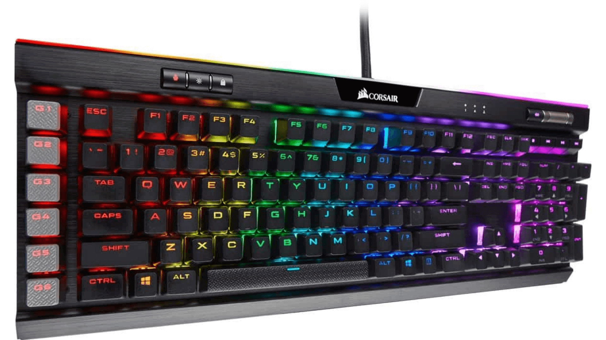

import { Image } from "astro:assets";

import __Kinesis_Freestyle_Edge_RGB_png from "./Kinesis-Freestyle-Edge-RGB.png";
import __Razer_Hunstman_Elite_Keyboard_png from "./Razer-Hunstman-Elite-Keyboard.png";
import __HyperX_Alloy_Elite_2_png from "./HyperX-Alloy-Elite-2.png";
import __Asus_ROG_Strix_Scope_png from "./Asus-ROG-Strix-Scope.png";
import __Razer_Cynosa_Chroma_png from "./Razer-Cynosa-Chroma.png";
import __Logitech_K840_png from "./Logitech-K840.png";

Do you have the best gaming keyboard?

If not, I am sorry to break it to you but your chances of winning in those intense rounds are pretty low.

It is important that when playing games, especially competitive ones like League of Legends or Call of Duty: Black Ops 4, that your hands and fingers are as agile as possible.

That is why there has been a surge in new models on the market with different features for gamers to choose from.

Here we will discuss some of these new models and what they offer!

## Best Gaming Keyboard: The Top 7

Here are the top gaming keyboards as selected by our Discord community.

### 1\. Corsair K95 RGB Platinum

\[content-egg module=Amazon products="us-B01N5IISXY" template=list\]

When you finally decide to upgrade your keyboard to get one that’s designed for gaming the Corsair K95 Platinum will exceed your expectations. It’s a larger-than-usual keyboard with plenty of controls including dedicated media controls, a metal volume wheel, and a USB- pass-through.

While this model is costly, the value for money is quite obvious with this keyboard. Adding to comfort during gameplay is a detachable wrist rest and a rubberized wrist pad. The decent spread of keys makes it easy to play all sorts of games.

#### Pros

- Amazing build quality
- Added keycaps
- Witty shortcut keys and media control
- Keyboard spread for the ultimate gaming

### 2\. Kinesis Freestyle RGB

<Image
  decoding="async"
  width="1920"
  height="1080"
  alt="Kinesis Freestyle Edge RGB"
  sizes="(max-width: 1920px) 100vw, 1920px"
  src={__Kinesis_Freestyle_Edge_RGB_png}
  widths={[1920, 300, 1024, 768, 1536]}
/>

\[content-egg module=Amazon products="us-B07SXX7P6D" template=list\]

The Kinesis Freestyle RGB is a great keyboard and advancement from the previous version which didn’t have a couple of features. The improved version still retains its split design which we’ve seen helps reduce shoulder strain. It is customizable to up to nine user profiles, including the entire layer of keys. It is also programmable without using any software.

It has an additional lift kit accessory with a resting place for the wrists and also allows keyboard tilting up to fifteen degrees.

#### Pros

- Fully customizable
- Split keyboard
- Extra lift kit including wrist rests

### 3\. Razer Hunstman Elite

<Image
  decoding="async"
  width="1920"
  height="1080"
  alt="Razer Hunstman Elite Keyboard"
  sizes="(max-width: 1920px) 100vw, 1920px"
  src={__Razer_Hunstman_Elite_Keyboard_png}
  widths={[1920, 300, 1024, 768, 1536]}
/>

\[content-egg module=Amazon products="us-B07DHNX18W" template=list\]

If you don’t mind spending the extra bucks to get an amazing gaming keyboard, then there’s something for you! This techy gaming keyboard has a solid performance and is one of the best keyboards with crazy lighting effects. With optomechanical switches, the keyboard’s performance is superfast.

The Razer Huntsman also has a dedicated media control button which is programmable like the rest of the keys. Added to its fancy lighting is another set of round lighting that surrounds the outside of the keyboard. It is a wired keyboard, so no extra USB port needed.

#### Pros

- Dedicated media control
- Perky lighting
- Tactile response with opti-mechanical technology

### 4.  HyperX Alloy Elite 2

<Image
  decoding="async"
  width="1920"
  height="1080"
  alt="HyperX Alloy Elite 2"
  sizes="(max-width: 1920px) 100vw, 1920px"
  src={__HyperX_Alloy_Elite_2_png}
  widths={[1920, 300, 1024, 768, 1536]}
/>

\[content-egg module=Amazon products="us-B088KRFVBK" template=list\]

The HyperX Alloy Elite 2 is one of those large keyboards you should clear space before setting up. It comes with a thick-braided cable and an extra USB pass-through port to connect your extra controller or mouse. As with most models, this keyboard also has dedicated volume controls to manage your music or sound effects during gameplay.

The keyboard is very colorful with custom light modes that apply during game mode. The keyboards have a HypeX ABS keycap with translucent sides.

#### Pros

- Larger frame
- Extra USB pass-through
- Advanced lighting options

### 5\. Asus ROG Strix Scope

<Image
  decoding="async"
  width="1920"
  height="1080"
  alt="Asus ROG Strix Scope"
  sizes="(max-width: 1920px) 100vw, 1920px"
  src={__Asus_ROG_Strix_Scope_png}
  widths={[1920, 300, 1024, 768, 1536]}
/>

\[content-egg module=Amazon products="us-B08412SYV6" template=list\]

This keyboard was designed and created with gamers in mind. It has a solid aluminum plate that holds the keyboard firmly to the surface. It has a wide variety of RGB switches and RGB lighting which you can choose to your own liking.

The Asus ROG Strix Scope is fully customizable and allows quick switching between modes during gameplay with the dedicated left Ctrl key. The keyboard's compact form makes it easy to reach and hit during an intense firefight session.

#### Pros

- Great focus on functionality
- RGB lighting
- Accessible Ctrl button

### 6\. Razer Cynosa Chroma

<Image
  decoding="async"
  width="1920"
  height="1080"
  alt="Razer Cynosa Chroma"
  sizes="(max-width: 1920px) 100vw, 1920px"
  src={__Razer_Cynosa_Chroma_png}
  widths={[1920, 300, 1024, 768, 1536]}
/>

\[content-egg module=Amazon products="us-B075KMZ4MX" template=list\]

This keyboard speaks to all the membrane gamers out there. The Cynosa has impeccable low profile membrane keys at a fraction of what average gaming keyboards cost. It has an appealing RGB lighting system that’s customizable for all keys or in applied zones. Though it falls short on some basic ergonomics like wrist rest, it is a nice looking keyboard and the best membrane option for gamers.

#### Pros

- Individual key lighting
- Best membrane keys
- Affordable

### 7\. Logitech K840

<Image
  decoding="async"
  width="1920"
  height="1080"
  alt="Logitech K840"
  sizes="(max-width: 1920px) 100vw, 1920px"
  src={__Logitech_K840_png}
  widths={[1920, 300, 1024, 768, 1536]}
/>

\[content-egg module=Amazon products="us-B078ML6BJ3" template=list\]

Logitech’s famous Romer-G switch is the highlight of this gaming keyboard. It was initially reserved for the sleeker versions, but it's now available in budget pieces like the K840 model. Since it is equipped with the Romer-G switch, Logitech had to cut down on other common features. You won’t even get a backlight on this model.

All in all, it is still a great option for the budget-conscious gamer or beginners for this matter.

#### Pros

- Simple design
- Long-lasting aluminum front plate

## What to Look for When looking for the best Gaming Keyboard

When deciding which gaming keyboard to choose, there are three key areas to choose from.

### Keyboard size

By now you’ve already noticed some gaming keyboards with wide frames. That’s because larger keyboards reduce shoulder strain and allow you to key in faster.

### Membrane/Mechanical

Well, this will depend on your liking or feel when using the keyboard. Membrane keyboards have a membrane layer under the keys making them soft when pressed. Mechanical keyboards have a distinct click sound. It is easier to tell if you’ve pressed a key in mechanical keyboards than the membrane types.

### Customization

The best gaming keyboards have the most customization options. That’s because each game you play will have a slightly different set of controls. Some customizations like RGB lighting will also help during gameplay in poorly lit rooms.

## Why Do You Need a Gaming Keyboard

Though the need for a good gaming keyboard can’t surpass that of a gaming computer, it can give you a better edge over other players. You are more likely to win a title if you’re more comfortable with the keys and can adjust accordingly.

At the very least, the experience will be fun and worthwhile. In competitive terms, a gaming keyboard can be a huge determinant of success and failure in competitive PC gaming.

## Conclusion

PC gaming is a unique computer activity and you shouldn’t limit yourself to the basic keyboard that comes with your PC. just remember to read the trends and stay in the loop on what's best for your gaming needs.

You can also check sales on gaming boards to get the best bang for your buck. New models are bustling in the market making the current models less pricey. Just make sure you spend wisely. All in all, the comparison we’ve put up will help you weigh up on what you want for your next keyboard for gaming.
