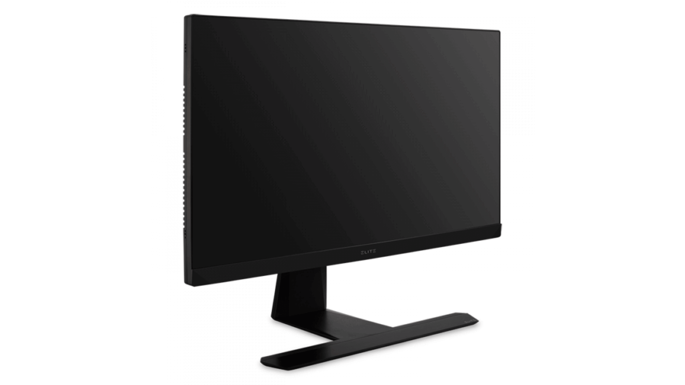

import { Image } from "astro:assets";

import __Asus_ROG_Swift_PG27A_png from "./Asus-ROG-Swift-PG27A.png";
import __Alienware_AW5520QF_png from "./Alienware-AW5520QF.png";
import __Razor_Raptor_27_png from "./Razor-Raptor-27.png";
import __Samsung_C49RG9_png from "./Samsung-C49RG9.png";
import __LG_24MP59G_P_png from "./LG-24MP59G-P.png";
import __Acer_Predator_X34_png from "./Acer-Predator-X34.png";

The best way to enjoy your favorite games is by having the proper equipment.

There are endless things you can buy for gaming, but there's one thing that will make a world of difference: the monitor.

Your graphics card might be good enough for now, but as time goes on and new games come out, you're going to need a better monitor than what you have now if you want to keep up with everyone else.

The 7 monitors below are all excellent choices and will let you maximize your gaming experience!

## Best Gaming Monitors: The Top 7

Here are our top picks for the best gaming monitors.

### 1\. Asus ROG Swift PG27A

<Image
  decoding="async"
  width="1920"
  height="1080"
  alt="Asus ROG Swift PG27A"
  sizes="(max-width: 1920px) 100vw, 1920px"
  src={__Asus_ROG_Swift_PG27A_png}
  widths={[1920, 300, 1024, 768, 1536]}
/>

\[content-egg module=Amazon products="us-B083Z8JXW6" template=list\]

The Asus ROG is one of the most intuitive monitors with 4K display, in-built speakers, and an Nvidia G-sync graphics. Though it is not the largest monitor (27-inch display), it still shows a clear sRGB color gamut with lightning 4-ms response time.

The picture quality is superb as arcade games like Narnia showed super sharp images with subtle details like face features were rich and visible. It is equipped with two HDMI ports and a gaming port for all your console connections.

#### Pros

- Amazing 4k picture
- G-sync capability
- Built-in HD speakers

### 2\. Alienware AW5520QF

<Image
  decoding="async"
  width="1920"
  height="1080"
  alt="Alienware AW5520QF"
  sizes="(max-width: 1920px) 100vw, 1920px"
  src={__Alienware_AW5520QF_png}
  widths={[1920, 300, 1024, 768, 1536]}
/>

\[content-egg module=Amazon products="us-B07YSVF47Q" template=list\]

Coming in close at the second spot is the Alienware AW5520QF OLED monitor. It has a gorgeous 4K display capability showing in a massive 55-inch wide-screen. The screen is wide enough to cater to all gaming requirements and we realized it was a perfect fit for playing games like FIFA 20.

Also, the screen is quite responsive and at a 1-ms response time, you get the best gaming experience. It also has a 120Hz refresh rate and an AMD FreeSync. You can hear separate sounds with its built-in high definition speakers.

#### Pros

- Widescreen display
- 4K OLED Panel
- Multiple ports selection
- Elegant design

### 3\. Razor Raptor 27

<Image
  decoding="async"
  width="1920"
  height="1080"
  alt="Razor Raptor 27"
  sizes="(max-width: 1920px) 100vw, 1920px"
  src={__Razor_Raptor_27_png}
  widths={[1920, 300, 1024, 768, 1536]}
/>

\[content-egg module=Amazon products="us-B085K647FM" template=list\]

The bright monitor comes at a minimal 27-inch display emitting up to 295  nits of brightness. It is a 2560 x 1400 panel with an sRGB color gamut that ensures a vivid picture display. The HDR400 feature allows for several customization features including MMO Gaming, FPS Gaming, and, Racing Gaming mode apart from the streaming and default settings.

The Razor Raptor 27 looks sleek and has a design that's glowing in flair and modern-looking. It is easily one of the best-looking monitors on this list.

#### Pros

- Great design
- HDR400 support
- Bright screen
- Witty cable management

### 4\. Samsung C49RG9

<Image
  decoding="async"
  width="1920"
  height="1080"
  alt="Samsung C49RG9"
  sizes="(max-width: 1920px) 100vw, 1920px"
  src={__Samsung_C49RG9_png}
  widths={[1920, 300, 1024, 768, 1536]}
/>

\[content-egg module=Amazon products="us-B07L9HCJ2V" template=list\]

When you want to fully immerse yourself in gaming and would like something bigger than usual, go for the Samsung C49RG9 ultrawide monitor. It is so wide that the aspect ratio comes to a whopping 32:9. That’s almost two 1440p monitors!

It comes with an advanced HDR performance including a great color gamut. For a better experience, the monitor is curved making viewing angles a breeze. You might need to look for enough desk space to fit this monitor but once you find it, you’re good to go!

#### Pros

- FreeSync Integrated
- Super Ultrawide display
- HDR performance

### 5\. ViewSonic Elite XG270

\[content-egg module=Amazon products="us-B07VL5SNG8" template=list\]

The best example of a budget gaming monitor is the colorful ViewSonic Elite XG270. With a lightning 1-ms response time and a 240Hz refresh rate, the monitor can handle all graphics-hungry games. It is a perfect choice for eSports. The picture quality is amazing and subtle details remain visible even from a distance.

It comes with HDR10 support compatible with both AMD FreeSync and Nvidia G-Sync. Clocking 277 nits of brightness, the Elite XG210 is pretty bright and covers up to 132% of the sRGB.

#### Pros

- Nvidia G-Sync and AMD FreeSync support
- Plenty of display settings
- Amazing 240Hz refresh rate

### 6\. LG 24MP59G-P

<Image
  decoding="async"
  width="1920"
  height="1080"
  alt="LG 24MP59G-P"
  sizes="(max-width: 1920px) 100vw, 1920px"
  src={__LG_24MP59G_P_png}
  widths={[1920, 300, 1024, 768, 1536]}
/>

\[content-egg module=Amazon products="us-B06XDY3SJF" template=list\]

Another super affordable monitor for your gaming needs is this stylish model from LG. Though it costs a fraction of, let’s say, Alienware, it still has some amazing features that allow for smoother gaming. The 1920 x 1080 display is pretty much standard but it shows an outstanding 246 nits of brightness. Its design is top-notch and compatible with AMD Freestyle.

The LG 24MP59G-P has a decent color quality and a wicked outer design that’s actually sleeker than most expensive versions. Coming with a red and black color scheme, the monitor will fit perfectly and look great in your gaming room.

#### Pros

- Stylish look
- Bright display
- Affordable
- Great value for money

### 7\. Acer Predator X34

<Image
  decoding="async"
  width="1920"
  height="1080"
  alt="Acer Predator X34"
  sizes="(max-width: 1920px) 100vw, 1920px"
  src={__Acer_Predator_X34_png}
  widths={[1920, 300, 1024, 768, 1536]}
/>

\[content-egg module=Amazon products="us-B08PPPMZDX" template=list\]

Another great curved option for gaming is the latest model from Acer’s line of monitor screens. The X34 has a 34-inch display with a superwide 21:9 aspect ratio. It lights up with 261 nits of brightness and is incredibly immersive, especially in games like CS:GO.

The 4K display is also responsive and is beefed up by an Nvidia G-Sync capability for the ultimate gaming experience. Plus, Acer added a pair of 7-watt speakers to top it off. The design is also futuristic and one would easily confuse it with the Alienware models.

#### Pros

- Low latency
- Ultrawide display
- Great picture quality
- Futuristic design

## What To Look For When Buying A Gaming Monitor

Choosing the right fit of a gaming monitor will rely on a number of factors like the screen size, budget, GPU, and sometimes the refresh rate.

### Screen size

A good-sized monitor will help you capture all the details in a game. Wider screens are better for strategy games.

### Budget

Not all gaming computers come under $1,000. There are extremely expensive pieces and cheaper ones too. Since all will come with a fair balance of pros and cons, it is up to you to choose according to your budget.

### GPU

The GPU is important in fast-paced games. Look for compatibility with AMD or Nvidia graphics card. A great GPU will display information-rich games with no lagging.  
Refresh rate. Just like GPU, fast-paced games will require a higher refresh rate, measured in Hz.

## Why Do You Need A Gaming Monitor

Even with the best gaming laptop, the full experience is still not achieved if you don’t own a gaming monitor. They are essential because they help you free up your laptop screen for other uses like chats or guides. With a larger display, offline multiplayer games are more enjoyable.

[https://www.youtube.com/watch?v=LnKGTZIAup0](https://www.youtube.com/watch?v=LnKGTZIAup0 'Play video "Is Your Monitor FAST Enough? - Refresh Rates"')

Video can't be loaded because JavaScript is disabled: [Is Your Monitor FAST Enough? - Refresh Rates (https://www.youtube.com/watch?v=LnKGTZIAup0)](https://www.youtube.com/watch?v=LnKGTZIAup0 "Is Your Monitor FAST Enough? - Refresh Rates")

You can’t really play FIFA 20 KICK OFF or tournament on a tiny 14” laptop screen without strain. Since gaming monitors are made for gaming, they have amazing display quality and refresh rates.

## Conclusion: Best Gaming Monitor

No gaming monitor is a one size fits all type for gamers. Each model comes with its own perks and drawbacks. From the type of game you are playing to the equipment, gaming monitors serve varied purposes.

But now that you know a thing or two about gaming computers, you can easily choose the best models using criteria like refresh rate, picture display, among others.

Even with a shallow pocket, you can still grab a decent gaming monitor that will get the job done.
