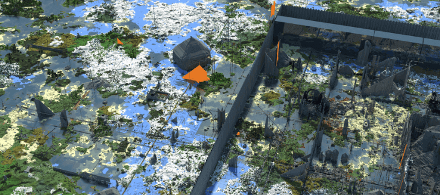
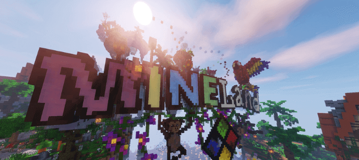
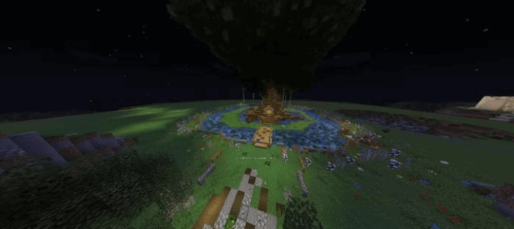

Do you love Minecraft but get tired of all the rules?

Ever wanted to just build whatever you want, destroy whatever you want, and do anything without getting yelled at by a moderator or banned from the server?

If so then I have some great news for you!

There are servers called Minecraft Anarchy Servers that allow players to take their creativity and use it however they see fit.

These servers provide a unique experience where there is no structure whatsoever.

Players can be creative in any way they please and make up their own set of rules as long as everyone agrees on them.

You can also change your game mode from survival to creative or adventure anytime if you need a break from building structures or fighting monsters.

It's an entirely new world with no limits!

## **3 Best Minecraft Anarchy Servers**

Choose from one of our top Minecraft Anarchy servers to leave the world in chaos. Here is our pick for the top Minecraft Anarchy Servers that you can play on right now.

### 1\. 2b2t

2b2t is one of the oldest and most popular anarchy servers in Minecraft. There are no rules, but as a result, it's often said to be "the birthplace for all things chaos." The server features some serious YouTube stars like [FitMC](https://www.youtube.com/channel/UCHZ986wm_sJT6wntdDTIIcw) and Salc1 who have given up on other forms of survival because they can't find anything more chaotic than 2b2t!

- The birthplace of all things chaos
- A vast world with a ton of players
- Hostile and chaotic environment
- There are no rules to follow

2b2t is the most infamous anarchy server that exists and you can try it out if you want a feel of what it's like to play with no rules. You should just watch out for instances where hackers are looking for an opportunity to attack your game, using their newly obtained skills in order to inflict harm on unsuspecting players.

Some players find this type of gameplay thrilling - even more so than watching constructions be destroyed due to lack thereof any sense or regulation.

**2b2t Server IP:** 2b2t.org

**2b2t Website:** 2b2t.org

**2b2t Discord:** N/A

### 2\. Mineland

Mineland Network has one of the best Minecraft Anarchy servers and Minecraft networks in general with high-quality game modes, monthly tops, interesting quests for players who love to compete and create.

- Fight for survival and power
- Become a member of the Mineland community
- Free to play, best quality
- Unparalleled Minecraft gameplay

They offer intrigue in a lack of power or lawlessness as you attempt to survive alongside other intriguing survivors that are trying their hardest just like you!

Build your own base and unite together in clans while being on constant guard against griefers - those pesky people out there that want nothing more than ruin everyone's hard work by destroying everything they have created.

Mineland Network is one of the best Minecraft Anarchy servers with an exciting variety of different game modes available from building towns as settlers to battling zombies hordes all night long every day until it's morning

**Mineland Server IP:** hd.join-ml.com

**Mineland Website:** [https://mineland.net/](https://mineland.net/)

**Mineland Discord:** [https://mineland.net/discord/en](https://mineland.net/discord/en)

### 3\. Simply Vanilla

Want to experience anarchy without all those pesky rules? Then join Simply Vanilla! This server is for people who just want the freedom of a vanilla world, but with no hacks. You can grief and raid on this server - so you don't have to play by any silly rules at all.

- Play Minecraft as it was intended to be played
- No hack clients allowed
- Unique like no other server
- Build alliances, create bases and raid others

Simply Vanilla is a vanilla Minecraft server where the ONLY rule is no hack clients. Similar in many ways to 2b2t but without all of that messy cheating and long queues! Other than this single rule there are absolutely NO other rules and NO game-changing plugins - it's just 100% pure vanilla Minecraft goodness (for players who want an authentic survival experience).

You're free not only loot chests but also bases too; team up, build empires and kingdoms if you so choose; say whatever you want in chat... The possibilities really are endless at Simply Vanilla

**Simply Vanilla Server IP:** simplyvanilla.net

**Simply Vanilla Website:** [https://reddit.com/r/SimplyVanillaMC](https://reddit.com/r/SimplyVanillaMC)

**Simply Vanilla Discord:** [https:**//**discord.gg/dP7SqPF](https://discord.gg/dP7SqPF)

## **What Is A Minecraft Anarchy Server?**

Anything goes!

There are simply no rules and you could be attacked by just anyone if they work through their gameplay well. If you are not the tough and resilient type, you might have a difficult time playing in these servers.

Minecraft Anarchy servers are the type of server that greatly favor griefers, who like to disrupt other players. It might be fun, but without all restrictions, there is no telling what another player can do. So you play cautiously as some ambitious folks will go out their way to try things they were restricted from in regulated servers.

Anarchy servers, just from the name, describe the type of servers that are void of rules and restrictions within the gameplay. This creates conditions that greatly favor the type of player that does not like to play by the rules.

Hackers might fancy these types of servers as they can actually put their hacking skills to test since this would not be forbidden. As such this is not a place for those who are quite soft in the gameplay of Minecraft.

## **Why Do People Play On Minecraft Anarchy Servers?**

Minecraft Anarchy Servers are designed in a unique manner and are unmatched by many other game servers out there. You will realize this with the very first impression you have of it. The aggression of any kind is given the green light and your safety in the game is not guaranteed. Players can destroy each other’s property and they can even kill your avatar.

An individual’s survival is not really guaranteed; you have to earn it. Funny enough, there are Minecraft players who fancy this type of game and are quite energetic and excited to try it out.

Such are the type of players that are amused with destruction and killings throughout the game. The thing with these servers is that they create that real-world feeling where you have to fight for your survival and that war can erupt from any angle at any time.

This particular Minecraft server has limited rules that are meant to guide the gameplay throughout Minecraft. In some instances, rules do not apply and players are not restricted in any way as they try to survive throughout the whole game.

This is as they try to collect adequate and important resources that they need to defend themselves against not only their enemies but also from the environment which can be quite challenging.

Minecraft Servers allow the acts of causing consternation to other players in the online mode as it encourages interrupting the activities of the others. This is made possible in the anarchy servers because of the fact that there is no use of land protection plugins. This, therefore, means that as a player you should invest your resources in building a concealed and fortified base that would not be easily attacked by other players in the online community.

## **Conclusion**

All in all, you can conclude that the Minecraft anarchy server is one that can turn out to be quite wild.

Players are not restricted by any rules and anything they want to do goes! Players are even allowed to cheat as they try to grief and avoid being grieved or killed in the game.

The Minecraft Anarchy Servers do not limit players and they offer you a scope to attack and defend yourself in any way you wish to. You should beware of hackers and cheaters that would go to any lengths to get what they want.

Therefore, these are not the best Minecraft Anarchy servers for those that are quite humble or weak.
