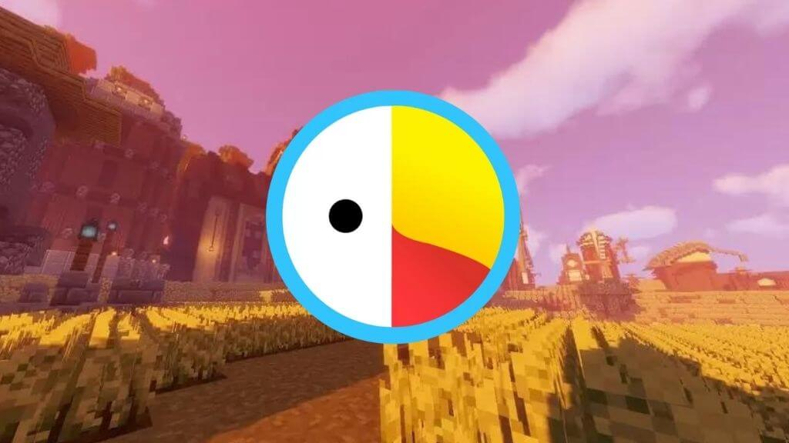
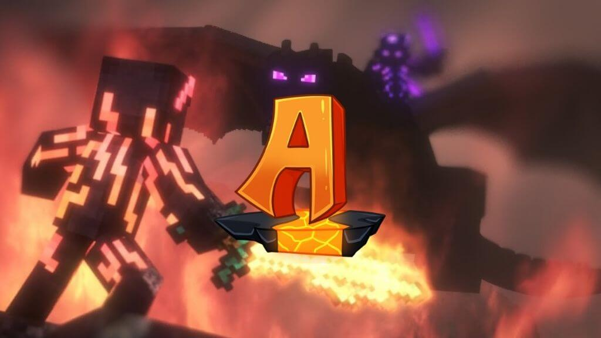

Minecraft Annihilation has to be one of the most popular Minecraft mods today. One of the reasons for its popularity is that the game is unique and takes an intense team-based approach.

Four teams compete head to head, intending to destroy the enemy’s Nexus while at the same time defending their own using an array of classes.

The game, as it turns out, is a lot more complex than it sounds.

## 4 Best Annihilation Minecraft Servers

It's best to join a server where there are many other players so that you don’t necessarily need to invite friends and family to join. Below are the best Annihilation Minecraft servers you can join today.

### Cosmic Craft

Cosmic Craft is one of the best Minecraft servers out there. It's got a great community, and it's got a ton of different game types to keep you entertained.

I particularly enjoy the Annihilation servers, but there are also Survival games, McMMO Factions, Bed Wars, SkyBlock, and more.

The server is always adding new content and updating old content, so there's never a dull moment. And if you ever need help, the staff are always on hand to assist you.

[https://www.youtube.com/watch?v=PkI3czEwG9s](https://www.youtube.com/watch?v=PkI3czEwG9s 'Play video "🎮 HOW TO JOIN COSMIC CRAFT! EASY STEPS | Cosmic Craft"')

Video can't be loaded because JavaScript is disabled: [🎮 HOW TO JOIN COSMIC CRAFT! EASY STEPS | Cosmic Craft (https://www.youtube.com/watch?v=PkI3czEwG9s)](https://www.youtube.com/watch?v=PkI3czEwG9s "🎮 HOW TO JOIN COSMIC CRAFT! EASY STEPS | Cosmic Craft")

Cosmic Craft is what’s called a cracked Minecraft server, which has many players and a pretty healthy community. It is one of the best Minecraft Annihilation servers but has other Survival games, McMMO Factions, Bed Wars, SkyBlock, etc.

The server is highly responsive, and we didn’t notice any lags. Also, there are dozens of players online and playing at any given time, which, as we mentioned earlier, is a good thing for this game.

I highly recommend Cosmic Craft to any Minecraft fan looking for a great server to play on.

**Cosmic Craft Annihilation Server IP:** mc.cosmicmc.net

**Cosmic Craft Website:** https://www.cosmicmc.com/

### PixelEdge

The PixelEdge Network happens to be another one of our favorite Minecraft Annihilation servers. The PixelEdge Network is a group of Minecraft servers that were originally created for the Annihilation minigame.

However, the network has since expanded to include a variety of other servers, such as Survival, Practice PvP, Bedwars, and Minigames.

[https://www.youtube.com/watch?v=0L4z\_\_GYWno](https://www.youtube.com/watch?v=0L4z__GYWno 'Play video "আজকে সবাইকে মারলাম [ Pixeledge PvP ]"')

Video can't be loaded because JavaScript is disabled: [আজকে সবাইকে মারলাম \[ Pixeledge PvP \] (https://www.youtube.com/watch?v=0L4z\_\_GYWno)](https://www.youtube.com/watch?v=0L4z__GYWno "আজকে সবাইকে মারলাম [ Pixeledge PvP ]")

While the Annihilation server is still our favorite, all of the servers on the PixelEdge Network are well-made and offer a great gaming experience.

The staff is also very friendly and helpful, which makes the overall community a great place to be.

In our experience, the server has some of the best players online and is ready to play. While not everyone is a native English speaker, it is, after all, a foreign server, but one of the best out there.

If you're looking for a good Minecraft server to join, we highly recommend checking out the PixelEdge Network.

**PixelEdge Annihilation Server IP**: play.pixeledgebd.com

**PixelEdge Website:** [https://pixeledgebd.com/](https://pixeledgebd.com/)

### UneasyVanilla

Anyone who is playing Minecraft Annihilation wants to make sure that other players aren’t cheating. In the world of Minecraft Annihilation, players are always looking for ways to get ahead of the competition.

That's why it's important to have a robust set of rules in place to ensure that everyone is playing fair. One of the most popular cheating methods is to use faction plugins with TPA commands and claiming land commands.

This allows players to teleport around the map and claim large areas of land, giving them a significant advantage.

[https://www.youtube.com/watch?v=TksljL76ciM](https://www.youtube.com/watch?v=TksljL76ciM 'Play video "Uneasy Vanilla:  Return to Spawn"')

Video can't be loaded because JavaScript is disabled: [Uneasy Vanilla: Return to Spawn (https://www.youtube.com/watch?v=TksljL76ciM)](https://www.youtube.com/watch?v=TksljL76ciM "Uneasy Vanilla:  Return to Spawn")

To level the playing field, you want to be as close to vanilla as possible while also having zero rules when in the game world. This will prevent cheaters from having an easy time getting ahead, and it will make the game fairer for everyone involved.

So if you're looking to get the most out of your Minecraft Server experience, then UneasyVanilla is the server for you.

Players are allowed to do whatever they want in-game so as long as they follow the server’s simple rules.

UneasyVanilla does reserve the right to ban anyone who is found cheating to ensure that everyone plays fair.

If you ask us, that’s a pretty good rule to have.

**UneasyVanilla Annihilation Server IP**: play.UneasyVanilla.com

**UneasyVanilla Website**: [https://www.uneasyvanilla.com/](https://www.uneasyvanilla.com/)

### AcentraMC

Out of all the different Minecraft servers I've played on, AcentraMC is definitely one of the better ones. It offers players a bunch of different game modes to choose from, so you're never bored. And if you are, there's always something new to try.

I especially enjoy the Annihilation and Ranked Bedwars game modes, but there's something for everyone. The network is also constantly adding new features and updating existing ones, so it's always improving.

We've been really enjoying ourselves on the AcentraMC servers, but we have to say that their customer support could use some work. We opened a ticket to report an issue we were having and it took quite a while to hear back from anyone.

But it's good to know that they do eventually respond to tickets. We just hope that they can get things sorted out on their end so that players don't have to wait so long for assistance.

Other than that, we're loving the servers and can't wait to keep playing on them.

If you're looking for a fun and enjoyable Minecraft experience, I recommend checking out AcentraMC. You won't be disappointed.

**AcentraMC Annihilation Server IP:** play.acentramc.com

**AcentraMC Website:** [https://acentramc.com/](https://acentramc.com/)

## Conclusion

There you have it, the Best Minecraft Annihilation servers for everyone. We would start with the servers listed on the very top and then work your way down. That said, almost all servers forbid cheating and will ban you without prior notice.

As you all know, there are a ton of game modes in Minecraft, and we cant test every server. If there is a server have missed, then leave a comment below and let us know about it.
