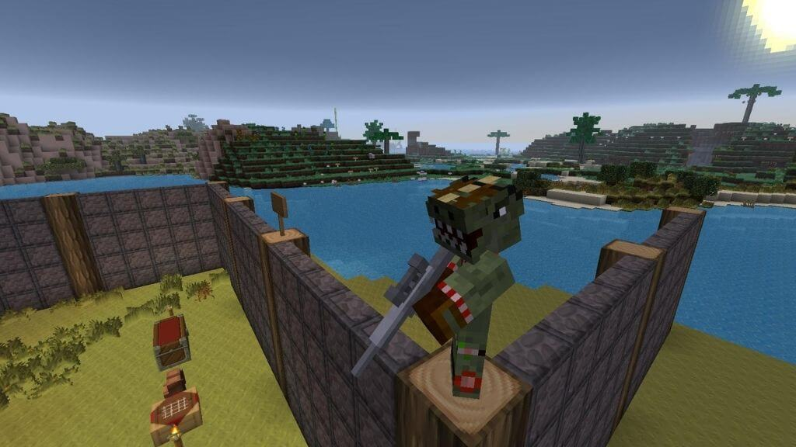
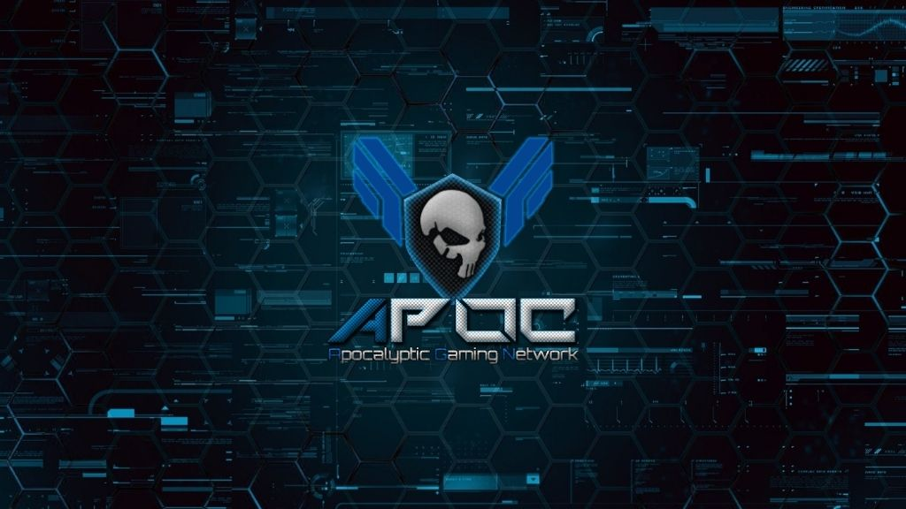

Attack Of The B-Team is mainly a pack of mods for Minecraft, which were picked by two leading YouTube personalities, i.e., [GenrikB](https://www.youtube.com/channel/UCJTWU5K7kl9EE109HBeoldA) and [BDoubleO100](https://www.youtube.com/c/bdoubleo) also referred to as the B-Team.

Players can download the b team modpack from the [Technic Platform](https://www.technicpack.net/modpack/attack-of-the-bteam.552556), the creators of other popular packs like Tekkit and Hexxit.



Technic says that Attack Of The B-Team was mainly designed with crazy mad science in mind. That's why they picked out the wackiest mods and put them all together for people to enjoy.

Some of the cool stuff players can do in the game is morphing into the shape of any mob you kill, getting attacked by a zombie wearing a top hat, and weird-looking trees. In other words, this isn't your Vanilla Minecraft Server.

## Top 3 Attack Of The B Team Servers

Are you interested in playing?, Then choose from a b team server below to play it on with everyone else.

### APOC Gaming



APOC Gaming was founded back in 2010 and is a multi-server modded Minecraft networking server. With over 15 servers, they're one of the most comprehensive Minecraft servers around.

They offer a great variety of mods and plugins to tailor your gameplay experience, and their staff is incredibly active and helpful.

We often recommend APOC Gaming for other Minecraft mods because they're just that good.

Not only does it provide one of the best Attack of the B-Team experiences available today, but the staff is really fast and helpful. If you ever run into any problems, the staff is always quick to respond and help out. The servers are chock-full of awesome mods that add all kinds of new features, items, and blocks to the game.

Plus, it's always being updated with new content, so there's never a dull moment. You can get in touch with them via Discord, and they'll usually get back to you within a few minutes.

So if you're looking for an awesome Minecraft mod pack that's always being updated with new content, Attack of the B-Team is definitely worth checking out.

We counted 21 servers with more planned. If anything, that means you're not going to get bored anytime soon. If you're looking for a great server to play on, then join today and definitely check them out!

**APOC Attack Of The B Team Server IP:** BT.APOCGAMING.ORG

**APOC Website:** [https://www.apocgaming.org/](https://www.apocgaming.org/)

### Mine Your Mind Server


Now Attack of the B-Team is a growing and evolving server. Though it has been around for several years, the staff is still highly responsive, which means that your tickets and issues are addressed sooner rather than later. Furthermore, the moderators also resolve issues quickly.

The security is also pretty tight on this Attack of the B-Team Server, which means you can be pretty sure of not being griefed. Also, they have some very stringent policies on unclaimed and claimed alike. That's why if something does happen, don't worry; you will not lose everything.

> Important!
>
> An exploit was discovered which leaves our servers vulnerable. Our admin team will be working to patch our servers ASAP, but until then we suggest not playing unless your launcher has a fix in place.
>
> ~Lirael [pic.twitter.com/sJwyVle09z](https://t.co/sJwyVle09z)
>
> — MineYourMind (@\_MineYourMind\_) [December 10, 2021](https://twitter.com/_MineYourMind_/status/1469371714614317061?ref_src=twsrc%5Etfw)

```html
<script
  async=""
  src="https://platform.twitter.com/widgets.js"
  charset="utf-8"
></script>
```

The server also runs at optimal TPS; in other words, there are no speed or lag issues. Anyone who's played Minecraft knows that lag can be a real pain. No one wants to spend their time waiting for blocks to load or for the game to catch up with their movements.

That's why Attack of the B-Team Server is such a great choice - it runs at optimal TPS, so you never have to worry about speed or lag issues. And because the server is always updated with the latest versions of mods, you'll always have access to the best possible gameplay experience.

So if you're looking for a smooth, lag-free Minecraft experience, Attack of the B-Team Server is definitely the way to go.

**Attack of the B-Team Server IP:** bteam.mineyourmind.net

**Attack of the B-Team Website:** [https://mineyourmind.net/](https://mineyourmind.net/)

### Aurora Craft B-Team


We love the Aurora Craft Minecraft server because it always has people online (even though it feels more like a private server), making playing Attack of the B-Team Attack of the B-Team servers are a great way to get together with friends and work on building projects or taking down monsters.

Additionally, the Aurora Craft server has a lot of built-in features that make playing Attack of the B-Team more fun, like mini-games and custom items.

Plus, there is a solid claim protection system in place, PvE, and a couple of banned items.

[https://www.youtube.com/watch?v=rIEhvmK0m_o](https://www.youtube.com/watch?v=rIEhvmK0m_o 'Play video "Aurora Craft Vanilla Teaser"')

Video can't be loaded because JavaScript is disabled: [Aurora Craft Vanilla Teaser (https://www.youtube.com/watch?v=rIEhvmK0m_o)](https://www.youtube.com/watch?v=rIEhvmK0m_o "Aurora Craft Vanilla Teaser")

In addition to the classic B-Team experience, you can also create your own server with custom mods. This means that there is practically limitless potential for entertainment.

If you get tired of playing on the same old servers, you can always mix things up by creating your own. We've found that the create a server feature is great for those who want to experiment with different gameplay styles.

Of course, if you just want to stick to the tried-and-true formula, there are plenty of servers out there that offer classic B-Team action.

Aurora Craft is one of our favorites – definitely check it out!

**Aurora Craft B Team Servers IP:** bteam.auroracraft.info

## Conclusion

While there are quite a few other B Team Minecraft Servers, they didn't make it to our list for varying reasons. Some of which include our inability to log in to test them, while others were atrociously slow.

However, we've found that the servers on this list are the best of the best, and you'll be sure to have a blast playing on them.

Did we miss some B Team Servers that should have made it on this list? Then leave us a comment with all the details below and we will check it out.
