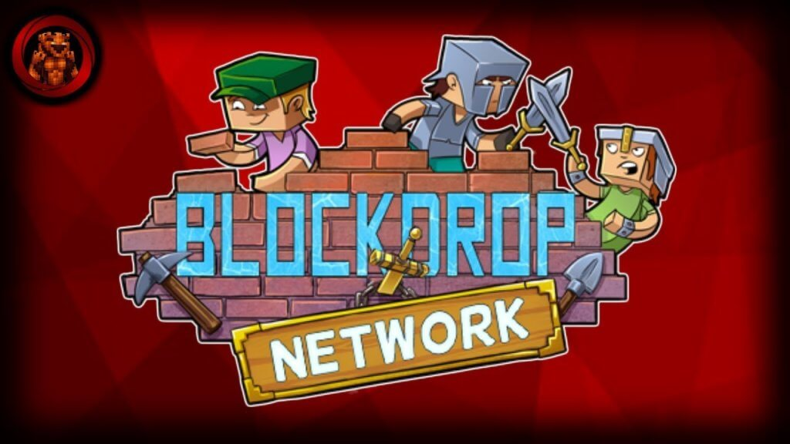
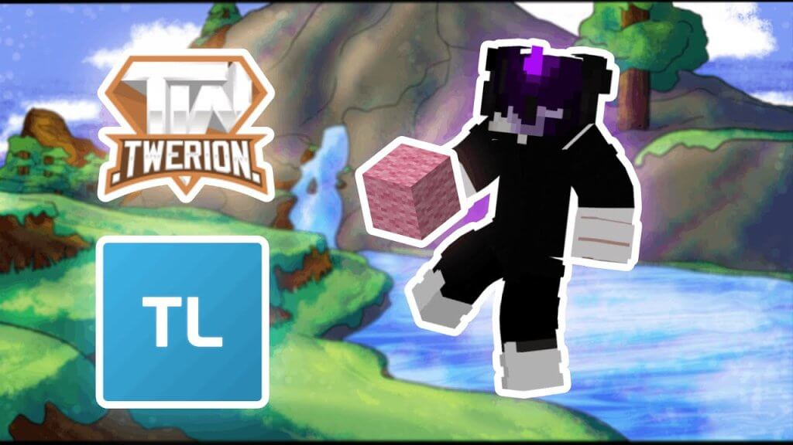
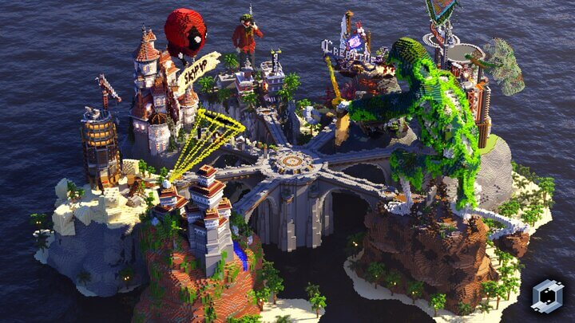
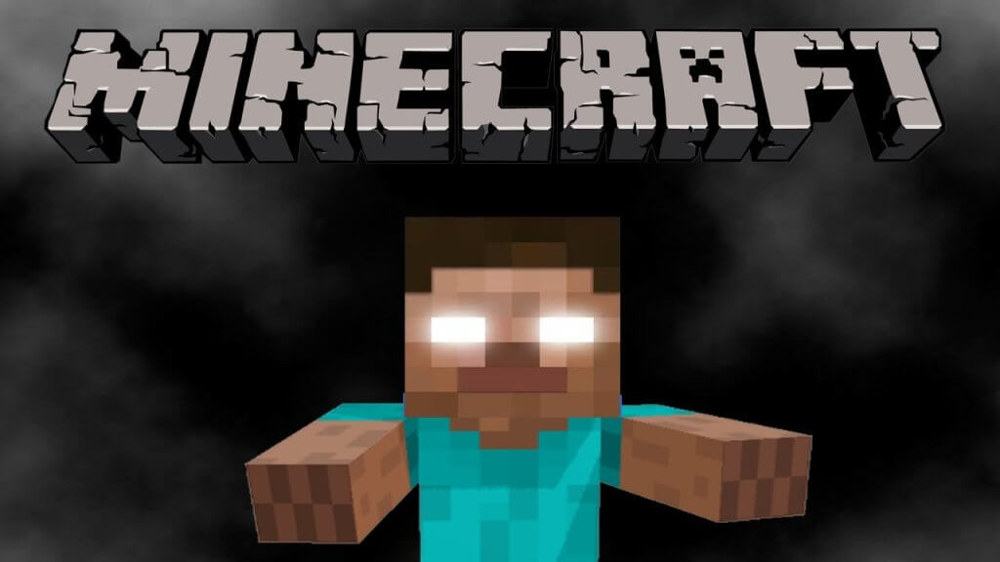
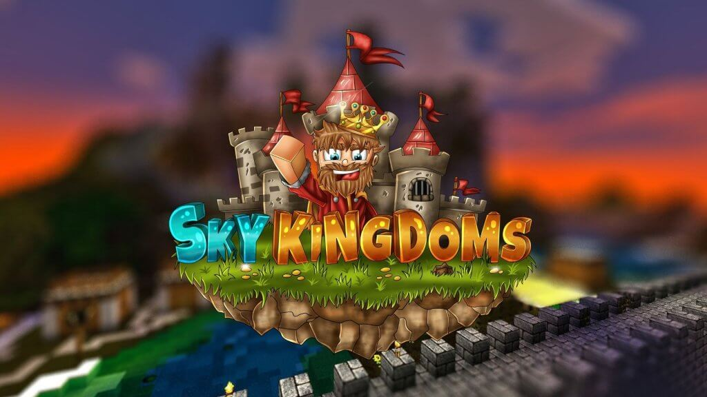

BedWars has since the time it was launched become a highly popular game, with one of the reasons being that the objective is to defeat other players by mainly destroying their beds.

Until the bed is destroyed, that respective player can keep respawning, so; the goal is to protect your own bed by taking out others.

Interestingly, there are only a few servers that allow this game mode to be played; we’ve listed the best ones in this article.

## 5 Best Minecraft BedWars Servers

Minecraft servers can be very fun and exceptionally hilarious. Most players play Bedwars because it is easy to pick up, have fun, and turn off if needed.

But you will need to play it online, and that’s where finding great Minecraft BedWars servers comes in.

Lets take a look at some of the best Minecraft servers for BedWars

### BlockDrop Network

The Blockdrop Network consists of many other game modes, which is usual for most other servers like Creative, Survival, and Skyblock. However, their focus is City Life and Bedwars.

As one of the most popular games on the BlockDrop Network, Bedwars has unsurprisingly garnered an active user base. With hundreds of players battling against each other in intense, multi-player matches, there is always something exciting going on in this game.

Yet despite its popularity, the rules are strictly enforced to ensure a fair playing environment for all users.

Any type of cheating or hacking is strictly prohibited, and anyone caught doing such activities risks being banned from the network altogether.

[https://www.youtube.com/watch?v=APi_6sO-Xck](https://www.youtube.com/watch?v=APi_6sO-Xck 'Play video "Blockdrop Minecraft Server Owner Finding Hackers, Trolling and Giant 150 Player Drop Party"')

Video can't be loaded because JavaScript is disabled: [Blockdrop Minecraft Server Owner Finding Hackers, Trolling and Giant 150 Player Drop Party (https://www.youtube.com/watch?v=APi_6sO-Xck)](https://www.youtube.com/watch?v=APi_6sO-Xck "Blockdrop Minecraft Server Owner Finding Hackers, Trolling and Giant 150 Player Drop Party")

Additionally, the BlockDrop team takes user feedback very seriously and makes it a point to quickly address any issues that arise.

The network also recently added more Minecraft Servers such as the Sims-inspired game called City Life, which is something people will want to try.

If you're looking for an adrenaline-pumping gaming experience with tons of action, then you definitely need to check out Bedwars on the BlockDrop Network!

**BlockDrop BedWars Server IP: mc.blockdrop.org**

**BlockDrop Website: [https://www.blockdrop.org/](https://www.blockdrop.org/)**

### Twerion

If you're looking for an action-packed, exciting multiplayer gaming experience, then look no further than Twerion.

This popular Minecraft server is known for hosting fast-paced and frenetic Bedwars matches and mini games that attract players from all over the world.

With hundreds of users logging on each month to participate in this popular mode, it's clear that Twerion is one of the top destinations for gamers everywhere.

Whether you are a beginner or an experienced player, there is always something to do on this active Minecraft server, which also features plenty of other game modes to explore.

Twerion is also a cracked Minecraft server that also allows premium players, which makes them the best for Bedwars as they can attract a huge user base.

[https://www.youtube.com/watch?v=5raHQBY3SeQ](https://www.youtube.com/watch?v=5raHQBY3SeQ 'Play video "Build FFA Gameplay | Twerion.Net"')

Video can't be loaded because JavaScript is disabled: [Build FFA Gameplay | Twerion.Net (https://www.youtube.com/watch?v=5raHQBY3SeQ)](https://www.youtube.com/watch?v=5raHQBY3SeQ "Build FFA Gameplay | Twerion.Net")

(Speaking of cracked servers, check our list of the best cracked servers)

Whether you're looking for a fun solo experience or are itching to compete against fellow gamers online, Twerion is the place to go for an incomparable Minecraft experience.

So what are you waiting for? Start playing today!

**Twerion Server IP: twerion.net**

**Twerion Website: [https://www.twerion.net/](https://www.twerion.net/)**

### Herobrine

When it comes to Minecraft BedWars game mode, there is arguably no better choice than Herobrine. With a large and active community of gamers, this server is always bustling with activity.

What's more, it consistently ranks at the top of BedWars leaderboards, due in no small part to its impressive variety of custom maps.

Whether you're looking to test your wit and skill against other players or just want to have some fun building in creative mode, Herobrine has something for everyone.

We would have to say that Herobrine is the best Minecraft BedWars server, especially when it comes to the incredible number of active users. Most users are arguably playing Bedwars.

Though there are several game modes on offer like Factions, Survival, Sky Wars, Earth Towny, and Skyblock.

Herobrine recently announced an update to the server’s Bedwars mode to facilitate a seamless performance for players of the game.

This is not just a Minecraft server you play, this is one of the best Minecraft servers in general.

So if you're looking for an awesome Minecraft BedWars experience, look no further than Herobrine!

**Herobrine Server IP: herobrine.org**

**Herobrine Website: [https://www.herobrine.org/](https://www.herobrine.org/)**

### Mineland

Mineland can be considered a creMineland is a Minecraft server with a difference.

Rather than just providing players with a set of predetermined games to play, Mineland focuses on giving players the tools they need to create their own mini-games and experiences.

This makes for a much more creative and dynamic server, as players are constantly coming up with new ideas and ways to have fun.

In addition to being able to design their own games, players on Mineland can also build battles and host contests.

[https://www.youtube.com/watch?v=\_k38a3dv230](https://www.youtube.com/watch?v=_k38a3dv230 'Play video "Minecraft servers - Mineland official trailer"')

Video can't be loaded because JavaScript is disabled: [Minecraft servers - Mineland official trailer (https://www.youtube.com/watch?v=\_k38a3dv230)](https://www.youtube.com/watch?v=_k38a3dv230 "Minecraft servers - Mineland official trailer")

This means that there is always something new and exciting going on, making Mineland a great server to spend time on.

BedWars is also very popular on Mineland, with many players logging in each day to compete against each other.

The in-game economy is very well executed and rewards players with various bonuses like perks and kits. If anything, Mainland offers an excellent Bedwars experience.

Finally, there are a variety of maps available, which makes them an excellent choice for Bedwars players.

Whether you're looking for a creative outlet or just a fun place to hang out and meet new people, Mineland Minecraft Servers are definitely the place for you.

**Mineland Server IP: promo.join-ml.com**

**Mineland Website: [https://mineland.net/](https://mineland.net/)**

### Sky Kingdoms

As a serious player of BedWars, I know how important it is to have a good server that meets all your needs.

For me, the Sky Kingdoms Minecraft server is one of the best out there.

With an active user base As a serious player of BedWars, I know how important it is to have a good server that meets all your needs.

This server has everything you could possibly want. Whether you’re looking for competitive PvP game modes or exciting PVE challenges, you’ll find it here.

[https://www.youtube.com/watch?v=e2ruKPWIfFQ](https://www.youtube.com/watch?v=e2ruKPWIfFQ 'Play video "MINECRAFT | BEDWARS GAMEPLAY #1 | Sky Kingdoms"')

Video can't be loaded because JavaScript is disabled: [MINECRAFT | BEDWARS GAMEPLAY #1 | Sky Kingdoms (https://www.youtube.com/watch?v=e2ruKPWIfFQ)](https://www.youtube.com/watch?v=e2ruKPWIfFQ "MINECRAFT | BEDWARS GAMEPLAY #1 | Sky Kingdoms")

And with regular updates and a welcoming community, Sky Kingdoms truly stands out as one of the best servers for BedWars players around.

Even though Sky Kingdoms has other game modes, BedWars seems to have done very well, and that’s one reason why you should check it out.

So if you’re looking for an engaging gaming experience, look no further than Sky Kingdoms! You won’t be disappointed.

**Sky Kingdoms Server IP: Play.SkyKingdoms.net**

**Sky Kingdoms Website: [https://www.skykingdoms.net/](https://www.skykingdoms.net/)**

## What Is BedWars?

BedWars is one of the popular game modes for Minecraft servers.

In Bed Wars, players are dropped onto an island where they must collect resources in order to obtain items such as swords, blocks, tools, and other special items.

The goal of the game is to protect your bed, as the bed breaking results in players no longer being able to respawn.

In order to win the game, players must either be the last one standing or have the most beds remaining at the end of the match.

There are a variety of strategies that players can use in order to win the game.

Some players choose to focus on gathering resources in order to build a strong defense around their bed, while others choose to be more offensive and try to take out other players' beds.

No matter what strategy you choose, Bed Wars is a fun and challenging game that is sure to keep you entertained for hours.

## Conclusion

When it comes to Minecraft BedWars servers, there are many options out there. Some are well-known and popular, while others are newer and lesser-known.

Regardless of which server you choose, though, each one is guaranteed to have a fun and engaging gameplay experience.

Whether you like high-fantasy settings with dragons and castles or more modern themes with helicopters and guns, there is sure to be a server that suits your tastes.

With so many great Minecraft Server options available, the hardest choice of all might just be deciding on which one to try first!
