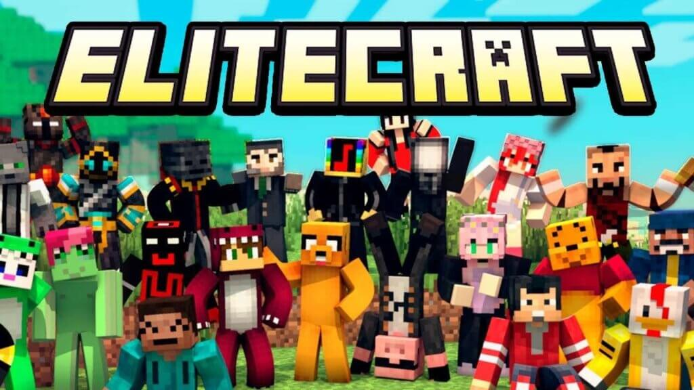
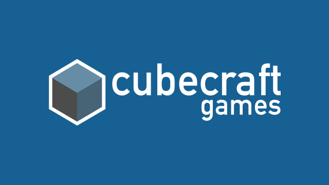

Bukkit is probably one of the most popular Minecraft server modes, which continues to attract a lot of attention from game enthusiasts. It is, for starters, an open-source, free multiplayer game server that allows you to expand the multiplayer server.

The Bukkit server generally allows for several game modes to ensure that everyone is catered to. The best Bukkit are understandably ones that provide the widest variety of Minecraft servers.

We have listed some of the best you will find on the internet. All you need is to choose a server from the list below and start playing. It is quick and easy for anyone who may not have played Minecraft online before.

However, if you want to feel the difference by playing on a Bukkit server, this list should serve you well.

## Top 5 Minecraft Bukkit Servers

We scoured the internet, played on every new server, spoke to tons of mods and we came up with this server list. Simply check the IP below and connect using any Minecraft Java or Bedrock client.

### Dogecraft

**Server IP: mc.dogecraft.net**

**Website: [https://dogecraft.net/](https://dogecraft.net/)**

If you are looking for a custom survival game experience, Dodgecraft’s growing community more than adequately caters to it. The servers boast of active and friendly players, in addition to response staff who will help you get the most out of the server.

In addition, you can take advantage of Dogecraft’s advanced crafting recipes to extend the survival experience past just getting diamond armor. Gamers have events to explore during the holidays and even compete for rewards.

[https://www.youtube.com/watch?v=3hNZQwkkO40](https://www.youtube.com/watch?v=3hNZQwkkO40 'Play video "Dogecraft Prisons Trailer"')

Video can't be loaded because JavaScript is disabled: [Dogecraft Prisons Trailer (https://www.youtube.com/watch?v=3hNZQwkkO40)](https://www.youtube.com/watch?v=3hNZQwkkO40 "Dogecraft Prisons Trailer")

We found that the staff is highly responsive and takes recommendations/opinions into consideration.

Players are treated to land-protection residences, [McMMO](https://www.ghostcap.com/best-minecraft-mcmmo-servers/), and free fly time when meeting the public goal in addition to lots of other features.

- Unique and custom survival game experience
- Active and friendly players
- Highly responsive staff who take recommendations into consideration
- Numerous features extend the survival experience
- Always the latest version of Bukkit

Dogecraft is a great community server to play on with owners who care, and best of all it's free!

### EliteCraft

**Server IP: EC-MC.NET**

**Website: https://www.elitecraft.net/**

The Bukkit server was initially established in 2011 and had been running for over a decade. The server boasts of a vibrant and welcoming community that consists of both new and veteran players of the game.

The EliteCraft server has multiple worlds. For starters, the [Survival](https://www.ghostcap.com/best-minecraft-survival-servers/)/[PvE](https://www.ghostcap.com/best-minecraft-pve-servers/) happens to be the main world.  
The server features advanced grief protection, including user-based land protection, chest locks, map backups, and disabled explosions.

PvP has been disabled except for in nether, but in our experience, joining to start building is quick and easy.

- A safe and fun environment for Minecraft players of all levels
- Grief prevention features make it a great place to play with friends
- Plenty of opportunities for creativity and exploration in multiple worlds
- Plenty of commands to help players manage their worlds

Players are treated to fun and creative multiplayer experiences with friends and without having to worry about grief. In addition, there is a full creative mode, a lot of protections in place, and a couple of World editing commands. In fact, it’s got everything you need to enjoy Bukkit.

### CubeCraft Games

**Server IP: play.cubecraft.net**

**Website: [https://www.cubecraft.net/](https://www.cubecraft.net/)**

CubeCraft Games is the largest server on our list with networks in the world. The server is fun to play on, and it is up 24/7, with the ability to house thousands of players simultaneously.

During our time playing on the server, there were at least a hundred people at any given time but with no noticeable lag. Furthermore, they offer fantastic support and quite a few games that you will not get bored of any time soon.

- A massive server that can handle thousands of simultaneous players
- Fun and engaging for hours on end
- Offers fantastic support
- Many game modes to keep you entertained

CubeCraft has over 300,000 members

If anything, the server makes getting into Minecraft Bukkit easy and fun for everyone.

## What Is Minecraft Bukkit?

Minecraft Bukkit is free, open-source software that allows gamers to create and manage their own Minecraft servers. Bukkit is designed to work with the popular game server management system, CraftBukkit, and offers a wide range of features and tools for server administrators.

With Bukkit, server owners can easily add new content to their Minecraft Bukkit servers, including plugins, worlds, and players. Bukkit also makes it easy to manage server permissions and keep track of player activity. In addition, Bukkit provides an extensive API that allows developers to create their own plugins and extend the functionality of the software.

Whether you're a casual Minecraft player or a seasoned server administrator, Bukkit is an essential tool for anyone who wants to get the most out of their Minecraft experience.

## What Is Better Bukkit Or Spigot?

There are a lot of choices to make when it comes to setting up a Minecraft server. One of the most important decisions is whether to use Bukkit or Spigot. Each has its own advantages and disadvantages, so it's important to weigh all the options before making a decision.

Bukkit is a popular choice for server admins because it offers a wide range of features and Bukkit plugins. It's also easy to set up and use, which makes it ideal for small servers. However, Bukkit can be slower than Spigot and uses more resources, which can be an issue on larger servers.

Spigot is a high-performance server platform that is used by many large servers. It's designed to be efficient and scalable, which makes it ideal for servers with a lot of players. However, Spigot can be more difficult to set up and configure than Bukkit.

We have found that the server version updates are generally handled quicker by the larger spigot community too.

In the end, the best choice for a Minecraft server depends on the needs of the server admin. If you're running a small server with only a few players, then Bukkit might be the better choice.
