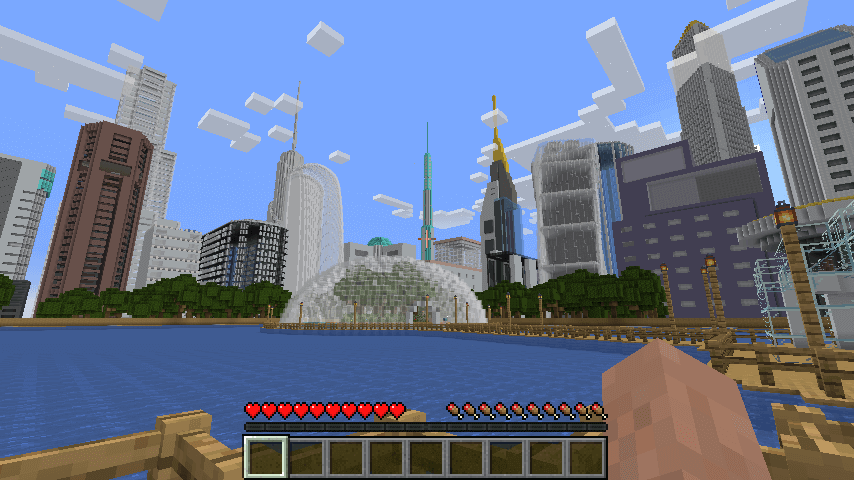
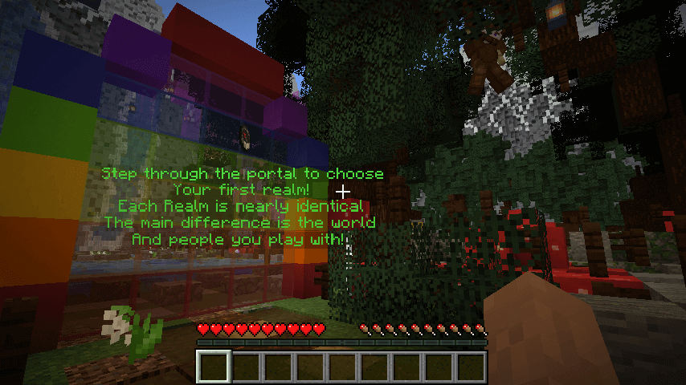
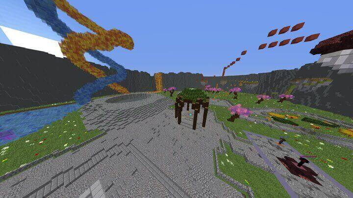
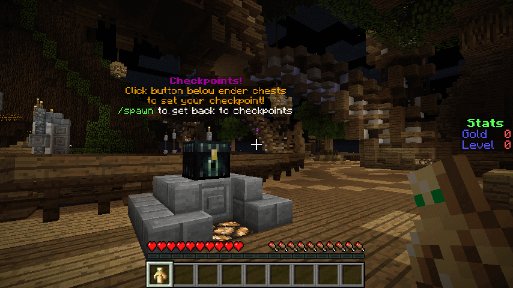

Minecraft is one of the most popular video games of all time, but it can get stale after a while.

And there are many days when you just want to play something different.

If that's the case for you, then there are Minecraft challenge servers that will provide hours of entertainment and guaranteed fun!

These four Minecraft challenge servers should be your next stop if you're looking for some fun!

## 4 Best Minecraft Challenge Servers

Gamers across the globe are accepting no challenge that comes before them to be tough. They are not simply giving up the fight, but they are rather trying to solve these problems differently. With the addition of a variety of game modes to Minecraft, Minecraft challenge servers have become extremely popular.

These servers provide special gameplay where gamers would have to sneak their way through the world, in order to try and reach the end of the game. Such servers are actually a great way to enjoy certain aspects of Minecraft without having to build something of their own. Mostly, these Minecraft challenge servers consist of one main map, which would be required to be explored in order to reach the end, and each map can be differently designed.

The players have to carefully select ways through so they can keep moving ahead, which will also depend on the different Minecraft features whether they have been enabled or not. Many Minecraft challenge servers consist of dungeons with a lot of puzzles and mods that change the atmosphere of the environment.

We present to you our list of the best challenge Minecraft servers, so let us begin.

### 1\. Skills Miner

Skills Miner is an educational Minecraft server for young people, and it's aimed at teaching them about the world of engineering.

Specifically, Skills Miner has challenges in construction, engineering, manufacturing, science, mathematics, and statistics.

Though it's built-in Minecraft, at the end of each challenge you are given an assessment based on your cerebral and dexterity. It will also give you tips on how you can improve more or transfer those skills from the virtual world, to the real world.

- Educational Minecraft server for anyone looking to improve themselves, teaching them about engineering
- Can guide you to become a better builder or designer through assessments and tips
- Features varying difficulties
- Interactive for all ages

These challenges feature varying difficulties and the difficulty level is inversely proportional to the reward. Each challenge has been set with different roles to play and different ways of completing it. This server has incredible potential, which is completely controlled by the players.

All rewards can only be claimed by spending accumulated skill points on the rewards.

When you claim a reward it will be kept with you until you complete the challenge. In order to complete a challenge, you must earn a certain amount of skill points. You may earn your skill points by completing various activities. As long as you're not cheating by using mods, you should be able to complete the challenges within a reasonable amount of time.

With tons of fun, Skills Miner is at the top of our list as one of the best Minecraft servers.

**Skills Miner Challenge Server IP:** skills-miner.enginuity.org

**Skills Miner Website:** https://www.skills-miner.co.uk/

**Skills Miner Discord:** N/A

### 2\. Survivewithus

Survivewithus is a brand new challenge server hosted in the USA with completely custom plugins and a fresh map for our players to begin adventuring on.

Every player has access to an instant teleport so they can find the perfect spot where their adventure begins! Their claiming system allows you to protect your home and loot from anyone who may try to steal, damage, or otherwise grief it/them.

While they have live reporting in place that is available should any bugs occur, someone needs assistance with in-game via chat support (or even outside of the game) - all reports go straight to the owner's inbox which means he/she handles them asap without issue(s)!

- Keep inventory
- 24/7 server uptime
- Active owners/admins

Once again this is a newly established server free of glitches or errors thus far. This also means it might be harder to see other players but it's still a challenge with the number of games it has.

**Survivewithus Challenge Server IP:** come.survivewith.us

**Survivewithus Website:** https://survivewith.us/

**Survivewithus Discord:** http://discord.survivewith.us/

### 3\. Xylon Realms

Xylon Realms is a Minecraft Challenge Server that promises to keep you entertained with its 40 different challenges. Each challenge has rewards including game giveaways, money, and other prizes as well! The server even contains some base game modes for the most immersive experience possible.

The world map is completely randomly generated and it's a brilliant idea to add changes to it. It means that each time you restart the server, the world map will be different and so will the conditions.

In Xylon Realms, the player will have to get over a lot of obstacles, using their keen knowledge of Minecraft. In addition, there will be a huge variety of items which are divided into different categories. The theme of this server is really unique and doesn't have just one particular theme.

- Gives your Minecraft experience the challenge it needs
- The maps are randomly generated, meaning a new game each time you start Xylon Realms
- Users of Xylon Realms will have to think quickly but be rewarded with their loyalty
- Challenges provide unique [and creative ways](https://www.ghostcap.com/best-minecraft-creative-servers/) to interact with Minecraft

The challenges are set in such a way that players have to fight situations without having to build anything. This server is really easy and fun to play. It is a delight for players to have to figure out the puzzles themselves.

**Xylon Realms Challenge Server IP:** 142.4.200.20:25591

**Xylon Realms Website:** N/A

**Xylon Realms Discord:** N/A

### 4\. The Labyrinth of Sordrin

The Labyrinth of Sordrin is one of the most popular Minecraft challenge servers in the world and is currently one of the best servers in its niche. It has many unique features and an active and creative team.

Its players can expect a whole bunch of features that have been requested by the players. The server has a wide range of game modes, items, and equipment, and the best part is that the server admins are really responsive to the players and their evolving needs and expectations.

On this server, you will require to go through a maze and overcome all the obstacles. The difficulty level of the server and the challenges vary from time to time according to the choices made by the players.

- It is the best server in its niche
- You can find a wide range of game modes, items, and equipment
- The difficulty level of this game makes it challenging but not impossible for every player

There are tons of different blocks included in this server and the players get to craft tons of useful items in order to move forward in the game.

The progression in this server is quite linear, and you will have to start from scratch even if you complete a map.

While there are other servers to choose from, this is one the Minecraft community shouldn't miss.

**The Labyrinth of Sordrin Challenge Server IP:** mc.sordrin.com

**The Labyrinth of Sordrin Website:** [http://www.sordrin.com/](http://www.sordrin.com/)

**The Labyrinth of Sordrin Discord:** [https://discord.gg/PZckaJA](https://discord.gg/PZckaJA)

## What Is A Minecraft Challenge Server?

Challenge Minecraft servers are popular on many platforms and Minecraft is no exception to that. The difference with Minecraft challenge servers is that these servers have been organized in a way to entice players to meet a set of conditions of which they get rewarded.

The whole challenge is quite minimal and simple, just a set of tasks or conditions which are crafted through a storyline. The most interesting part is that there are very few Minecraft challenge servers in the world at the moment so these can offer really unique experiences.

People of all ages, professions, and mindsets show a great addition to Minecraft. Dedicated at its best, Minecraft is one of the most successful games of all time encompassing many Minecraft Mods which keep its popularity alive.

Minecraft challenge servers can be considered one of the best alternatives to play rather than playing high-end games and investing a large amount of money to have fun. This way, every user can become a creator of their own world by arranging blocks of different materials and assigning different functions which they want to create in that world. The whole game is built upon its rule set i.e. “Only you, the player”.

Nothing is pre-defined, there are no end goals and the player decides how the game should be played.

## Conclusion

We have listed down the best Minecraft Challenge servers and they are undoubtedly perfect for players who love a challenge. These servers are available in many different versions of Minecraft and there is much to look forward to.

If you're an avid gamer like many others, then you should make time for challenging yourself and take on the fun.

Sick of searching for Minecraft servers only to be disappointed?, then start your own challenge Minecraft server then check out a [Minecraft Setup guide here](https://www.ghostcap.com/minecraft-server-setup-guide/).
