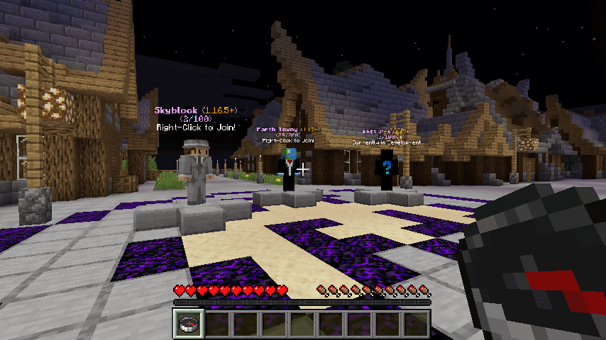
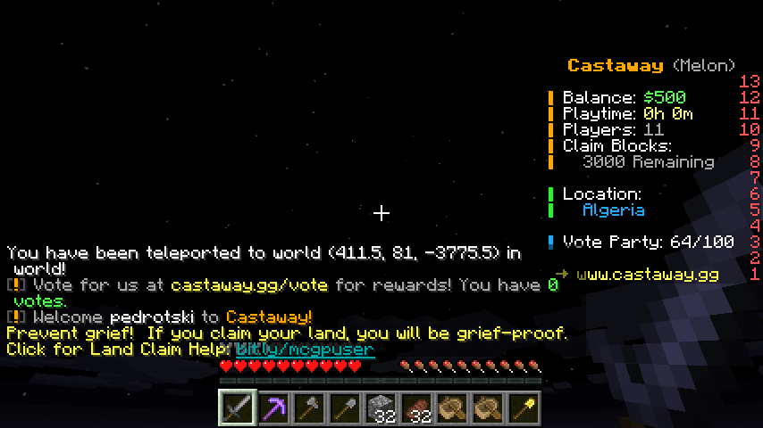
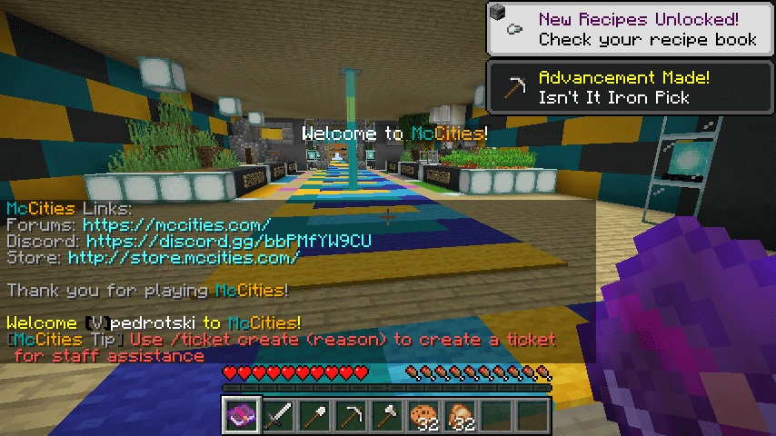
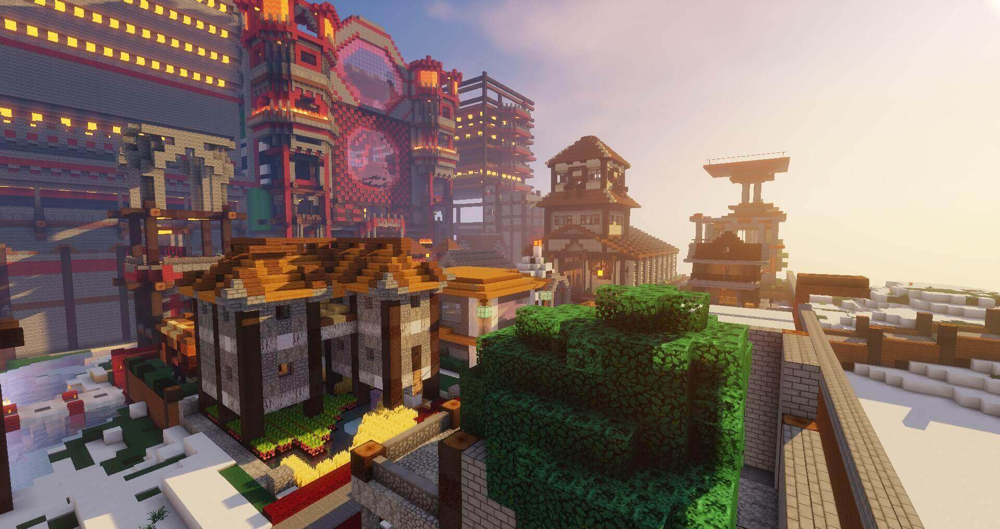
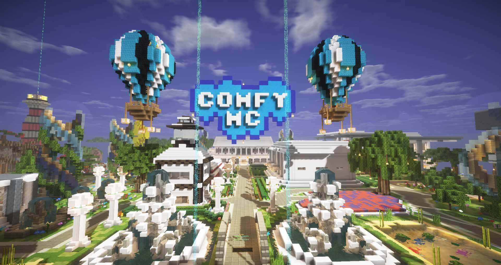
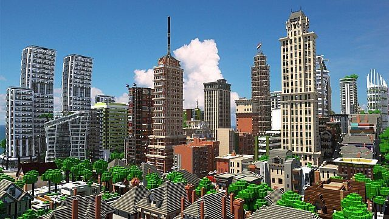

Do you spend hours on end building your own Minecraft city?

Building blocks, designing roads, making a perfect layout for the best-looking city in all of Minecraft?

Well, then I have some good news.

There are plenty of different servers out there that will not only give you an outlet to build your dream city but also provide other fun features so that you can enjoy it with others!

By the end of this post, you will have found the perfect city Minecraft server!

## 5 Best City Servers For Minecraft

When you are bored with the vanilla Minecraft game, playing on a City Server is the best way to have some fun and get a completely new experience.

These Minecraft servers are not only the place where you can build up wonderful cities but they also help you to experience City Life.

### 1\. Nebula (Previously EarthPol)

Nebula (Previously EarthPol MC) has been around for 10 years now, and it is one of the most popular and loved servers as well. This Minecraft server is always buzzing with activity making it a place that passionate gamers love to visit time and time again.

One of the best things about this server is that it offers you the chance to choose from thousands of premade buildings of numerous sizes and then place them in any location you want.

This server helps you get absolutely anything that you need to build for your properties, and it uses a simple point and clicks system that enables you to create a perfect structure and fill it with different custom items.

EarthPol [runs on the Bukkit platform](https://www.ghostcap.com/best-minecraft-bukkit-servers/), a popular modification for Minecraft servers and it has been developed by Minecraft players for Minecraft players. This is heaven for anyone who is looking for a highly customizable Minecraft Server with an old-school atmosphere.

- Play with friends and strangers on a classic server
- Build your own unique homes in any location you want
- Enjoy unlimited creativity with the building features it offers
- Become an influential person on Nebula

People love to play on this server because of its never-ending features, and this is why it is one of the most popular Minecraft City Servers of all time.

**Nebula City Server IP:** nebulamc.io

**Nebula Website:** https://nebulamc.io/

**Nebula Discord:** https://nebulamc.io/discord

### 2\. Castaway

Castaway is another Minecraft City Server that is full of exciting new features and is a server that you can think of if you are looking for a place to play Minecraft. This Minecraft city server offers you a set of never-ending worlds.

If you are looking for a game that gives you all the freedom to explore the world on your own terms, then you should give this server a go. This server has been around for a few years, however, it is one of the newer Minecraft City Servers on our list.

The best part about this server is that it is always entertaining its users to a great extent.

This Minecraft server gives its players complete freedom of play and building. It comes with great building areas alongside world-class urban development. If you are someone who loves to build, then this is one of the servers that you should definitely give a go.

This city server is one of the most highly customized servers that are packed with some very unique features that the developers of the game have come up with.

However, the good part is that if you don’t want to own land, then you can become a worker and get paid on a weekly basis.

Similarly, this server is also interconnected with some really good support and help that makes it easy for all players to go about making changes and setting up different structures in their cities.

- Explore the world of Minecraft in your own way
- You'll never wish you were somewhere else
- The server is always entertaining

A lot of people have enjoyed playing on this Minecraft server and they keep on doing it every single day. This is why Castaway has a great community revolving around city Minecraft

**Castaway City Server IP:** server.castaway.gg

**Castaway Website:** [https://castaway.gg/](https://castaway.gg/)

**Castaway Discord:** [https://castaway.gg/discord/](https://castaway.gg/discord/)

### 3\. McCities

McCities is a Minecraft server that is completely different from all the other servers out there. It is a City Server that has been developed by an enthusiastic team of Minecraft fans who are highly experienced in what they do.

If you are looking for a very friendly, safe, and fun atmosphere, then you should give this Minecraft server a go. This server gives you the freedom to do absolutely anything in a very flexible and fun way.

McCities has a large network of players who are always present to listen to your every request and try and make things better for you at all times.

It gives you the freedom to build up your cities as you like inside a beautiful world that has been entirely customized to suit the needs and demands of all its users. It has thousands of blocks that are available to you for you can use to build up your city.

[They also have RPG elements](https://www.ghostcap.com/best-minecraft-roleplay-servers/) that allow you to have jobs, vehicles, gangs, police, etc.

The server has everything in it that you would want to have, and it is always good to have a good time for yourself and for your family.

- Invest your time in a server that is safe and fun.
- Gives you the freedom to do anything
- Makes all requests feel heard
- Provides an interactive environment

Additionally, if you are looking for other players to help you build your city and make things better for yourself, then you definitely should start playing McCities.

**McCities City Server IP:** play.mccities.com

**McCities Website:** [https://mccities.com/](https://mccities.com/)

**McCities Discord:** [https://discord.gg/CH7RRNh2wj](https://discord.gg/CH7RRNh2wj)

### 4\. EcoCityCraft

EcoCityCraft is a Minecraft City Server where you can build and do whatever you want to do. If you are someone who loves to have an amazing time playing Minecraft, then you should definitely try out EcoCityCraft. This server is one of the most versatile City Server that exists in the market, and it has been created by a group of passionate and dedicated developers who want to bring complete fun and entertainment to all their users.

It has a huge set of different land plots that have been divided into different parts across the map. There are numerous types of road sections that have been set up by the players in their city, and they are utilized to travel from one city to another.

Some of the things that make this a great Minecraft server are the fact that it provides you with the chance to explore one of the biggest cities that is based on historical places.

It has a community of around 15000 other players, and it is always packed with enough activities and events that are going on throughout the world.

This server is always buzzing with activity, and it gives people a chance to have a great time.

### 5\. ComfyMC

ComfyMC is a Minecraft Server that has been created by a team of dedicated and passionate Minecraft fans who just love to play the game. This particular server is designed for those people who are looking for some amazing Minecraft City servers.

It is a server that gives you the freedom to build your cities and do whatever you want to do at any given time. This is a place that is packed with many exciting and interesting events that are always going on with plenty of people participating in them.

If you are someone who is looking for a city server that is packed with loads of great and unique features, then you should definitely give this one a try. This Steam City Server is one that you should definitely be talking about when you are planning to have fun.

## What Are Minecraft City Servers?

In simple words, City Minecraft servers are servers that have been designed to look like an actual city.

Basically, it is a Minecraft server where players can create a city by building various kinds of houses, mansions, and other structures, and then fill them with cool stuff that can serve as decorations. These servers can be accessed by a lot of players at the same time, and each of them can own a different part of the city, and then do whatever they want with it.

Some build luxurious mansions while others prefer building cute houses.

You will be provided with various types of buildings, roads, parks, shopping malls, various kinds of mines, as well as swimming pools. You get to build everything in a way that you like without having to worry about the different resources.

[https://www.youtube.com/watch?v=z4hmG-HojNc](https://www.youtube.com/watch?v=z4hmG-HojNc 'Play video "Minecraft TRS Ambersyell City Server Review (1/2)"')

Video can't be loaded because JavaScript is disabled: [Minecraft TRS Ambersyell City Server Review (1/2) (https://www.youtube.com/watch?v=z4hmG-HojNc)](https://www.youtube.com/watch?v=z4hmG-HojNc "Minecraft TRS Ambersyell City Server Review (1/2)")

Additionally, developers of these servers keep on adding new things to the game every once in a while, and this is how it keeps on getting better with every passing day.

Minecraft with all its enticing high-end graphics has become a global phenomenon, and it is one of the most popular video games today. Running on over 90 million copies worldwide, it has become a massive family where millions of players are related to each other by their love for the game.

If you are one of those people, then you should know that every massive family that consists of a few people, individuals who take things to a whole different level. Such individuals go a step further to make sure that every game takes place in an environment that is truly unique.

So if you are interested in Minecraft city servers, then you should know that they are the first libraries of Minecraft creative servers that everyone wishes to visit. These servers not only help you escape from your own boring world but also provide you with the ultimate playing experience.

## Conclusion:

City Servers for Minecraft is one of the highly enjoyable ways to play the game. Whether you play a normal single-player game or join a Minecraft server and play with others, there are so many things that you can do in the game.

If you didn't find what you like or we missed something, let us know about your favorite Minecraft multiplayer servers in the comments below.
