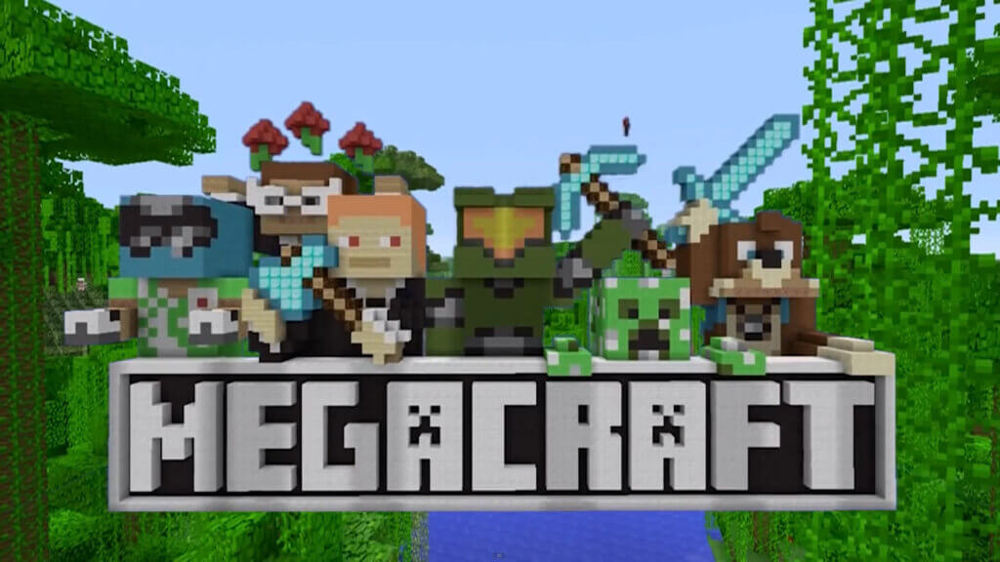
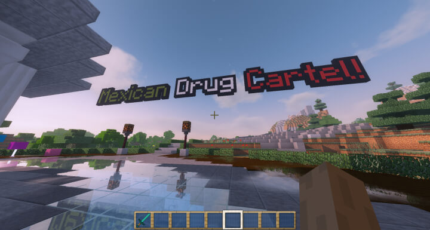
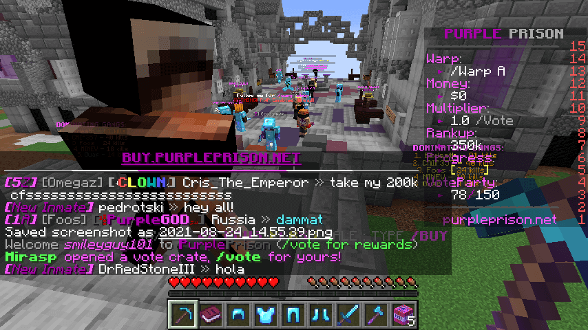
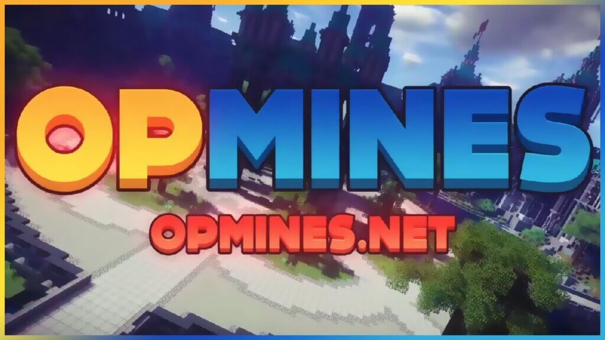

Minecraft Drug is probably one of those minigames that not many people know of, but it is certainly becoming increasingly popular.

As of right now, there are only a few servers that allow you to play this game mode without a custom Minecraft client. Fortunately, it includes all the best servers, where the speed is good and is populated by several hundred players.

The objective of drug Minecraft servers is to hide from the police while you engage in growing weed. Yes, we know it sounds illegal, but it is worth checking out if you haven’t played this game yet!

## 5 Best Minecraft Drug Servers

Do you like to get high on pixelated drugs? I’ve compiled a list of the best drug servers out there. So put on your favorite pair of headphones, blaze up a J and join the party!

### MegaCraft

**Server IP: mc.megacraft.org**

**Website: [https://megacraft.org/](https://megacraft.org/)**

MegaCraft is probably one of the best Minecraft servers, hands down, regardless of how you look at it. They have a growing number of players and a variety of mini-games, which include the Drug game mode.

We didn’t experience any glitches or even the occasional slowdown during our time playing the game.

That said, you can find it hard getting in when the server is busy, which tends to be anytime after 5 pm EST.

- No lag or glitches – perfect for an enjoyable experience
- Wide variety of mini-games to keep you entertained for hours on end
- Gets busy quickly, so there’s never a dull moment
- Fun and addicting – perfect for players of all ages

In addition, to Minecraft Drug, players are also treated to SkyWars, BedWars, Hunger Games, The Bridge, and Annihilation!

### Cartel Craft

**Server IP: play.cartel-craft.com**

Cartel Craft is an excellent Faction PVP Drug Minecraft Server. It allows players to build the biggest ever drug empire by progressing through the ranks to prove that they can operate the business.

However, you will want to ensure that your product isn’t wasted on trying it out yourself.

- Easily build the biggest drug empire on the server
- Progress through ranks to prove your skills and business acumen
- Grief, raid and steal to your heart's content for an edge over other players
- Collect heads of others as gruesome trophies
- Earn skill points for every block mined

Cartel Craft features griefing, raiding, and stealing. Players can also, sell drugs, and collect the heads of others as trophies after they are killed. It is also possible to create a faction, then raid other factions.

Speaking of which, you can also earn skill points for everything that’s mined.

### Purple Prison!

**Server IP: purpleprison.org**

**Website: [https://www.purpleprison.co/](https://www.purpleprison.co/)**

People who play Minecraft online are already familiar with Purple Prison. The server was voted Best Prison Server in 2015, and yes, they have been around for over five years! During that time it has become a popular Minecraft server with a big community.

- Join one of the oldest and most popular Minecraft prison servers
- Play on a server that has custom plugins and features
- Get rewarded with cool rank-up items for your time spent on the server
- Enjoy lots of randomly-generated loot

Even today, it has to be one of the best prison servers with custom plugins, lots of drop parties, custom rank-up rewards, and lots of randomly-generated loot.

As PP is an older Minecraft server, it also includes a custom built map and has translations for multiple languages. This is not typically something you see on a smaller Minecraft server.

### OpMines

**Server IP: opmines.net**

OpMines is one of the comparatively newer Minecraft Drug servers, but it isn’t ordinary in any way. The server has the highest quality builds, with players starting as A prisoner and then working through their ranks and eventual freedom.

- Highest quality server with amazing builds
- Lots of activities to keep players entertained
- Easy to get started, with a ranking system that is fair
- Perfect for people who want an exciting and unique Minecraft experience

Players can buy and sell items throughout the course of playing the game. In addition, there are PvP, Lotteries, Crates, Auctions, etc. In other words, there is something for everyone, which is why this server is well worth it in every way imaginable.

### NemeGaming Network

[https://www.youtube.com/watch?v=rszZpCmFzMM](https://www.youtube.com/watch?v=rszZpCmFzMM 'Play video "Minecraft Server Network - Noble Craft"')

Video can't be loaded because JavaScript is disabled: [Minecraft Server Network - Noble Craft (https://www.youtube.com/watch?v=rszZpCmFzMM)](https://www.youtube.com/watch?v=rszZpCmFzMM "Minecraft Server Network - Noble Craft")

**Server IP: play.nemegaming.com**

**Website: https://www.nemegaming.com/**

NemeGaming (Formally Noble Craft) is the collective name for a network of Minecraft servers, which have been around for close to over a decade. The server features Drugs in addition to many other game modes.

While there aren’t many players playing Minecraft Drug on the server in our experience, it does have a vibrant community that we advise you to join.

- A network of servers that have been around for over a decade
- Minecraft Drug server with a vibrant and active community
- Wide variety of games, including Minecraft Drug, to play on the server
- Fun and engaging game modes for players of all ages

In addition to Minecraft Drug, there are also SkyWars, BedWars, Hunger Games, etc.

## What Is A Minecraft Drug Server?

[https://www.youtube.com/watch?v=O5i7CuFwRoM](https://www.youtube.com/watch?v=O5i7CuFwRoM 'Play video "Drugs In Minecraft (Drug Factions)"')

Video can't be loaded because JavaScript is disabled: [Drugs In Minecraft (Drug Factions) (https://www.youtube.com/watch?v=O5i7CuFwRoM)](https://www.youtube.com/watch?v=O5i7CuFwRoM "Drugs In Minecraft (Drug Factions)")

Minecraft drug servers are multiplayer servers that allow players to grow and trade illegal drugs. These servers typically have different areas for different drugs, and players can use their drug money to purchase other items from other players.

Some Minecraft drug servers also have minigames, such as drug wars, in which players can compete against each other to see who can grow the most drugs.

Drug servers are generally frowned upon by the Minecraft community, as they promote illegal activities. However, some people find them fun and entertaining, and they provide a unique challenge for those who enjoy playing Minecraft.

## Conclusion

So, there you have our list. Our top five Minecraft drug servers. We hope that you found this Minecraft server list helpful and that you enjoy your time on these servers.

Be sure to let us know in the comments below which server is your favorite and whether or not we missed any of your favorites. Happy gaming!
