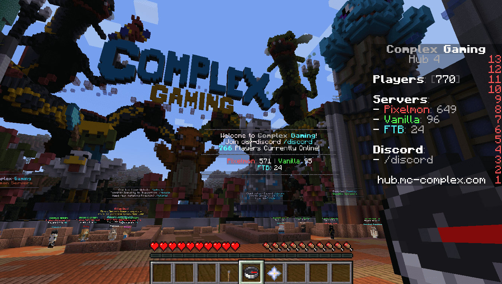

Minecraft is a game that we all know and love.

However, what if there was more to the game than just playing it?

Feed The Beast servers are some of the best Minecraft servers out there for those who want to play with other people on the same level as them.

These servers offer many different types of gameplay like [Skyblock](https://www.ghostcap.com/best-minecraft-skyblock-servers/) or Prison worlds where you can work your way up from nothing!

So, what are you waiting for? Give these 5 Feed The Beast servers a try today!

## 5 Best Feed The Beast Servers For Minecraft

If you are looking for Feed The Beast servers, then here is our list of the most popular ones. This list is based on the user's feedback, and the items mentioned here are those that have been proven to be of high quality.

Blacklisted Feed The Beast servers shall not be mentioned here. And as far as the criteria for judging the best servers go, we are going to base them on the quality of gameplay and the number of players on the server. So, here are the 5 best Feed The Beast servers for Minecraft.

### 1\. Complex Gaming

The Complex Gaming Feed The Beast server allows clans, so that as a clan you will be allowed to enjoy all the premium features, otherwise not allowed in regular servers.

With the one vote per day system, you will get premium status by voting once per day, so that you are able to participate in the in-game events and gain the right to enjoy the in-game features.

Basically, it allows you to go berserk on the maps available, build secret rooms in your homes, or even deploy minecart tracks in order to make your homes even more interesting.

- Have access to the Feed The Beast map
- Enjoy in-game events that are not available on normal servers
- Ability to go berserk on maps with friends

To gain access to this server, you can apply through the forum or the site.

**Complex Gaming Feed The Beast Server IP:** hub.mc-complex.com

**Complex Gaming Website:** [https://www.mc-complex.com/](https://www.mc-complex.com/)

**Complex Gaming Discord:** [https://discord.gg/sWmr34m](https://discord.gg/sWmr34m)

### 2\. DirtCraft Pixelmon

DirtCraft is one of the best Feed The Beast servers, which is completely free to play and has something new to offer every day. It is an amazing server, which comes with an excellent staff who are always there to help you out and make sure that you are having the best possible time on the server.

Based on [Pixelmon Reforged](https://www.pixelmonmod.com/), the server is loaded with a variety of mods that have been designed to make the gameplay more interesting.

This Feed The Beast server is a great way to enjoy the gameplay and enjoy the variety of maps available.

- A free to play Minecraft server with something new every day
- Built on top of Pixelmon Reforged, packed with mods and high-quality staff that can help
- Customize your world to have a balanced experience

The server offers a wide range of modes, including those with fewer rules such as Creative, Hardcore, and Skyblock. This server can be easily joined by anyone in the world, especially those in North America.

**DirtCraft Pixelmon Feed The Beast Server IP:** pixelmon.gg

**DirtCraft Pixelmon Website:** https://dirtcraft.net/

**DirtCraft Pixelmon Discord:** [https://discord.com/invite/PfX5tjVq](https://discord.com/invite/PfX5tjVq)

### 3\. ApocGaming.org

This server gives you the best possible experience that you can have playing Minecraft.

The Feed The Beast server is fully equipped with all the fine-tuning customizations and the mods pre-installed as well as detailed information about them. You can easily go in-game and get your mods, if you don't find your mod or texture in the list, then you can request it through the website and the devs will try their best to add the missing resources within a day.

All the new Feed The Beast Mods are always added to the server with the help of voting so that the server owner is able to keep his server up-to-date with the best possible mods available. The server also offers an amazing and entertaining PvP system, which can be seen through the GriefPrevention plugin.

Also, for the best possible experience, the Feed The Beast server also allows mods like Optifine, Rei's Minimap, Mo' Creatures, Corail Radar, NetherPortals, Death Chest, LibsDisguises, Xaero's Minimap, and so on.

### 4\. Craftersland.net

This Feed The Beast Minecraft server is completely free to play with no whitelist and is also included in the Feed The Beast's Master Servers List. It provides the best possible experience to all its users and is a great source of entertainment for those who are addicted to the game. It offers free mod storage, an efficient and easy-to-use website, and is always up-to-date within 24 hours.

The server has a highly dedicated staff as well as the most valuable players. All the players can look forward to a great time and a ton of fun, even when using the server's Vanilla features. Basically, Craftersland allows you to use the Feed The Beast and if you are going to use it, then you will be able to ensure the best possible experience for you.

### 5\. topstrix.net

This is the best Feed The Beast server available, and also has many add-ons including the Better Sprinting Mod, which helps in controlling the fatigue and allows you to run faster.

This server is brilliant and offers a lot of entertainment to the players. To play on this server, you just need to create a free account and then download the Feed The Beast Launcher. There are a lot of premium and free mods that are available to use on this server, with a wide variety of different modes including the Feed The Beast, Tekkit, and FTB Ultimate.

The server offers a single [MineZ](https://www.ghostcap.com/best-minecraft-minez-servers/) map, which is completely free to play. All in all, this server offers a great experience to the players, and helps them have a great time playing this awesome game.

It features automated tournaments which are a great place for the players to show-off their skills and win some amazing prizes. It also has a great and friendly community and is a great place to make new friends and to play with them again and again.

## What Are Minecraft Feed The Beast Servers?

Feed The Beast is by far one of the best Minecraft add-ons, and has garnered a massive popularity for itself and among the millions of Minecraft users. And one of the main reasons for its massive popularity is that its Mod Pack can benefit almost every user.

This is a comprehensive package that can add different kinds of mods to Minecraft, and even tell the user when new updates are available. And if you are a fan of Minecraft, and are in need of something really new and interesting only available in Minecraft, Feed The Beast is definitely the best answer.

Above all, Feed The Beast servers are great in terms of gameplay and fun. Because of the different kinds of mods, maps and even weapons in the package, you are bound to enjoy your Minecraft even more than before.

Also, if you are a Feed The Beast server owner, then you can directly add the Minecraft servers to the site and have your modded Minecraft server online, the same day.

Minecraft in recent years through continued development and addition of new features have been gaining popularity among not only children but also older people, proving that this game is not limited to any particular age group.

Enriched with a thrilling story and a plethora of biomes, it has become a global phenomenon. However, as we have stated earlier, even a video game of this quality needs a lot of support, especially from those devoted fans who can make the game more fun and interesting with their contribution.

And one of the things that Minecraft servers need the most is a popular mod, which is Feed The Beast. In a short amount of time, it has evolved exponentially and has given rise to a vast variety of Minecraft Feed The Beast Servers.

Fun, well-developed and loaded with unmatched power and features, these servers, as evident by their name, are inspired by the ever-increasing popularity of the Feed The Beast mod. They too are full of life, offer you a unique platform to play on, and give you the most interesting and thrilling experience you can ever have.

## Conclusion

When gaming, users tend to want something new and exciting and Feed The Beast servers are the perfect platform to exact that need. These servers, especially MC-Complex have caught the hearts and minds of many people, keeping them occupied with their new experiences and making them forget all about time.

Because of the unique gameplay and features, the Feed The Beast servers have garnered immense reputation and popularity within a short period of time. And there is a reason why people keep coming back to these servers.

You will get to know more about this, when you actually get your hands on the server. There are so many things that you can gain access to when you use these servers and one such perk is voting points.

With these amazing points that you can earn, you will also be able to get yourself the best in-game skins, and also decorate your own Minecraft house.

Also, these servers have an amazing community, which you can join as a new player, and interact with the players to get acquainted with the game and enjoy playing Minecraft online.

So, use these servers and have the best possible time playing with them!
