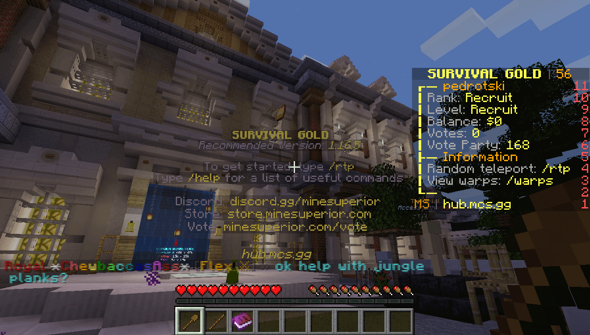
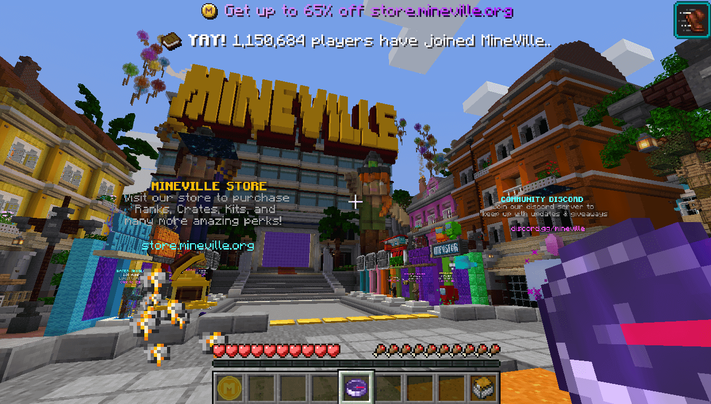
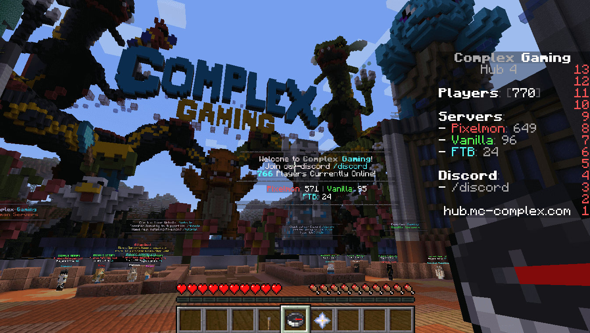
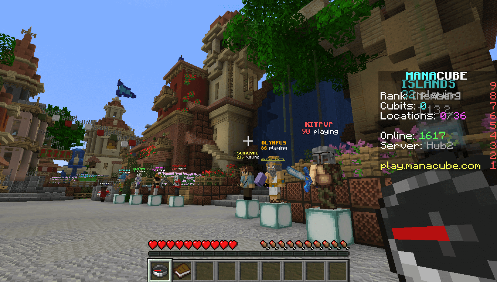
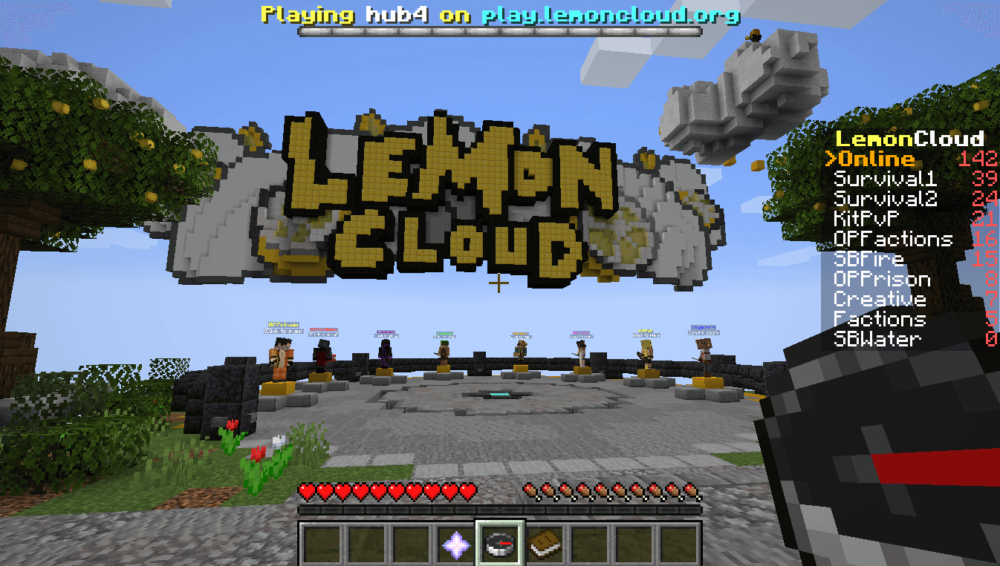

import { Image } from "astro:assets";

import __Minecraft_Starter_Survival_Base_png from "./Minecraft-Starter-Survival-Base.png";
import __Minecraft_Survival_Base_Finished_png from "./Minecraft-Survival-Base-Finished.png";

What's your favorite part about Minecraft?

The building blocks, the animals, or the mobs that want to kill you?

If you're like me then it's either all of them or none of them.

I love this game but if I'm being honest with myself there are some parts that really do not appeal to me.

One thing, in particular, is a survival mode where players have to mine for resources and fight off monsters while trying to stay alive as long as possible.

Now a lot of people might be thinking "so what?"

Well "so what" is actually why I think you should try out one of these best Minecraft Survival Servers instead!

## 5 Best Minecraft Survival Servers

Playing Minecraft alone can get boring, but with a survival server, you have the opportunity to work together or go it solo while building your own home and defending yourself against zombies.

Wonder how this game could be more fun? Well here are some of the best Minecraft servers that make playing even better!

Here is the GhostCap Gaming list of the best Minecraft survival servers.

### 1\. MineSuperior

MineSuperior is part of the next generation of Minecraft server setups. Designed to be for players, always constantly adding new ideas, designed to be transparent and accessible by all!

MineSuperior features Factions with Skyblock and Survival modes.

It also has Towny which enables you to create your own town or city where other users can visit if they want a change in scenery from their current spawn point, Prison (if that's what interests you), Creative mode so everyone can have fun creating whatever it is they're interested in building- even KitPVP where every player gets a kit at random before going into battle against each other!

MineSuperior actually has 3 different survival servers you can choose from, Emerald, Diamond, and Gold. I was however not able to find what the difference in these servers is.

**Each survival server includes:**

- Claims
- Economy
- Jobs
- Quests
- Achievements
- Player warps

MineSuperior tops our list because it's made by gamers, for gamers. It's not made by people who are simply trying to make money. Our only suggestion for improvement is to their website. It was very hard to find the MineSuperior IP address and port and we had to go to a 3rd party site.

Luckily, we have included the details for you below.

**MineSuperior IP Address:** server.mcs.gg

**Website:** https://minesuperior.com/

**Discord:** [https://discord.gg/minesuperior](https://discord.gg/minesuperior)

### 2\. MineVille

MineVille is a Minecraft: Java Edition network that provides players with captivating and unique gameplay experiences.

Mineville (formerly InPVP) has the highest player count for Bedrock in history, 27,123 as of 2019

MineVille is also a roleplaying server but lets you play minigames at their "space station" lobby if you want to switch things up.

Owned by MobCrush, an entertainment company best known for its streaming app on mobile devices, Mineville offers two sister servers on other platforms like SaicoPvP or The Legend Craft--a popular Italian Server!

- Network of Minecraft servers with one of the highest player count
- Play Survival in a unique way while still playing other modes at your leisure
- Wide variety of sister servers on other platforms to play on!
- Lots of content to choose from

The stand-out feature for this Survival server is the quality of the mods, resource packs and world builds. These all come together to form an amazing experience

**MineVilleIP Address:** join.mineville.org

**Website:** https://mineville.org/

**Discord:** [https://discord.gg/mineville](https://discord.gg/mineville)

### 3\. Complex Gaming

Complex Gaming is a host of the most popular and newest Minecraft servers.

They offer many different game modes on their network that will keep you entertained for hours upon end.

When searching through their extensive selection, they have something to suit your play style no matter what it may be - whether it's finding treasure in [Skyblock](https://www.ghostcap.com/best-minecraft-skyblock-servers/) or building with friends on creative mode!

**Complex Gaming Minecraft servers include:**

- Factions
- Survival
- Prison
- Creative
- Skyblock

Complex Gaming provides players with an outstanding gaming experience from world exploration to combat between factions; they've got everything covered and more!

One thing that I LOVED about Complex Gaming is its tutorial system. Once you enter a world you are greeted by a villager who will show you exactly what to do. This made it an especially nice touch in a game where it can be overwhelming for a new player.

This tutorial feature is what earned Complex Gaming a spot on our list for the best Minecraft Survival servers!

**Complex Gaming IP Address:** hub.mc-complex.com

**Website:** [https://www.mc-complex.com/](https://www.mc-complex.com/)

**Discord:** [https://discord.gg/sWmr34m](https://discord.gg/sWmr34m)

### 4\. Manacube

ManaCube is a premium Minecraft network with a range of exciting game modes.

You can jump around in Parkour, solve puzzles and explore the world as an artist-in-residence or just have some fun creating your very own content.

If you want to get competitive then try out [P](https://www.ghostcap.com/best-minecraft-pvp-servers/)[vP](https://www.ghostcap.com/best-minecraft-pvp-servers/) where players use their skills to kill others and earn points for team rankings!

Want something more laidback?

Join one of their SkyBlock parties hosted every Friday night at 8pm EST/5pm PST so that you don't die from hunger while trying not to starve yourself on these gorgeous islands full of farms waiting for harvest!

- Relaxing and social experience
- Join a community of people on the new age Minecraft network
- Create content for your own pleasure or for others to enjoy
- Keep up with trends in Minecraft

Feeling tired already? Check out ManaCube's Prison server which features plenty of jail cells and prisoner jobs such as laundry duty, making food, and more.

Something that stood out about ManaCubes survival server is the ability to earn Flying Time.

This was something I had not seen on any other server before. This makes it a good way to go and claim land that is far away from everyone else. Making your survival experience more exciting!

**ManaCube IP Address:** join.manacube.net

**Website:** [https://manacube.com/](https://manacube.com/)

**Discord:** [https://discord.gg/manacube](https://discord.gg/manacube)

### 5\. LemonCloud

LemonCloud is almost like a playground for you to enjoy getting to know the basics of the game. You and your friends can create houses, castles, towers, and anything else that you desire.

You can trap monsters, tame them, fight them, steal them, and even befriend them.

So get on this server, meet the people and your friends that you like the most, and have a great time getting to know the basics of the game, and try out some of the advanced features like using armor, weapons, and swords.

- Provides a safe, welcoming space for beginners
- Makes the basics of playing Minecraft easy and fun
- Gives new players an opportunity to learn and grow while still having fun in this environment
- Fosters cooperation between friends in a collaborative way with their own space to explore together

LemonCloud actually has 2 Survival Servers. The difference being is one is normal terrain, and the other is custom terrain.

On this survival server, they allow you to toggle PVP on or off. So you can play casually or hardcore with people in the same world!

**LemonCloud IP Address:** one.lemoncloud.net

**Website:** [https://lemoncloud.org/](https://lemoncloud.org/)

**Discord:** [https://discord.gg/lemoncloud](https://discord.gg/lemoncloud)

## What Is Minecraft Survival?

Minecraft Survival mode is the classic way of playing Minecraft, and one of the coolest ways to play.

In Minecraft survival, you start off with nothing but your 2 bare hands, and you have to take resources from the environment (such as trees, rocks, etc), craft them into tools (and weapons!), then use those tools for various purposes.

You then need to defend yourself against the hostile mobs (creeps, spiders, and zombies), find food, make a shelter to protect you from the monsters at night.

On Minecraft survival servers, you can either play alone or with others people, of any group size too!

- Build, explore and fight your way across a variety of small, medium or large scale maps
- Form alliances with other players to be safe during the night
- Make friends from all over the world

## Tips for playing Minecraft Survival mode

The best base you can build to **start off in Minecraft is a 4x4 or Cliffside base**. What this does is give you a lot of space to work with and isn't too difficult to build, either!

As for tools, it's best to get a **full set of stone tools before iron.**

What this does is make sure you have access to all the tools in Minecraft if for some reason your iron gets destroyed or lost.

**I build my starter bases like this:**

<Image
  decoding="async"
  width="1920"
  height="1080"
  alt="Minecraft Starter Survival Base"
  sizes="(max-width: 1920px) 100vw, 1920px"
  src={__Minecraft_Starter_Survival_Base_png}
  widths={[1920, 768, 1536]}
/>

- A workbench where I can craft stone tools and blocks.
- Enough room to store my items, such as a chest or two chests with the crafting table on one side of them. What this does is keep me from losing everything while working on something else!
- Storage for food so that if I need to eat

I would normally **build on a plain biome where I can see everything**. What this does is provide a lot of space to work with and not have it be too difficult.

**Later on,** **the base would look like this:**

<Image
  decoding="async"
  width="1920"
  height="1080"
  alt="Minecraft Survival Base Finished"
  sizes="(max-width: 1920px) 100vw, 1920px"
  src={__Minecraft_Survival_Base_Finished_png}
  widths={[1920, 768, 1536]}
/>

This makes it harder for creeps to come in when its night time. It also is WAY cheaper to create as you are not building walls or a roof.

If you have some more tips that I could add, leave a comment below or on [our Discord.](https://discord.ghostcap.com/)

## What is SMP in Minecraft (Survival Multiplayer)?

SMP, meaning Survival Multiplayer, is just an abbreviation for a multiplayer Minecraft server.

Most of the time when people refer to survival servers, they are talking about SINGLE PLAYER servers. SMP is multiplayer.

## Conclusion: Best Minecraft Survival Servers

With a wealth of options for every type and skill level, there is no reason to settle on an inferior Minecraft Survival server.

For those who want the best out of their game time, you can always take advantage of our best Minecraft Survival servers or even make your own list.

What's more exciting is that this gameplay style has become one of the most popular ways people now play!

It provides hours upon hours worth in excitement with challenges galore guaranteed to give all players something new each day they log into it.
