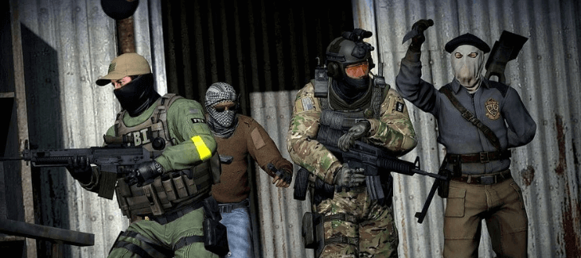
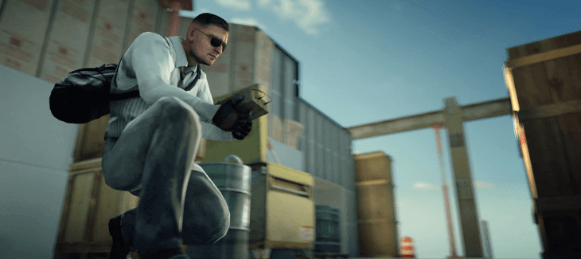
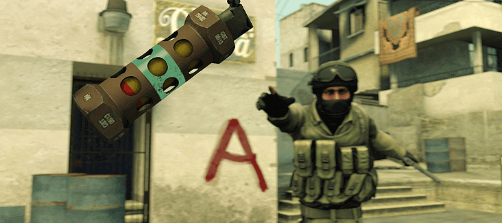

import { Image } from "astro:assets";

import __CSGO_Deathmatch_Server_png from "./CSGO-Deathmatch-Server.png";
import __Warmup_Server_png from "./Warmup-Server.png";
import __Cybershoke_CSGO_Deathmatch_png from "./Cybershoke-CSGO-Deathmatch.png";

What are the best CS GO deathmatch servers?

The answer to this question is not as straightforward as you might think.

Consider these questions:

- What kind of player are you?
- Do you want a server with active players or one that has fewer people but more guns and grenades?
- Are there any specific maps that you're interested in playing on, like de_dust2 or cs_italy?

We've compiled a list of what we think are some of the best CSGO deathmatch servers for all types of gamers.

Read on to see if we find your perfect match!

## 6 Best CS GO Deathmatch Servers

Here are a few of the best CS GO deathmatch servers that we think you should check out.

### 1\. Aim Monster

Aim Monster is an up-and-coming competitive server network for the hardcore CSGO player. Right now they are currently in beta but have some custom plugins to bring an extremely polished warmup experience to gamers.

When the server is empty, they have custom AI bots that act like real plays, they peak, crouch, jump, and flick shot you. It's a real challenge!

They currently only have 1 warmup server but once the config is done with this server, they will be expanding to USA, Europe, Asia, and Australia.

Another perk is they plan to give away real-life rewards such as mech, hardware, etc just for playing on their servers and winning seasons.

- Unique experience with polished plugins
- A safe and friendly atmosphere for less toxic players
- Aim Monster staff are flexible, kind, and always available to help!
- Aim Monster will be free-to-play when it launches so sign up now!

One thing to keep in mind is the server is beta. So their ranking system is not 100% right now, but it also means you can join their Discord and give feedback about your experience to make it better.

Aim Monster is worth a try today!

**Aim Monster Warmup Server IP:** 45.88.228.29:27015 [(click to connect)](steam://connect/45.88.228.29:27015/)

### 2\. GhostCap Gaming

<a href="https://www.ghostcap.com/wp-content/uploads/2021/01/CSGO-Deathmatch-Server.png">
  <Image
    decoding="async"
    width="730"
    height="325"
    alt="CSGO Deathmatch Server"
    sizes="(max-width: 730px) 100vw, 730px"
    src={__CSGO_Deathmatch_Server_png}
    widths={[730, 300]}
  />
</a>

GhostCap is a PVP-orientated server that enforces non-stop action on all maps with evolving spawns. The only server with a Multishop that can carry what you earn in-game over to all of the other GhostCap servers around the world.

No one joins a deathmatch server to shift walk around the map and waste time reloading. After each kill, you are given a fresh magazine to continue your streak.

Supporting both the casual and hardcore player it offers the ability to use any gun in the game along with a large variety of free-to-use skins.

Hitting a maximum of 28 real players on the server is non-stop action, exactly what you need to get warmed up for a ranked game.

**Server Features**

- Brutal custom AI when the server has low pop
- Strong Anti-Cheat
- Multiserver shop
- No Pay to Win incentives
- Custom knives, models, gloves, and dances
- Custom weapon skins
- 99.9% server uptime
- Active admins
- Strong community support

[**CLICK TO JOIN NOW!**](steam://connect/45.88.228.29:27015/)

[**JOIN DISCORD**](https://discord.gg/qNUcjkj7QY)

**GhostCap CS GO Deathmatch Server IP's:**

**Europe:** 95.214.180.58:27015 [(click to connect)](steam://connect/95.214.180.58:27015/)

**ASIA:** 15.235.181.104:27020 [(click to connect)](steam://connect/15.235.181.104:27020/)

**GhostCap Gaming Website:** [https://www.ghostcap.com/](https://www.ghostcap.com/)

**GhostCap Gaming Discord:** [https://discord.ghostcap.com/](https://discord.ghostcap.com/)

### 3\. Warmupserver

<a href="https://www.ghostcap.com/wp-content/uploads/2021/01/Warmup-Server.png">
  <Image
    decoding="async"
    width="730"
    height="325"
    alt="Warmup Server"
    sizes="(max-width: 730px) 100vw, 730px"
    src={__Warmup_Server_png}
    widths={[730, 300]}
  />
</a>

There is little that we can say about the Warmupserver that we haven't already mentioned. This CS GO deathmatch server is insanely fun, and crazy quick-paced.

It is mostly played by casual players, but pros can totally give this a shot too. You can find both public and private rooms on this site, it mostly depends on the number of players you want to play with.

The private rooms tend to have fewer players, but they do not hamper the overall experience. Users are given different stats based on their performance, and it's an overall great site to be on.

- A pulse-pounding deathmatch CS GO server
- Great for boosting your reflexes and skillset
- Become an expert by playing this game long after you retire from the competitive scene
- Have a ton of fun, so what are you waiting for?

**WarmupServer CS GO Deathmatch Server IP:** 74.63.211.6:27015

**WarmupServer Website:** [https://www.warmupserver.net/](https://www.warmupserver.net/)

**WarmupServer Discord:** N/A

### 4\. Cybershoke

<a href="https://www.ghostcap.com/wp-content/uploads/2021/01/Cybershoke-CSGO-Deathmatch.png">
  <Image
    decoding="async"
    width="730"
    height="325"
    alt="Cybershoke CSGO Deathmatch"
    sizes="(max-width: 730px) 100vw, 730px"
    src={__Cybershoke_CSGO_Deathmatch_png}
    widths={[730, 300]}
  />
</a>

This is where things get a little more serious.

But it does not mean that it is impossible to play here if you are a beginner. The Cybershoke CS GO Deathmatch server is considered a professional-friendly site, where anyone can watch professionals battling ferociously.

Gameplays on this site are lightning-fast, and you can always expect a thrilling experience. The Cybershoke is one of the most trusted CS GO deathmatch servers out there and it should really not be missed out on.

- Improve your game-play skills with a professional website
- Lighting fast gameplays for an intense experience
- Unmatched CSGO Deathmatch service that is truly worth the time and money

**Cybershoke CS GO Deathmatch Server IP:** 116.202.241.15:27047

**Cybershoke Website:** [https://cybershoke.net/](https://cybershoke.net/)

**Cybershoke Discord:** N/A

### 5\. BrutalCS

BrutalCS started out with a server in an old, dusty closet back in 2004.

They were nervous and shy when they first opened for business but soon found themselves surrounded by tons of new friends from around the world who loved playing Counter-Strike together!

BrutalCS focuses on game modes such as DM FFA, KZ Climb, Retakes, Executes, Duels, Aim, and much more.

16 years later, BrutalCS is now hosting 60+ CS:GO community servers from various data centers across Europe that are visited by thousands of players every day thanks to their amazing servers.

- Millions of players from around the world play on their servers
- Hosts 60+ CS:GO community servers in various data centers across Europe
- Play with your friends or find new ones!
- Stable and secure hosting environment

**BrutalCS CS GO Deathmatch Server IP:** 51.195.238.192:27015

**BrutalCS Website:** [https://www.brutalcs.nu/](https://www.brutalcs.nu/)

**BrutalCS Discord:** [https://discordapp.com/invite/0t3nC40NI357kUOZ](https://discordapp.com/invite/0t3nC40NI357kUOZ)

### 6\. Tarik.gg

If you are looking for an insanely good CS GO deathmatch server, Tarik is your best bet. This CS GO deathmatch server is full of newbies, and pro players both.

People go here to socialize and talk, and it provides a very welcoming environment for anyone. The server has excellent stat tracking, so expect to get a smooth gaming experience. It is a CS GO deathmatch server you wouldn't want to miss out on.

- Play on a competitive and skilled CS GO deathmatch server
- A highly social and welcoming environment for people of all skill levels
- Excellent stat tracking will provide a smooth gaming experience
- Competitive pricing displayed on the website

**Traik CS GO Deathmatch Server IP:** dm5.tarik.gg:27015

**Tarik.gg Website:** https://www.tarik.gg/

**Tarik.gg Discord:** https://www.tarik.gg/discord

Before you make any decision, go through the list once again, and ensure you know which one to go with. All of the servers are worth it, and you should have no problem finding the one that suits you the best.

Yes, you may need to first get yourself acquainted with the game, but once you do, once you start interacting with other players, and playing it regularly, it will be a real treat.

The CS GO deathmatch servers will keep you entertained for hours, so be sure to give them a shot.

## What Is A CS GO Deathmatch Server?

As mentioned earlier, a deathmatch server or DM server is a game mode where individuals fight against each other. This is done in a highly competitive environment, where two teams try to out-smart their opponents in terms of tactics, strategy, and skills.

It is somewhat similar to the competitive mode in terms of objectives, except the mode is a lot quicker, and not as complicated.

How It Works:

To blow out a brain, simply head over to these websites and choose the server you would like to play on. You should ensure you register your account before trying to use the server, this is to ensure you get credits. You earn credits by winning rounds that are fortunately enough it is free.

The credits can be used to purchase skins, or if you lose them all, the match will be over. The basic mechanics of the deathmatch server include weapon and health spawns, all of which depend on the server settings.

This means that certain weapon/health/armor spawns might not be available on a server, but that does not mean the server is bad. It is all about giving users a choice in the matter.

CS GO has captured the hearts of millions of people around the globe. As a matter of fact, statistics reveal that around 20 million people have experienced the thrill of this game.

Whether people are playing it for fun, or for professional, competitive purposes, it does not consume a lot of their time. Its in-between capabilities of allowing strategic planning and individual approach gives players a choice to engage in what they want to. It is this style of play that popularised CS GO Deathmatch Servers.

Gamers can choose to maintain their own game servers to offer their friends and other people, or they can get it hosted on different servers to play against other gamers.

This mode is referred to as Deathmatches. The gameplay of this game mode is extremely fast-paced and more challenging.

But once you get the hang of it, it's pure fun. Below is a more detailed overview of what a deathmatch server is, how it works and why you should consider getting one.

## Conclusion

While these are incredibly good CS GO Deathmatch servers, there are a ton of options out there for you to choose from.

All of them are fantastic, and you cannot go wrong with any of them, but these are the 5 that have been making the most noise in the community.

You are in safe hands whichever service you choose to go with, so start doing that now and get the game started.

Are warmup servers too crazy for you? Would you prefer to focus on your aim? Then check out the [best 1v1 CS GO servers](https://www.ghostcap.com/cs-go-1v1-servers/) instead.
