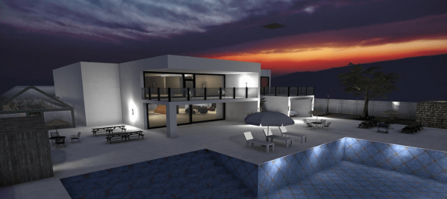
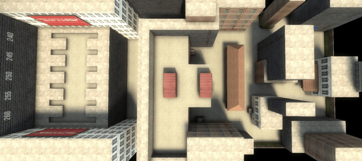
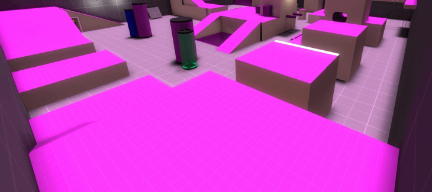

Hide and Seek is a game of.. well hide and seek.

It sounds simple enough, but there's more to it than meets the eye.

The person who is "it" typically has to find all the other people who are "hiding."

In CS GO Hide and Seek servers, they have some extra rules that make this challenging: you can't just shoot your way in!

That would be too easy. You have to use grenades as well as other weapons like the knife or even fists if necessary.

Be careful though, If you're hiding with your friends, don't let them see you because then they'll blow you up!

## 3 Best CS GO Hide and Seek Servers

CS:GO Hide and Seek Servers are a great way to have some fun with your friends in the game and relive those fun times from Counter Strike 1.6.

You can play hide-and-seek (HnS) on any map that has enough space for hiding spots or go around playing tag like they did back when we were kids.

Here is our picks for the top CS GO Hide and Seek servers.

### 1\. Edan.gg

The motto of Edan's Community is Quality + Quantity. They have a strong focus on creating an enjoyable community for the many gamemodes in CS:GO with unrivaled efficiency and speed to ensure that your experience there will be fair, fun, and memorable!

In the world of Edan.gg, a terrorist's arsenal is more than just guns and bombs - it includes some unconventional weapons as well!

One such weapon in their hands are "frostnades" which can freeze enemies for 3 seconds if they're running after you while attempting to catch you.

What puts Edan.gg at the top of our list is their strong anti-cheat system, Defender.

With newly written detection methods, Defender breaks cheats at its finest. Keeping you protected from the most recent threats in 2018 and continuing to do so today!

With over 35 bans a day and 13 thousand+ overall bans, it is clear that their work has paid off with an excellent 90% VAC/OW ban rate for those who are looking for extra protection against hackers.

**Edan.gg Hide and Seek Server IP:** hns.edan.gg

**Edan.gg Website:** [https://edan.gg/](https://edan.gg/)

**Edan.gg Discord:** [https://discord.edan.gg/](https://discord.edan.gg/)

### 2\. USP.ro

USP or UnderSurfaceProject is an adaption of CS HnS servers. It is a very well-known hide and seek server with this mode. You get to play many different maps and this server also has a strong anti-cheat system to ensure a fair play.

USP.ro has a highly active Forum where you can get support for all aspects of their server, complain about unfair admins, discuss CS Go and more.

With around 20 people playing HnS each night, this is a server you must check out.

**USP.ro Hide and Seek Server IP:** hns.usp.ro

**USP.ro Website:** [https://usp.ro/forum/](https://usp.ro/forum/)

**USP.ro Discord:** [https://link.usp.ro/discord_usp](https://link.usp.ro/discord_usp)

### 3\. Efrag.eu

Efrag Community, also known as efrag.eu, is a professional and fair community for CS:GO with the goal of being high quality at scale so that all players can feel welcome to enter this group.

Efrag strives not only to be top-of-the line but provide an environment where there are many different CS GO types of games you may enjoy playing in order for everyone's needs to have their place on our servers!

**Efrag.eu Hide and Seek Server IP:** 85.10.200.100:27015

**Efrag.eu Website:** [https://efrag.eu/](https://efrag.eu/)

**Efrag.eu Discord:** [https://discord.gg/xe3TMUd](https://discord.gg/xe3TMUd)

## What Is A CS GO HnS Server?

Hide and Seek or as it is more popularly called, One in the Chamber is quite a popular mode in CS GO. But unfortunately, the mode that has been casted in the pre-set scenario in the original game, does not include all the features this mode has to offer.

In the pre-set scenario of CS GO, the game includes 10 players out of which 6 are terrorists, and the rest are counter-terrorists. In order to make the game more interesting, the server has been modified to include more players and the maximum number is 15.

The game eliminates players one by one until there is just one player left. The one player left remaining becomes the winner, or until all the terrorists are killed. There are different servers available with different rules and different ways to play it. These servers offer different maps which have different options, and you can choose the one you like.

For example, you might want to choose one that lets you play without buying weapons. So, you have an option to not buy weapons. Another one might allow you to buy extra weapons. If you are truly a fan of this genre, then try playing it in CSGO.

Not only are the options incredible, you also get to practice aiming skills while displaying quick reflexes, and if you are lucky you might also come out as a winner.

With its implementation of cool features and abilities, CS GO has seen remarkable success. It has become one of the most popular action games out in the market (Now free to play).

With millions of players around the world, the game has earned it headlines and made it to the list of must-have games on steam However, as great as it may seem, CS GO has its limitations. Such limitations were then dealt with by offering players customizable community servers. As such, CS GO Hide and Seek Servers were born.

The pre-set length of maps or game modes might be overwhelming at times. And sometimes there might not be enough variety in maps and modes to keep you engrossed in the stock game.

With the same maps, same players and same matches, sometimes the game might seem to be a bit monotonous.

And if you are the kind of gamer who loves to play with different people, different maps and different modes, then CS GO hide and seek servers might be the perfect change for you.

There are numerous CS GO servers available with this mode, while some servers are dedicated to that. And one of the best things about it is that you can choose between the available modes and choose the server you like the most.

## Conclusion

The best CS GO hide and seek servers are Edan.gg, USP.ro, Efrag.eu because they have the most players on them 24/7!

These three HnS servers make it easier to play with friends by hiding in a variety of different spots - be sure to check out these awesome game modes while you're there!

After something more crazy? Check our [CS GO Zombie Escape servers](https://www.ghostcap.com/cs-go-zombie-escape-servers/), specifically ZM maps. They are like hide and seek servers but with nearly 60 players!

Another server to check out is CS GO Jailbreak servers.
