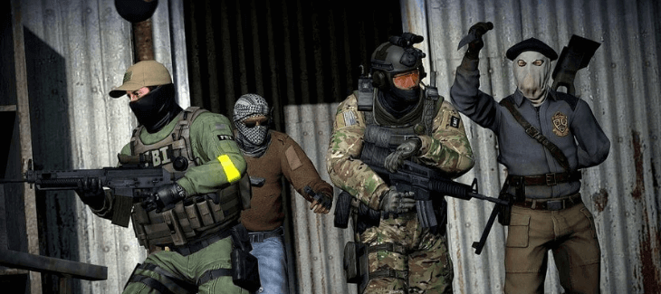

import { Image } from "astro:assets";

import __CSGO_AWP_png from "./CSGO-AWP.png";
import __M249_CSGO_png from "./M249-CSGO.png";
import __Best_CS_GO_Hide_and_Seek_Servers_png from "./Best-CS-GO-Hide-and-Seek-Servers.png";
import __BrutalCS_Deathmatch_png from "./BrutalCS-Deathmatch.png";

I'm not sure what it is, but I just can't seem to get enough of CS:GO.

Between the competitive matches and thrilling game modes, I've found that there's always something new to explore in this amazing world of guns and gadgets.

But one thing has been really bothering me lately; not being able to find a decent retake server!

So today I decided to take some time out of my day for myself and write this blog post about the 5 best CS GO Retake servers - enjoy!

## 5 Best Private CS GO Retake Servers

### 1\. GhostCap Gaming

<Image
  decoding="async"
  width="730"
  height="325"
  alt="CSGO AWP"
  sizes="(max-width: 730px) 100vw, 730px"
  src={__CSGO_AWP_png}
  widths={[730, 300]}
/>

Fight for your rank and win big while training on a CSGO Retake server. With free skins galore, you can learn how to aim with all of the latest weapons in this intense format that is sure to get your heart racing as you jump into some high-intensity action!

Fighting on a competitive retaking tournament during Counter-Strike: Global Offensive matches can be an excellent way for players who are new or want more practice time before they compete at their best level.

Frantic gameplay mixed with fast-paced rounds will help train both reaction times and target acquisition skills

Play against others online today!

**Server Features**

- Multiserver shop
- No Pay to Win incentives
- Custom knives, models, gloves and dances
- Custom weapon skins
- 99.9% server uptime
- Active admins
- Strong community discord

**GhostCap Gaming CS GO Retake Server IP:**

**USA:** 45.88.228.29:27015 [(click to connect)](steam://connect/45.88.228.29:27015/)

**ASIA:** 15.235.181.104:27023 [(click to connect)](steam://connect/15.235.181.104:27023/)

**GhostCap Gaming Website:** [https://www.ghostcap.com/](https://www.ghostcap.com/)

**GhostCap Gaming Discord:** [https://discord.ghostcap.com/](https://discord.ghostcap.com/)

### 2\. Sneaks Servers (Snksrv)

Being a professional game server provider, Snksrv is well-known for providing high-quality services that cater to almost all needs a professional or a casual player might need.

Therefore, when it comes to CS GO retake servers, Snksrv could be the best choice out there. Also, it is one of the few providers that offer to run the servers at full capacity without any problems. So, players have nothing to worry about.

- Sneaks Servers is a well-known provider of professional game servers
- Snksrv will customize the retake servers to player's needs and demands
- Players can enjoy playing the game without any interruptions or lag
- Players are sure to be happy knowing that they have chosen one of the best CS GO servers on the market.

By doing what the best in the business are doing, there is a fair chance that it is going to please a large number of people. Also, the options of modifying the retake servers are available. So you can have your own custom settings on the server.

**Sneaks Servers Retake Server IP:** 72.5.195.31:27015

**Sneaks Servers Website:** [https://snksrv.com/](https://snksrv.com/)

**Sneaks Servers Discord:** [https://discord.com/servers/sneak-s-community-253812864786235402](https://discord.com/servers/sneak-s-community-253812864786235402)

### 3\. PowerFPS

<Image
  decoding="async"
  width="730"
  height="325"
  alt="M249 CSGO"
  sizes="(max-width: 730px) 100vw, 730px"
  src={__M249_CSGO_png}
  widths={[730, 300]}
/>

PowerFPS is a CS:GO server network founded by Erik (Powerind) in August 2018.

After the creation of their first Hide'n'Seek Chasemod, they expanded into new game servers and modes such as Deathmatch FFA with Bunny Hop-Jump enabled or Classic DM FFA for more experienced players.

They are committed to providing premium servers that you can enjoy without cheaters ruining your experience. To achieve this goal, they use a custom Anti-Cheat (Guardian) which prevents cheating from happening on PowerFPS servers!

- Strong server security
- Powerful Anti-Cheat protection
- Variety of game modes for different player skill levels
- 24/7 highly responsive customer service

Regardless of the fact that many gamers are not familiar with this gaming community, they should definitely consider it as an option. And it is clear from the looks of it that it is one of the best choices that gamers can make.

**PowerFPS Retake Server IP:** retake.powerfps.com:27018

**PowerFPS Website:** [https://powerfps.com/](https://powerfps.com/)

**PowerFPS Discord:** [https://discord.gg/SaZ4G98](https://discord.gg/SaZ4G98)

### 4\. Healon Gaming

<Image
  decoding="async"
  width="730"
  height="325"
  alt="Best CS GO Hide and Seek Servers"
  sizes="(max-width: 730px) 100vw, 730px"
  src={__Best_CS_GO_Hide_and_Seek_Servers_png}
  widths={[730, 300]}
/>

Being another one of the best choices when it comes to servers, Healon Gaming has got what it takes to become a favorite among gamers.

Healon Gaming is a community of CSGO players who share the same goal.

With their humble beginnings in July 2016, they have grown to over 20,000+ steam group members with the help of social media and other interactions. They are confident that this will only get better with time!

- Private Dedicated Servers
- Counter-Strike Global Offensive is their main game
- Hardworking Staff and Loyal Players
- 24/7 Uptime

That is the reason why many people recommend it with a passion. And after taking a close look at the features that it offers, there is a good chance to make a point that it is one of the best choices that the customers should make.

**Healon Gaming Retake Server IP:** retake.healongaming.com

**Healon Gaming Website:** https://healongaming.com/

**Healon Gaming Discord:** [https://discord.gg/DerekAa](https://discord.gg/DerekAa)

### 5\. BrutalCS

<Image
  decoding="async"
  width="730"
  height="325"
  alt="BrutalCS Deathmatch"
  sizes="(max-width: 730px) 100vw, 730px"
  src={__BrutalCS_Deathmatch_png}
  widths={[730, 300]}
/>

BrutalCS makes our best list again for their servers, this time instead of their [CS GO deathmatch server](https://www.ghostcap.com/cs-go-deathmatch-servers/), it's their Retake server.

Starting from humble beginnings that was hosting servers in a closet, they are now hosting 60+ CS GO community servers around the world that are enjoyed by thousands of players each and every day.

[https://www.youtube.com/watch?v=IUcx00lASVA](https://www.youtube.com/watch?v=IUcx00lASVA 'Play video "CSGO - OLOFMEISTER TRAINING ON RETAKE SERVER"')

Video can't be loaded because JavaScript is disabled: [CSGO - OLOFMEISTER TRAINING ON RETAKE SERVER (https://www.youtube.com/watch?v=IUcx00lASVA)](https://www.youtube.com/watch?v=IUcx00lASVA "CSGO - OLOFMEISTER TRAINING ON RETAKE SERVER")

Not only do they host multiple CS GO Retake servers, but they also host DM FFA, KZ, Retakes, Executes, Duels and Aim.

- CS GO servers that are low ping
- Multiple server types to choose from
- Large player base enjoying their servers daily

What is more, is their servers come with a low ping, which is exactly what multiplayer gamers need.

**BrutalCS Retake Server IP:** retakes9.brutalcs.nu

**BrutalCS Website:** [https://www.brutalcs.nu/](https://www.brutalcs.nu/)

**BrutalCS Discord:** [https://discordapp.com/invite/0t3nC40NI357kUOZ](https://discordapp.com/invite/0t3nC40NI357kUOZ)

## What Are CS GO Retake Servers?

Retakes are a brand new shooting game mode in which a team has to stop the attacks of the opponents from the bombsites, which they have just taken.

And it is done by one of the teams pushing forward in an attempt to determine whether or not they can reclaim a bombsite from the opponents.

That is the time when the other team comes in to save the day and take the bombsite back.

Taking into consideration the rest of the team's actions, it is clear that this game mode is far more dynamic than the ones that have been presented before. For instance, it is not a usual thing for a team to remain at the same place for too long. It mostly happens when one of the teams has a working strategy on how to defend or attack a particular place, the bomb plants, or the kills made by some of the players.

However, in this case, things have changed and they are not the same as before.

Consequently, the dynamic nature of the gameplay is enhanced even further, which makes this shooting mode one of the most exciting and thrilling ones that players can find in any game.

## Can You Play Retakes Officially With Operation Broken Fang?

Well, the answer to that question would be a negative on the whole.

However, you can still enjoy the thrilling and running game modes that are available only for the matches between the members of the same team playing against each other. Basically, this is a twist on the standard game mode that allows the players to choose between retakes and the standard ones.

And there is nothing wrong with that, except for one thing. That is, the game developers have decided to let the players enjoy this mode, but this cannot be done through the official game servers. But, that does not mean that the game is devoid of retakes.

There are many CSGO retake servers in existence, including the official ones. So, it is possible to determine that the developers still did not want to let go of this shooting mode.

And although the official servers do not support it, it is still feasible to play it against the teams from the same organization. Or, if you prefer to play against the terrorists through the retake servers, it is also possible to do that.

Of course, it will be a different experience and would be a lot more dynamic to play against the counter-terrorists, who have been practicing the routine of taking or defending the bombsites.

After the successful launch of CS GO, it didn't take the game players much time to realize the potential of the game and the fact that what they actually have in their hands is a revolution in the FPS genre.

And even though its predecessors have also won a lot of hearts, but there is a fair chance that it has won even more of them. What makes the game so special is that it combines all the best features from previous games and throws into the trash the ones that attract no one (Especially when you merge two of the best parts together and create CS GO retake servers).

For instance, the game includes modern features like weapon skins but eliminates the negatives that could be found in other games, like client-side lag that has been a major complaint of the players.

At the same time, the game looks and feels decidedly different from its predecessors, not to mention being better than them in pretty much all respects.

This also includes shooting modes. Although there is an option to maintain the original shooting mode, most people have an urge to play other exciting modes that have been developed over the years.

And of course, there are certain game modes that are bound to become even more famous as the game develops, and retake servers are considered to be one of them.

What is cool about this shooting mode is the fact that it offers a newer, better, and more exciting experience of rivalry and competition.

## Conclusion:

While CSGO isn't in its early days anymore, it is obvious that it has all the skills to become one of the most successful FPS games in history.

And the thing that makes it so special is the fact that it offers something new and something exciting to the players.

From the weapons, maps, features, and shooting modes, everything is fresh and new, and there is no doubt that the developers will introduce new content as time goes on.

What makes people love the game is the fact that it is not just a shooter with cool graphics. It also has a lot of things to offer and things to consider.

For instance, the weapons, the game modes, the game strategies, and the different game types.

So, if you are looking for the most thrilling experience in an FPS game, then CS GO Retake servers are for you.

If you do it soon enough, it is obvious that you are going to fall in love with it, just like millions of people all over the world have.
