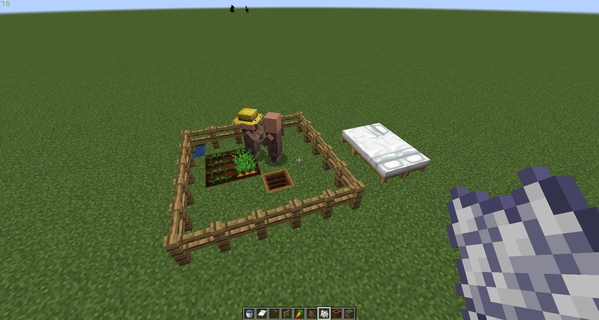
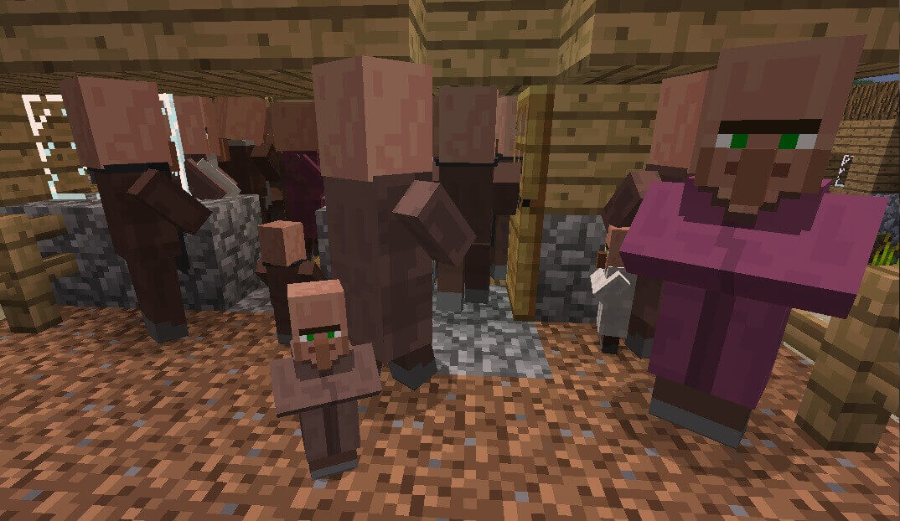
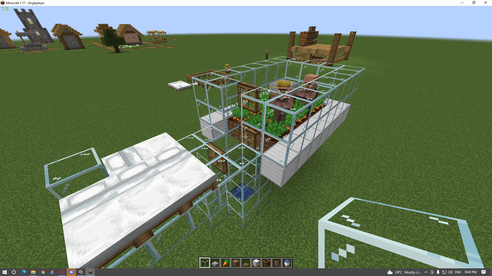
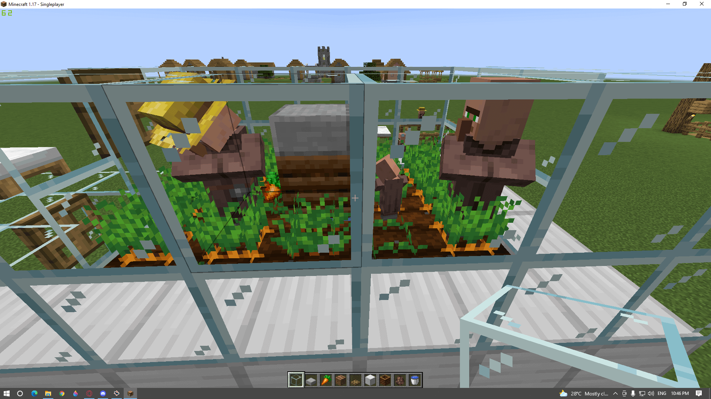
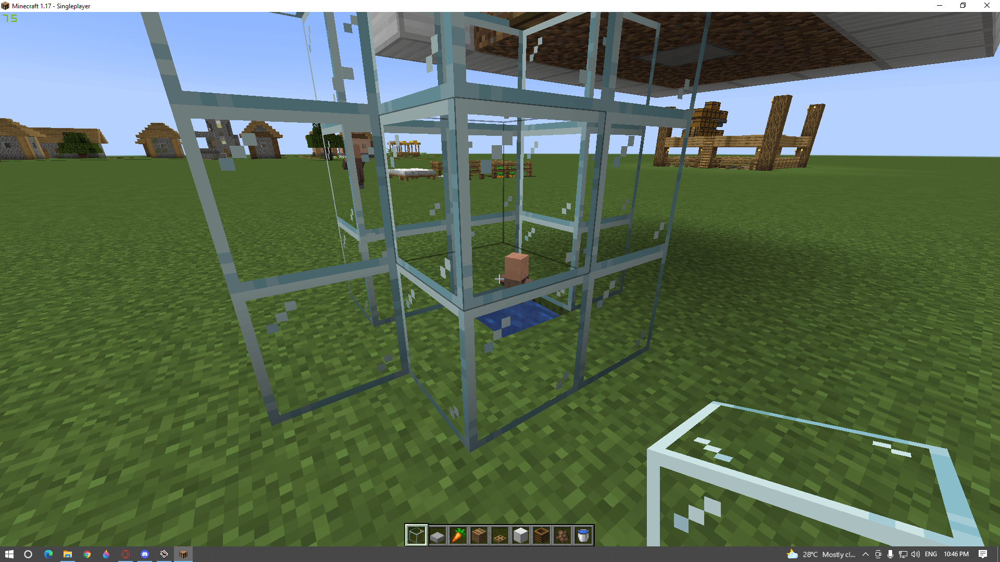
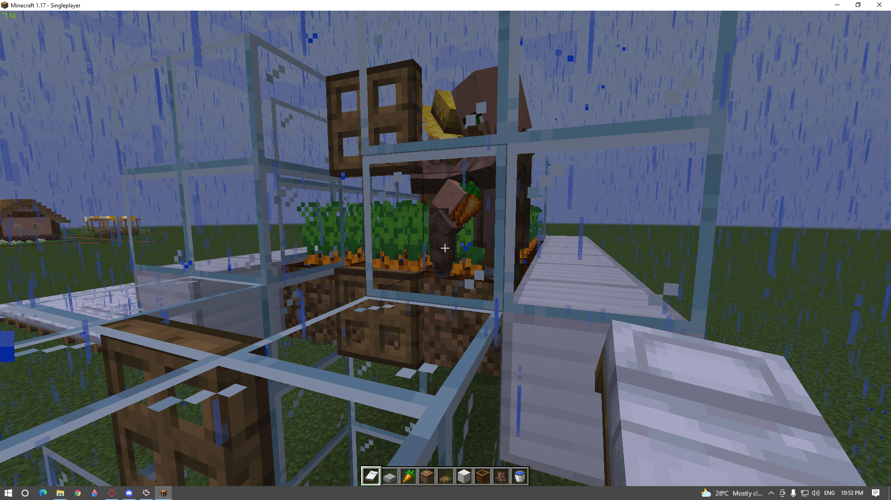

Breeding a villager is another great mob to have in your world for emeralds or iron golems!

This tutorial will teach you how to get started breeding villagers in Minecraft today which could make the difference between having an empty village where no one lives or a thriving town full of life with people coming through all day long.

## How to Breed Villagers in Minecraft

Pick two villagers to breed together. Make sure they are alone and there is a bed in the room with them. Then, give food to the villager you want to breed by throwing it on the ground near him or her - their "willingness" will increase over time until he or she gets tired enough for mating!

Here is what you need to get started

- 2 Villagers (a farmer villager if you want to automate the process)
- 3 Beds
- Food (24 Carrots usually does the trick)

### Step 1: Set up a breeding room.

First, we need to create a breeding room. To do this you need to place your 3 beds down and plant some carrots.

The villager with a hat is a 'farmer villager' who would harvest the carrots once they are fully grown and give them to the 'unemployed' villagers.

This ensures that your Minecraft villagers won't die.

### Step 2: Find and lure your villagers

Now we have our room setup, you can now lure a villager to your breeding room. To do this, go to the nearest village and use a bell or try to befriend one of the villagers.

Now that you have the villagers in the same room you will need to wait a day for them to breed. This can sometimes take a day or two.

They need to be “willing”

After a while, you will notice a baby will spawn and it will claim its own bed.

## Automatic Villager Breeder Machine

The new villager breeder farm is a great way to speed up the production of villagers for your game!

It features two plots, one with a house and job (the working villager) and another without. They are separated by an opening that only allows them access to each other during breeding season so they can mate in peace.

Once these poor souls have had their fun then it's time for our little ones to be born!

The children will travel over towards the bed but inevitably fall into the hole below where they'll stay until adulthood before finally being freed near enough on top of my own village just waiting for me to give them some orders or sell 'em off as slaves as commoners deserve

## Can you manually breed Villagers in Minecraft?

You can manually creed villagers by manually feeding them food such as bread or carrots. I don’t recommend this however because it’s simply a waste of your time when you could be out farming or mining other resources.

## Can Villagers spawn in an Empty village?

No. There is no way that you can revive an abandoned village in Minecraft. The only way to find a nearby villager would be to cure a zombie.

## Conclusion

So in summary, to breed a villager in Minecraft all you need is food, minimum of 3-4 beds, and two villagers. First, give them food, then wait for a while since it has a certain time that they will breed, after that a baby villager will be created/born.

I actually made a villager breeder on the old GhostCap Gaming [Minecraft server](https://www.ghostcap.com/minecraft-server-setup-guide/) before it was griefed.

You can see from the image that a second baby had just been born as I was about to finish.

You can make multiple setups like this to speed up the process.
