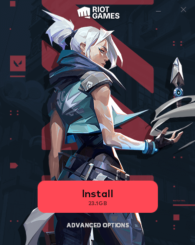

import { Image } from "astro:assets";

import __VALORANT_Riot_Games_competitive_5v5_character_based_tactical_shooter_jpg from "./VALORANT-Riot-Games-competitive-5v5-character-based-tactical-shooter.jpg";
import __Create_Account_jpg from "./Create-Account.jpg";
import __Download_the_Valorant_installer_jpg from "./Download-the-Valorant-installer.jpg";
import __Let_the_game_download_png from "./Let-the-game-download.png";

Valorant is the hottest [free-to-play](https://en.wikipedia.org/wiki/Free-to-play) title in the world right now.

Seriously, Riot Games hit the nail on the head with this one.

- Team strategies
- Sharp gunplay
- Tactical abilities

It's no wonder how [Valorant was able to quickly match and surpass the player count](https://www.ghostcap.com/valorant-player-count/) of Counter Strike Global Offensive on the competitive stage.

In this guide, I'll show you exactly how to download Valorant and properly installed it on your PC so you can start playing and enjoy some clutch moments.

## How To Download Valorant And Install

Downloading Valorant is pretty simple and it starts with downloading the Riot Client.

**Total Time:** 5 minutes

### 1\. Visit the Valorant website

<Image
  decoding="async"
  width="1715"
  height="792"
  alt="VALORANT-Riot-Games’-competitive-5v5-character-based-tactical-shooter"
  sizes="(max-width: 1715px) 100vw, 1715px"
  src={
    __VALORANT_Riot_Games_competitive_5v5_character_based_tactical_shooter_jpg
  }
  widths={[1715, 768, 1536]}
/>

Go to the [Valorant main website](https://playvalorant.com/) and click on "Play Free"

### 2\. Create your Riot account

<Image
  decoding="async"
  width="1718"
  height="1319"
  alt="TODO: update alt text"
  sizes="(max-width: 1718px) 100vw, 1718px"
  src={__Create_Account_jpg}
  widths={[1718, 768, 1536]}
/>

Select if you have a Riot Games Account or not. If you have played games [such as League of legends](https://leagueoflegends.com) then you will already have an account. This can be any name you want as you can [change your Valo name](https://www.ghostcap.com/how-to-change-valorant-name/) later if needed.

### 3\. Download the Valorant installer

<Image
  decoding="async"
  width="1718"
  height="1319"
  alt="TODO: update alt text"
  sizes="(max-width: 1718px) 100vw, 1718px"
  src={__Download_the_Valorant_installer_jpg}
  widths={[1718, 768, 1536]}
/>

After you have created your Riot Games account, then click the "Download" button to save the installer to your computer.

### 4\. Run the installer

Double click the file "Install VALORANT.exe" and Install the game. [Valorant is a 26GB install](https://www.ghostcap.com/valorant-download-size/) so if you don't have enough disk space, then click "Advanced Options" and change your installation location.

### 5\. Let the game download

<Image
  decoding="async"
  width="1529"
  height="859"
  alt="Let the game download"
  sizes="(max-width: 1529px) 100vw, 1529px"
  src={__Let_the_game_download_png}
  widths={[1529, 768]}
/>

Wait for the game client to finish downloading the game. This will take quite a while depending on your internet speed.

### 6\. Click Play

Once the Riot Games Client is finished downloading, the button will change to Play. Simply click that and you can let your gunplay shine and show everyone your spectacular plays!

**Tools:**

- Windows PC

## Is Valorant Free To Play?

Yes, Valorant is 100% free to play and Riot Games only makes money off in-game purchases. All you need to play Valorant is a PC and a Riot Account.

## Can You Download Valorant On Mac OS/Steamdeck/Xbox/PS5 Etc?

Not natively no. The reason for this is that Valorants anti-cheat is highly invasive to your system and requires kernel access. This is simply not possible right now on operating systems other than Windows.

Right now Riot Games Valorant is only supported on PC with no current plans to bring the game to other platforms.

With that said you can run Valorant on a Mac but only if you use Bootcamp however the performance won't be great on newer M1 varients.

## Is It Possible To Install Valorant Without A Riot Account?

You're able to download and install Valorant without a Riot account by simply going to the bottom of the Valo home page and clicking "Download Game Client".

However, it's worth noting, that you must have a Riot Games account to launch and play the game.

This is handy if your installing Valorant on a family or friend's PC and you don't have their account details yet.
