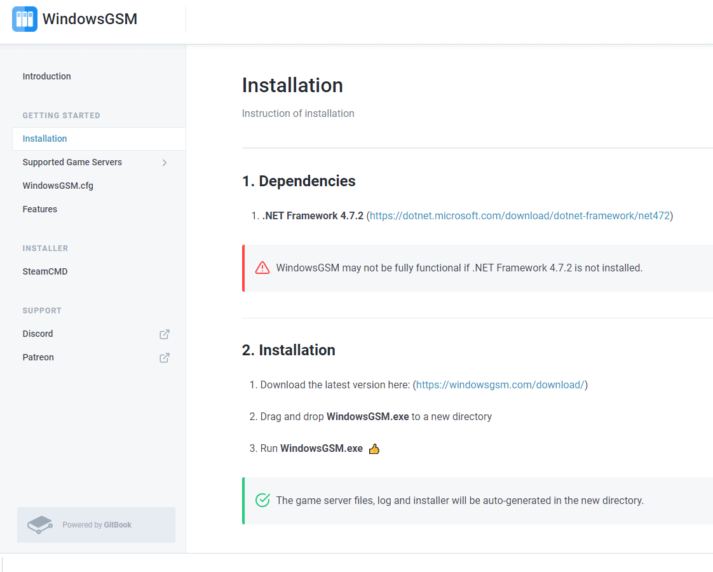

There's no denying that Rust is one of the most popular games on Steam right now.

It has a pretty steep learning curve, but once you get to grips with it, there are few better ways to spend your time.

But hosting a server for friends and family can be an expensive and time-consuming affair!

Thankfully we've found 10 easy steps to set up a Rust server in minutes which will cost much less than if you were renting from somewhere else!

Before you start, are you worried you will run into issues? If you get stuck at any point during this tutorial, ask us in Discord [#Techsupport](https://discord.gg/uRMNG7W3Tp) and we will hopefully be able to assist.

[https://www.youtube.com/watch?v=uGLotNsCotY](https://www.youtube.com/watch?v=uGLotNsCotY 'Play video "How To EASILY Setup A Dedicated Rust Server In Pterodactyl [With Oxide, Plugins & Admins]"')

Video can't be loaded because JavaScript is disabled: [How To EASILY Setup A Dedicated Rust Server In Pterodactyl \[With Oxide, Plugins & Admins\] (https://www.youtube.com/watch?v=uGLotNsCotY)](https://www.youtube.com/watch?v=uGLotNsCotY "How To EASILY Setup A Dedicated Rust Server In Pterodactyl [With Oxide, Plugins & Admins]")

## How To Make A Rust Server

Setting up a Rust server doesn't need to be hard. Below is a quick and easy 10 step in-depth guide to starting your very own dedicated Rust server that anyone from around the world can join. Run-on the latest spec out servers with ddr4 ram and 2.5ghz up. It offers a very competitive price to performance ratio while offering other services such as DDOS protection, fast support response time, and backup options.

### Step 1. Signup to Vultr

The first thing you need to do to get your own dedicated Rust server is to create an account at Vultr. If you use this link you will get a free $25 credit. This will help offset the cost of paying for the server while you get people on.

Want $100 Free Vultr Credit?

Use our link below to signup for your new game server and get $100 credit you can use.

**No coupon is required.**

Simply click the link, signup, and it's automatically applied to your account!

[Get $100 Vultr Credit Free!](https://www.ghostcap.com/get/vultr)

Click Sign Up on the top right-hand side and if you used the link above, your credit is applied automatically.

### Step 2. Deploy your server

Now that you have created your [Vultr](https://www.ghostcap.com/vultr-review/) account and have logged in, click on “Products” on the left-hand side of the screen.

On this page is where we are going to deploy our new Rust server.

### Step 3. Choose your server location

The next thing to do is select the type of server and where in the world it would best suit you. Select the "Cloud Compute" option as this will allow you to use a part of an entire dedicated server as that would be much more expensive.

As for the location, it's best to select what location is closest to you for best performance (ping). Otherwise, if you are looking to give your players the best ping while reaching as many of them as possible (In the US) it would be recommended that you select Dallas.

### Step 4. Choose your Operating System

The next thing we need to do is select the server type. It should automatically have "64 Bit OS" selected, if not, do that now. Out of the 8 options that are on the screen, select "Windows". Once you click that, it will give you 2 options. Select the top one "2016 X64".

### Step 5. Choose the resources you need

Now it's time to select server size. Typically at idle with no one on the Rust server, it will be using around 3GB of ram. This is something to keep in mind as the more people that join your server, the more ram it will use.

If you are looking at having a small Rust server with 10-15 friends then the $40 a month server will work perfectly for you. However, as many people know, Rust is much more enjoyable with more people.

This is why we recommend going to the next tier up. At 8gb of ram and an extra 2 CPU's your server will be capable of running almost anything you throw at it. From vanilla all the way up to 1000X battlefield servers with over 50 mods.

Having mods also helps you include a VIP system that can earn you money.

### Step 6. Enter your hostname

Almost there for server setup. While some of the larger servers with 200+ players might require DDOS protection, it would not be recommended when you are just starting out (You are able to change this later). Set the name of the server and click "Deploy Now".

### Step 7. Select your newly created server

Once this is complete it will take you back to the products page. Along with the server that you just started (It should take about 10 - 15 minutes to complete setup). Once this is done, it will say "Running" under status.

### Step 8. Open the console

When you select your Rust server it will take you to the area that you manage said rust server, within Vultr. At this point, you are ready to remote access into the server and start installing your rust server client. Select "Download RDP connection" (This is the laptop button 3rd across from "Password"). It will ask you to put in your username and password. These are located next to the button you just clicked to open the RDP.

### Step 9. Download WindowsGSM

Download WindowsGSM onto your server, you can find the link [here](https://windowsgsm.com/). WindowsGSM (Windows Game Server Manager) is exactly what it's named.

It is a game server manager that has the ability to manage a variety of different game servers, all in one place with the click of a few buttons. This will take out a lot of the hard work needed to start your own rust server.

**Please Note**: The windows server doesn't come with the appropriate dependencies (.NET Framework 4.7.2) make sure you download this onto the server. Once you have installed this, restart the server and you will be able to open WindowsGSM.

### Step 10. Install your Rust server using WindowsGSM

Now that WindowsGSM is installed on your server you are able to start the program and install Rust.

The final thing is to select the "**Game** **Server**" as Rust and give it a name. Click "Install" and wait a few minutes. That's it! Your server is now live.

No need to port forward. Just send out your IP address and anyone from around the world can join.

## Rust Server Requirements

The requirements for setting a dedicated Rust server depend upon the number of active slots, the server specs, player limits, and more. The minimum specs for Rust servers are:

- RAM: 4 GB (DDR3)
- CPU: Dual-core CPU (2.3ghz)
- HDD: 32 GB
- Internet: 25 Mbps upload

Now, these are the recommended requirements for a Rust server. The best dedicated server hosting services offer servers with the following specs:

- RAM: 8 - 32 GB (DDR4)
- CPU: Quad-core CPU (4.0 ghz)
- SSD: At least 128 GB.
- Internet: 100 - 1000 Mbps upload

Rust requirements breakdown of each specification:

- Ram - This directly affects how many 'things' are on the map and players that can join. If you are planning on running a 10x server be prepared to see numbers higher than 8 GB of RAM usage,
- CPU cores - More CPU cores mean each thread can focus on its own task rather than taking turns. Your Rust server doesn't need tens of cores but giving it at least 4 to work with is good,
- CPU GHz - This directly affects server performance. Higher GHz means more server frames per second (Fps). For a normal 5-20 man Rust server, 60 server fps is ideal,
- HDD/ SSD - This directly affects server restart time. (Typical HHD read/write speed is: 80-160 MBps. While SSD read/write speed is around: 550 MBps. Even faster for NVMe drives),
- Internet - Typically each user will use a maximum of 5 Mbps of your allotted internet speed while they are connected. So if you're running a 10 man server, expect to allocate up to 50 Mbps of upload/ download speed to them.

Assuming you meet the requirements of running your own Rust server, let us now see how you can set up your own Rust server.

## How Do I Join A Rust Server By IP?

Sometimes finding a server through the in-game search console is difficult. Even putting the entire name in doesn't guarantee it will pop up. This is why "Direct Connect" or joining a Rust server by IP works wonders.

To start you will need the IP address of the server you want to join. This can be found either on the server's website, on a Rust-supported website (Such as [Just-Wiped](https://just-wiped.net/)), or from a friend.

**Use the command**: "client.connect 0.0.0.0:0000"

The above zeros represent the server IP (0.0.0.0) and the port number (:0000) An example of this would look like: "client.connect 208.103.169.198:28015"

## What Is Rust?

Beware what lurks in the shadows. Rust is a post-apocalyptic video game where players have to fight for survival, and they face many challenges on their journey from hunger to thirst. It's up to you how your character deals with these hardships - go raid other survivors' bases or venture into dangerous territory?

The only way to survive in the game is by building a shelter and defending it from enemies. The same loot can then be traded with other players for better weapons, equipment, resources, and many more things that will help you thrive in this hostile world.

Rust has been around since February of 2014 but only became popular recently thanks to Twitch and its viewer prizes that allow viewers at home an opportunity make some money by watching games being played live online Otherwise it would be just another indie PC title like [Minecraft](https://www.ghostcap.com/minecraft-server-setup-guide/)

## What Type Of Rust Servers Can I Setup?

When you set up your very own Rust Server, you have the option to create one with any mods and plugins.

Here are some of the most common rust server types people set up on their own server.

- [Rust PVE Servers](https://www.ghostcap.com/rust-pve-servers/)
- [Rust Vanilla Servers](steam://connect/159.196.80.12:28015)
- [Rust 1v1 Servers](https://www.ghostcap.com/rust-1v1-servers/)
- [Rust Training Servers](https://www.ghostcap.com/rust-training-servers/)
- [Rust Modded Servers](https://www.ghostcap.com/rust-modded-servers/)
- [Rust PVP Servers](https://www.ghostcap.com/rust-pvp-servers/)

## Conclusion: Rust Server Setup

Now that your Rust server is up and running you can either leave it and let everyone enjoy Rust in its entire glory or you can easily mod the server through oxide (Rusts modding files). Please let us know in Discord if you have any issues, we frequent these blogs regularly and try to keep them updated to make it as easy as possible.
