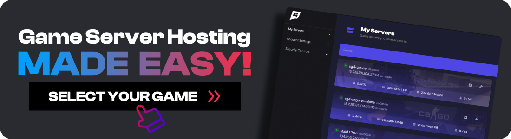

import { Image } from "astro:assets";

import __cs2_workshop_screenshot_jpg from "./cs2-workshop-screenshot.jpg";
import __image_png from "./image.png";

Valve [just released](https://www.counter-strike.net/newsentry/3787024475483064536) CS2 Workshop Maps for clients and server owners today, however there seems to be lots of confusion around how to use them. In this guide, ill show you exactly how you can play workshop maps in either your Counter Strike 2 dedicated, or start a match with your friends.

```html
<style>
  a.no-border-on-hover,
  a.no-border-on-hover:hover {
    border-bottom: none !important;
    text-decoration: none !important;
  }
</style>
```

[](https://www.gamehostbros.com/)

## How To Play CS2 Workshop Maps By Yourself Or With Friends

If you don't have a server, this is how you play workshop maps on CS2 by yourself or with your friends.

1.  Visit the [Steam workshop](https://steamcommunity.com/workshop/browse/?appid=730&requiredtags[]=CS2) and find all the maps you want to play.
2.  Subscribe to the map by pressing the green + button.
3.  Load CS2 and select Play.
4.  Then click Workshop Maps.
5.  Select the map you want to play, then press the Go button on the bottom right. It will ask if you want to select the game mode and play offline, just click go.

If you want to play by yourself, then you're done. But **if you want to play with friends, there are some extra steps you need to take**. Players can only connect to your CS2 server from a LAN network (until Valve fixes this). Luckily for us, you can create a virtual LAN over the internet.

1.  Install [Radmin](https://www.radmin-vpn.com/) or [Hamachi](https://vpn.net/) (I suggest Radmin) and **CREATE a network**.
2.  Get your friends to install the app you chose and have them **JOIN your network**.
3.  It will now give you an IP address for everyone. Take note of your IP address.
4.  Load up your Counter Strike 2 workshop map again like above.
5.  Tell your friend to open their console with ~ and type connect \<your IP address\>

I have [a full guide here on how to connect to a CS2 server](https://www.ghostcap.com/how-to-join-a-cs2-server/) with the IP address you can send to your friends along with a video.

---

## How To Play CS2 Workshop Maps On Your Dedicated Server

There are 2 different methods you can use for workshop maps. One is by loading a single map or creating a collection.

### How To Load A Single Map

If you have a dedicated Counter Strike 2 server and just want to play a single workshop map with friends, it's really simple once you find the Workshop map ID. To find it, simply go to the workshop map you want to play on the Steam Website and look in the URL.

Let's use this map for example: [https://steamcommunity.com/sharedfiles/filedetails/?id=3070288532&searchtext=bhop](https://steamcommunity.com/sharedfiles/filedetails/?id=3070288532&searchtext=bhop)

<Image
  decoding="async"
  width="1192"
  height="750"
  alt="TODO: update alt text"
  sizes="(max-width: 1192px) 100vw, 1192px"
  src={__cs2_workshop_screenshot_jpg}
  widths={[1192, 768]}
/>

As you can see, **our map ID is 3070288532**. Now simply go to your server and type this into the console: `host_workshop_map 3070288532`

### How To Create And Load Workshop Collections

If you want to have multiple maps, then you will need to create a collection. A workshop collection is simply a group of workshop items. You will also need to modify the startup command for your server.

Let's first create the collection.

1.  Go to the [CS2 Collections page here](https://steamcommunity.com/workshop/browse/?appid=730&section=collections).
2.  Click "Create Collection" and add the maps you want to that collection.
3.  Get the Collection ID from the URL (using the same method as getting the map ID)

Now that you have your Collection ID, It's time to modify your startup command. Your startup command will look something like this.

`srcds -game csgo -console -ip 192.168.1.89 +game_type 0 +game_mode 1 +map de_mirage`

We need to add these 2 to the end of it

`+host_workshop_collection YOUR-COLLECTION-ID`

So it should look like this in the end

`srcds -game csgo -console -ip 192.168.1.89 +game_type 0 +game_mode 1 +map de_mirage +host_workshop_collection 125499818`

After that, simply restart the server and all the maps will be available. Type ds_workshop_listmaps in your console to check. The first time you restart the server with a new collection, it will need to download all the maps, so just leave it without restarting the server and let it finish downloading the files. You can tell its downloading maps by the amount of CPU usage.

<Image
  decoding="async"
  width="1752"
  height="1170"
  alt="TODO: update alt text"
  sizes="(max-width: 1752px) 100vw, 1752px"
  src={__image_png}
  widths={[1752, 768, 1536]}
/>

If you get stuck modifying your startup command, reach out to your host, and they will be able to change it for you.

### How To Fix Workshop Collections Not Loading

**UPDATE:** My good friend Cruze has made a [CounterStrikeSharp plugin](https://www.ghostcap.com/cs2-plugins-list/) that will force change to a workshop map when the server starts. [You can get the plugin here](https://github.com/Cruze03/cs2_WorkshopDefaultMap).

We have seen multiple server owners complaining that once they add `+host_workshop_collection` it still loads the default server start map. Even if you type `ds_workshop_listmaps`, It would show the collection maps, but never load it. Previously we would simply wait, and it would fix itself eventually, but I've discovered a fix.

The issue here is the collection itself on Steams end. **You will need to create an entirely new collection on the Steam workshop, add the maps you want to the new collection**, and then use that collection ID. We are not sure if there is something that triggers this bug, but this is the way you can fix it for now.

### How To Update Workshop Maps On Your CS2 Server

By default, CS2 doesn't automatically update Workshop maps on your server ([see here](https://github.com/ValveSoftware/csgo-osx-linux/issues/3575)). This means you need to manually delete the maps to trigger downloading the map again.

To do this, shutdown your server and navigate to `/game/bin/linuxsteamrt64/steamapps/`

Inside there is a folder called `workshop`, delete it and then restart your server. If you anciently left your server on, then shut it down first and repeat the process. If the server is left on when you delete the workshop folder, the server will throw an error when you go to restart it again.

### CS2 Workshop Server Commands

Command

Description

`ds_workshop_changelevel`

Changelevel to an available workshop map by name

`ds_workshop_listmaps`

Dump workshop maps available on this server

`host_workshop_collection`

Host a workshop map collection as a mapgroup

`host_workshop_map`

Get the latest version of the map and host it on this server.

`sv_workshop_allow_other_maps true`

When hosting a workshop collection, users can play other workshop map on this server when it is empty and then mapcycle into this server collection.

## Conclusion

Now you should be able to play CS2 Workshop maps on your server or with your friends. Just remember that this is early days and there may be changes or other methods that work better. If you get stuck, come and [join the GhostCap Discord](https://www.ghostcap.com/discord) and get help from our community.
