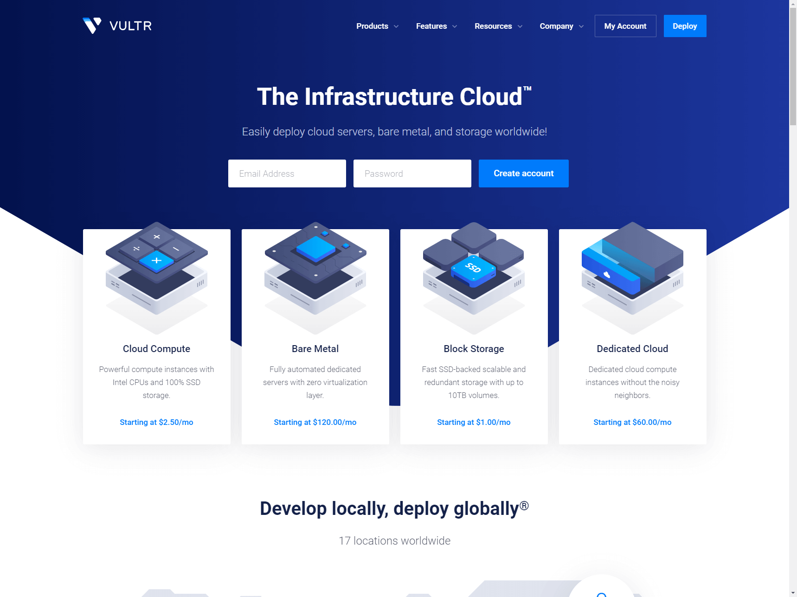
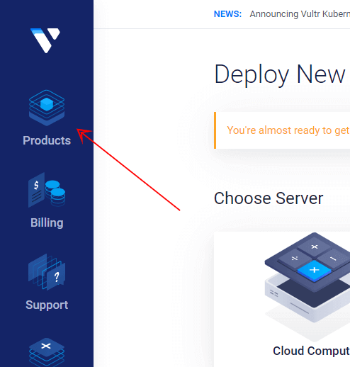
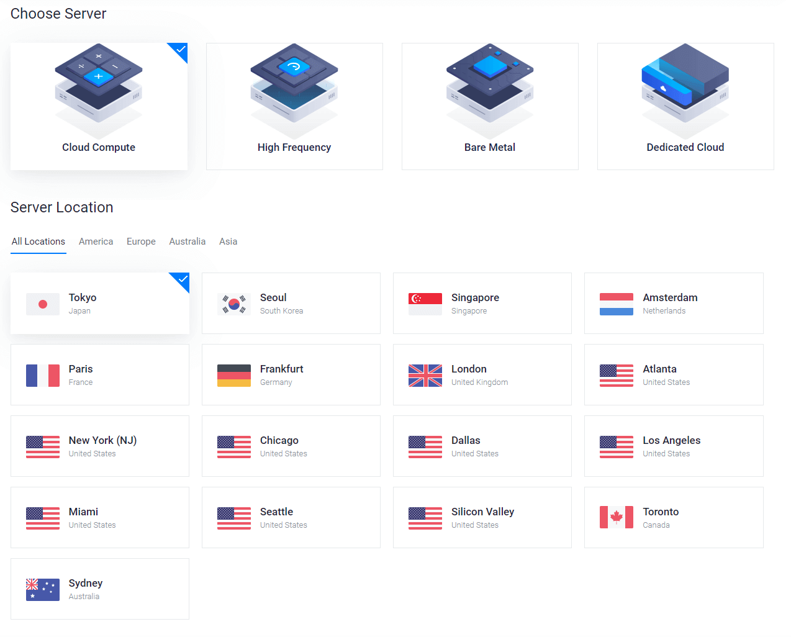
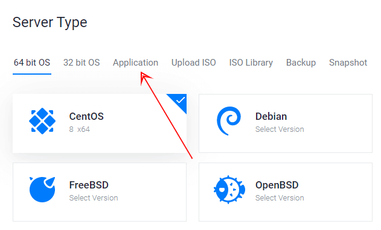
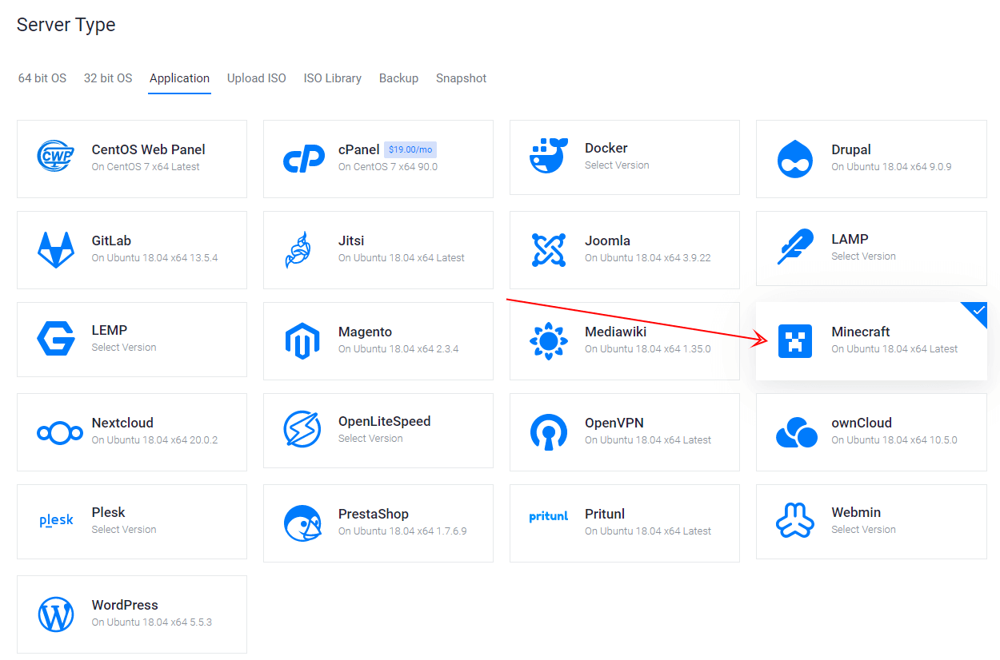
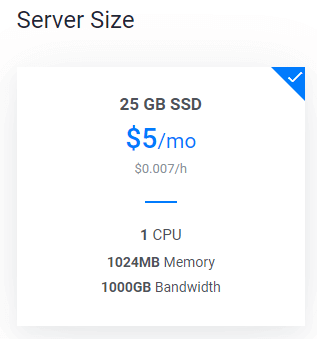
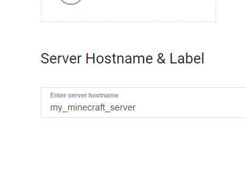
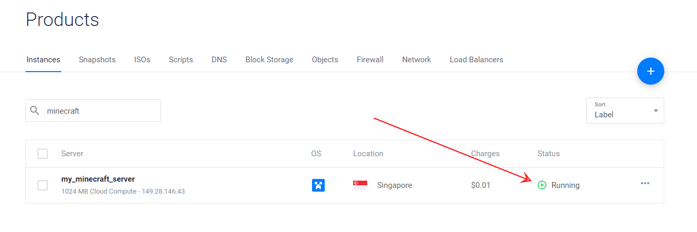
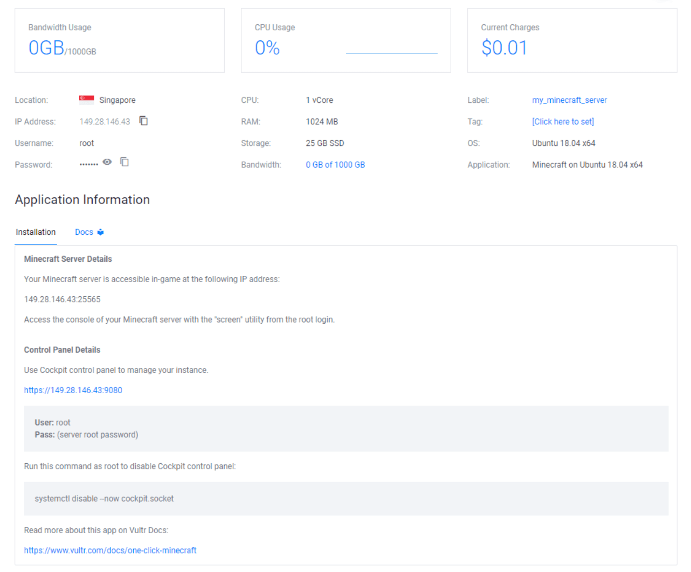
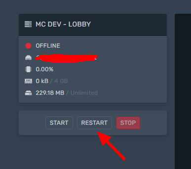

import { Image } from "astro:assets";

import __Spigot_png from "./Spigot.png";
import __MC_Dev_Lobby_File_Manager_png from "./MC-Dev-Lobby-File-Manager.png";
import __SkinsRestorer_SpigotMC_High_Performance_Minecraft_png from "./SkinsRestorer-SpigotMC-High-Performance-Minecraft.png";
import __MC_Dev_Skyblock_File_Manager_png from "./MC-Dev-Skyblock-File-Manager.png";
import __fresh_minecraft_world_setup_png from "./fresh-minecraft-world-setup.png";

I've been playing Minecraft for a while now and I find it oddly soothing.

It's a **great way to unwind after an intense day** of work or study.

The thing is, you can't just play by yourself all the time!

You need some friends to help you out with your next building project.

Lucky for you, this blog post will show you **how to set up a Minecraft server** so that anyone in the world can join!

This guide will walk you through the step-by-step process of setting up your own Minecraft server.

In this Minecraft Server guide I will show you:

- The major reason why you should start your own server.
- 3 ways to set up your own Minecraft Server.
- Discover who has the best Minecraft Hosting.
- Must know admin commands for Minecraft that literally no one is talking about.

Not only will you learn all of this, but it will be explained in a **SIMPLE** way that anyone can follow.

If you've been on the fence about building your own server then this article should help make that decision easier for you.

If at any point you get stuck, simply join our [Discord](http://discord.ghostcap.com/) and someone will be able to help you in our #tech-support channel.

## How To Setup Your Own Dedicated Minecraft Server

I'm actually going to show you **3 different ways** you can set up your Minecraft server, Windows, Linux and Vultr. Each way has its own pros and cons. But every way is as easy as it can be!

Remember though, if you get stuck, simply join our [Discord.](http://discord.ghostcap.com/)

Want $100 Free Vultr Credit?

Use our link below to signup for your new game server and get $100 credit you can use.

**No coupon required.**

Simply click the link, signup and its automatically applied to your account!

[Get $100 Vultr Credit Free!](https://www.ghostcap.com/get/vultr)

The biggest pro is you can literally be up and running with a dedicated server (without having to do any port forwarding!) **in as little as 5 mins!**

Don't be worried.

If you can click a button on a website, you can install it. I promise you haven't seen a guide this easy before!

### Windows - Not Recommended

Windows is one of the easiest ways to setup a server, but you need to know how to port forward IP addresses. However it is not good for more than a few players online due to the way you need to manage the server.

**Pros of a Windows Minecraft Server**

- Installation is easy
- Mods are easy to install
- Good for 2 - 3 players

**Cons of a Windows Minecraft Server**

- It's not suitable for larger networks
- Reliability is not as good as Linux

This section is still under construction

### Linux - The Best Way

This is the way we suggest you make your server. Not only do you get the performance benefits of Linux, but if you follow our guide, you will have a super easy to use web panel that makes it easy to install mods, plugins, edit configs and more!

**Pros of a Linux Minecraft Server**

- It's super easy to manage
- Installing mods is a breeze
- Performance is better (20 TPS is easy)
- Super reliable

**Cons of a Linux Minecraft Server**

- The initial setup takes longer than other methods

This section is still under construction

### Vultr - The Easiest Way

This is the fastest way of setting up a Minecraft server that will allow you to EXPAND your servers if they start getting bigger. We will be setting up Minecraft on a [Vultr](https://www.ghostcap.com/vultr-review/) VPS, which stands for virtual private server and it's perfect because our system can easily expand when needed.

**Pros of a Vultr Minecraft Server**

- It's "1 click" to get setup.
- Takes about 5 mins to do.
- No configuration is needed.
- Easy to scale.

**Cons of a Vultr Minecraft Server**

- It's harder to mod your game.

So let's get started.

#### Step 1.

The first thing we need is to get a VPS server. To do this simply set up an account at Vultr. If you use this link you will get a free $100 credit. That's enough to run a pretty powerful server without having to pay for anything.

**Click Sign Up on the top right hand side.**

#### Step 2.

After you have set up your account and are logged in, click on "Products" on the left-hand side.

On this page is where we are going to deploy our new VPS.

#### Step 3.

Now we need to select what type of VPS and location. You can either choose "Cloud Compute" or "High Frequency". The difference is High Frequency is faster but costs $1 extra per month.

As for the location, it's best to select what location is closest to you for the best performance.

#### Step 4.

Now we need to select the server type. For this simply click "Application"

And then select "Minecraft"

#### Step 5.

Select the server size that fits in your budget and the amount of Memory/Ram that fits your intended user base (We have an entire section on this later on in the post)

Just as a quick example:

- 1gb for 8 - 10 people
- 2gb for 10 - 20 people
- 4gb for 20 - 30 people
- 8gb for up to 90 people

For this tutorial we will be using the $5 plan but remember, you can UPGRADE at any time instantly!

#### Step 6.

You can skip the rest of the options until the very last one and that is "Server Hostname & Label". You can make this whatever you want.

After that **click Deploy**

#### Step 7.

After you have deployed your new server. You will see installing for a few minutes and then after it will say Running. Simply click it to enter the Minecraft Server dashboard.

#### Step 8.

That's it! You can simply connect to the IP address they give you and access the server via the dashboard.

See that wasn't that hard! This is the easiest way to set up a Minecraft server that I know of right now.

## How To Install Mods And Plugins On Minecraft

Most of the time when it comes to Minecraft, people want to install plugins or mods.

People normally get intimidated but it's actually **VERY EASY!**

Follow along and you will be running mods in no time!

### Step 1. Install Paper, Spigot or Bukkit

Installing Paper, Spigot or Bukkit will allow you to run mods on your Minecraft server. You can get the latest build of [Spigot from here](https://getbukkit.org/download/spigot).

<Image
  decoding="async"
  width="1215"
  height="868"
  alt="Spigot"
  sizes="(max-width: 1215px) 100vw, 1215px"
  src={__Spigot_png}
  widths={[1215, 768]}
/>

### Step 2. Copy the Spigot.jar file to your Minecraft server

Copy the .jar file you just downloaded to your Minecraft server install directory. I simply renamed my spigot.jar to it worked with our server. If your running vanilla minecraft, call it whatever your default .jar is called. Usually its simply server.jar

<Image
  decoding="async"
  width="1427"
  height="584"
  alt="MC-Dev-Lobby-File-Manager"
  sizes="(max-width: 1427px) 100vw, 1427px"
  src={__MC_Dev_Lobby_File_Manager_png}
  widths={[1427, 768]}
/>

### Step 3. Restart your server

Restart your server to update any files that need to be updated.

### Step 4. Find the plugins you want to install on your server

To find plugins I use a site called [SpigotMc](https://www.spigotmc.org/). Simply look for the plugins you want to install on the list. For this demo we are going to install Skin Restorer.

Once you're on the page for the plugin you want. Click on Download Now.

<Image
  decoding="async"
  width="1244"
  height="690"
  alt="SkinsRestorer-SpigotMC-High-Performance-Minecraft"
  sizes="(max-width: 1244px) 100vw, 1244px"
  src={__SkinsRestorer_SpigotMC_High_Performance_Minecraft_png}
  widths={[1244, 768]}
/>

### Step 5. Copy the plugin to your Plugins directory

After you have downloaded the .jar. You will need simply need to put the file you downloaded into the plugins directory. This is located in your default Minecraft directory.

<Image
  decoding="async"
  width="1250"
  height="1022"
  alt="MC-Dev-Skyblock-File-Manager"
  sizes="(max-width: 1250px) 100vw, 1250px"
  src={__MC_Dev_Skyblock_File_Manager_png}
  widths={[1250, 768]}
/>

### Step 6. Start your server

All that is left to do now is to start your server and the plugin will then be installed and running. If for some reason the plugin doesn't work, then read the comments on the SpigotMC page and you will find some helpful tips to get up and running.

## Why Should I Start My Own Minecraft Server?

<Image
  decoding="async"
  width="1366"
  height="768"
  alt="fresh minecraft world setup"
  sizes="(max-width: 1366px) 100vw, 1366px"
  src={__fresh_minecraft_world_setup_png}
  widths={[1366, 768]}
/>

One of the biggest reasons to start your own Minecraft server is to have 100% control over what is going on. For example, if you are playing on someone else server, at any moment your builds could be wiped, raided, or your progress could simply disappear!

This is because in the end they only care about 1 thing, and that is themselves.

And rightfully so, you are playing on their network and most of the time, you are playing for free! They have every right to do what they want!

This is why we always suggest it's best to run your own server. Be in control.

The next major reason is privacy. For example, if you only want to play with a select few of your friends, you can do so very easily. All you need to do once you start your server is to give them the IP address to connect to and that's it. Once you are done playing, you can simply turn off your server and you don't need to worry about being grieved or anything while your offline.

## What Type Of Minecraft Servers Can I Setup?

When you set up your own Minecraft Server, You have the option to install any mods and plugins that you want.

## Conclusion: Minecraft Server Setup Guide

That's it for now with our Minecraft Server guide. We will have this updated in the coming weeks with the other methods!

Remember to come and join us on our [Discord](https://discord.gg/uRMNG7W3Tp) if you need any help.
