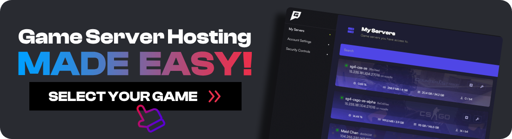

import { Image } from "astro:assets";

import __csgo_demo_viewer_and_cs2_png from "./csgo-demo-viewer-and-cs2.png";

As we all know, Counter Strike 2 was just released, and it just replaced CSGO. However, did you know there is still a way to play on CSGO servers including all the community servers such as Surf, Bhop, Zombies and more.

In this post, ill show you the easy way on how you can access Counter Strike Global Offensive while keeping CS2, so you can relive the glory days.

```html
<style>
  a.no-border-on-hover,
  a.no-border-on-hover:hover {
    border-bottom: none !important;
    text-decoration: none !important;
  }
</style>
```

[](https://www.gamehostbros.com/)

If you're more of a watcher, here is a video I made showing you exactly how to do it.

[https://www.youtube.com/watch?v=i6d5VOmHG6s](https://www.youtube.com/watch?v=i6d5VOmHG6s 'Play video "How To Play CSGO After CS2 Released [And Join Servers]"')

Video can't be loaded because JavaScript is disabled: [How To Play CSGO After CS2 Released \[And Join Servers\] (https://www.youtube.com/watch?v=i6d5VOmHG6s)](https://www.youtube.com/watch?v=i6d5VOmHG6s "How To Play CSGO After CS2 Released [And Join Servers]")

## How To Access CSGO After Counter Strike 2 Launched

<Image
  decoding="async"
  width="1281"
  height="797"
  alt="TODO: update alt text"
  sizes="(max-width: 1281px) 100vw, 1281px"
  src={__csgo_demo_viewer_and_cs2_png}
  widths={[1281, 768]}
/>

To unlock CSGO, just follow these simple steps.

1.  **Open Steam:** Launch the Steam application on your computer.
2.  **Go to Library:** Navigate to the “Library” tab to view your game list.
3.  **Find Counter-Strike 2:** Locate and select “Counter-Strike 2” from your library.
4.  **Access Properties:** Right-click on Counter-Strike 2 and choose “Properties.”
5.  **Navigate to Betas Tab:** In the Properties window, click on the “Betas” tab.
6.  **Change Beta Participation:** Locate and click the dropdown menu in the “Beta Participation” section.
7.  **Select csgo_demo_viewer - 1.38.7.9:** Choose “csgo_demo_viewer - 1.38.7.9” from the dropdown menu.
8.  **Close Properties Window:** Exit the Properties window and allow Steam to download the necessary files.
9.  **Launch CSGO:** Once updated, go back to your Library and launch Counter-Strike: Global Offensive.

## What Is The CSGO Demo Viewer?

The CSGO demo viewer is what is used for reviewing old demos. These are like videos of past matches. You can also use this to play old maps, join community servers, although we don't know how long valve will keep this around for.

## What Servers Can You Join?

Unfortunately, as all the Valve servers have been ported to CS2, you won't be able to play matchmaking. However, you will still be able to join community servers. I suggest looking for community who are still running servers on Google or Discord as the in game server browser is flooded with fake servers. Simply follow this video on how to join them via an IP address.

[https://youtu.be/PS_leHKXQYM?si=4BgfjyWsoXOyCah8](https://youtu.be/PS_leHKXQYM?si=4BgfjyWsoXOyCah8 'Play video "How To Connect To A Server IP Address In CSGO [Join Community Servers]"')

Video can't be loaded because JavaScript is disabled: [How To Connect To A Server IP Address In CSGO \[Join Community Servers\] (https://youtu.be/PS_leHKXQYM?si=4BgfjyWsoXOyCah8)](https://youtu.be/PS_leHKXQYM?si=4BgfjyWsoXOyCah8 "How To Connect To A Server IP Address In CSGO [Join Community Servers]")

## Conclusion

Enabling CSGO after the release of CS2 is a breeze with this concise guide. Whether you’re a beginner or a seasoned player, these steps will ensure you can continue enjoying the original game. Happy gaming!
