The Recoil Case, a third installment to the Broken Fang Case, has brought a new wave of excitement to the [Counter-Strike](https://www.ghostcap.com/cs2-commands/) community. Released on July 1, 2022, this container features 17 community-designed weapon finishes along with a variety of extraordinary gloves. In this post, we'll explore all the gloves that can be obtained from the Recoil Case, their unique designs, and market values.

[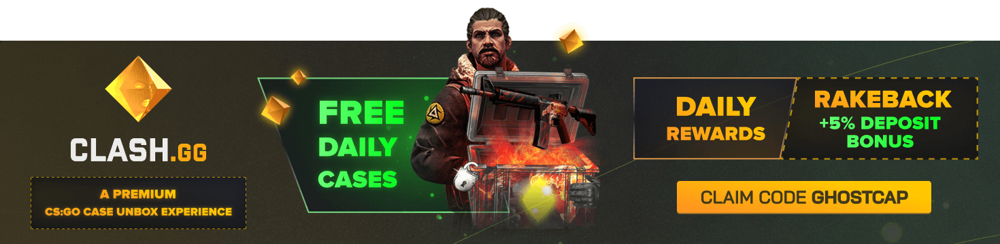](https://clash.gg/r/GHOSTCAP)

## 1\. **Broken Fang Gloves**

[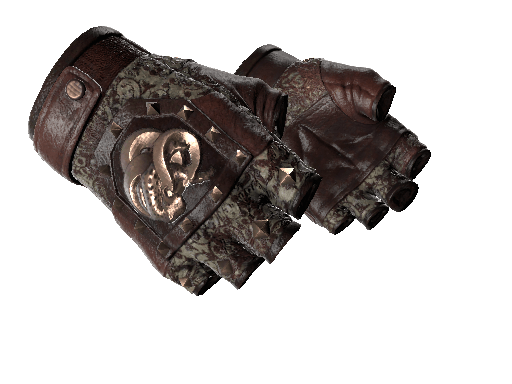](https://www.ghostcap.com/wp-content/uploads/2023/08/studded_brokenfang_gloves_operation10_floral_light_large.8738e4c5cf48aa1636acb8bd9888d4b12fe09df1.png)

**Needle Point**: Price range from $67.40 to $759.13.

[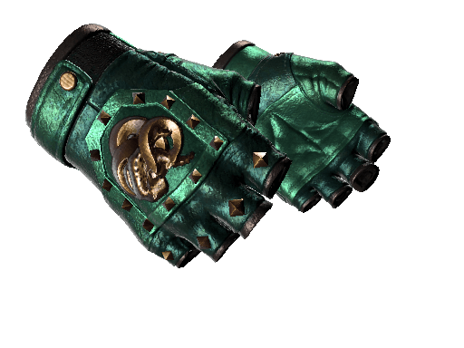](https://www.ghostcap.com/wp-content/uploads/2023/08/studded_brokenfang_gloves_operation10_metalic_green_light_large.80a800c0b681384b0227d4125cd21c4e4df0469c.png)

**Jade**: Price range from $113.27 to $2,200.00.

[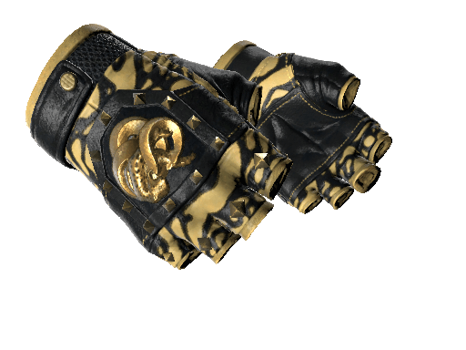](https://www.ghostcap.com/wp-content/uploads/2023/08/studded_brokenfang_gloves_operation10_poison_frog_black_yellow_light_large.288cab790af6a199b856678af930756e2fbb27ed.png)

**Yellow Banded**: Price range from $76.04 to $844.99.

[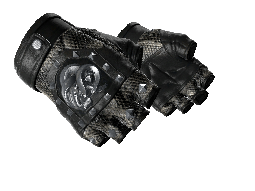](https://www.ghostcap.com/wp-content/uploads/2023/08/studded_brokenfang_gloves_operation10_snakeskin_black_light_large.66371a4c81360f765a00c334492edeb05f2bbb79.png)

**Unhinged**: Price range from $67.85 to $743.71.

Extraordinary Gloves

- **Jade**: Price range from $113.27 to $2,200.00.
- **Yellow Banded**: Price range from $76.04 to $844.99.
- **Needle Point**: Price range from $67.40 to $759.13.
- **Unhinged**: Price range from $67.85 to $743.71.

## 2\. **Driver Gloves**

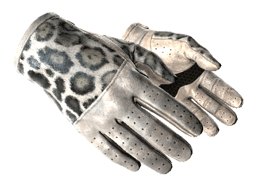

**Snow Leopard**: Price range from $482.27 to $1,700.00.

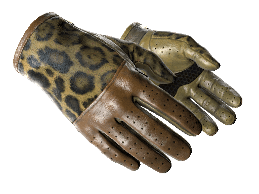

**Queen Jaguar**: Price range from $82.36 to $1,350.00.

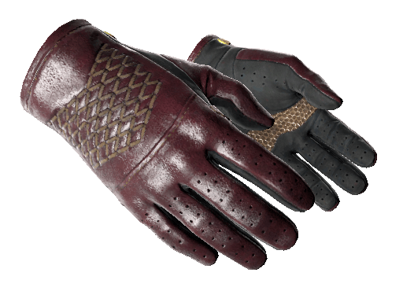

**Rezan the Red**: Price range from $81.77 to $1,629.02.

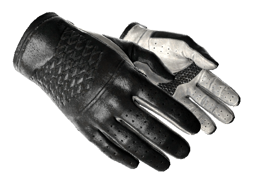

**Black Tie**: Price range from $126.00 to $1,127.38.

Extraordinary Gloves

- **Snow Leopard**: Price range from $482.27 to $1,700.00.
- **Black Tie**: Price range from $126.00 to $1,127.38.
- **Rezan the Red**: Price range from $81.77 to $1,629.02.
- **Queen Jaguar**: Price range from $82.36 to $1,350.00.

## 3\. **Hand Wraps**

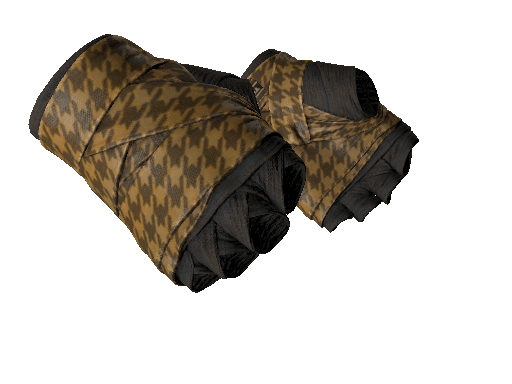

**Desert Shamagh**: Price range from $77.28 to $469.97.

[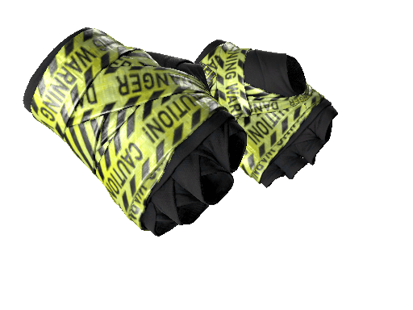](https://www.ghostcap.com/wp-content/uploads/2023/08/leather_handwraps_handwrap_leathery_caution_light_large.6a56c7aca789dc705530e1720672ee59efd11c61.png)

**CAUTION!**: Price range from $218.73 to $583.94.

[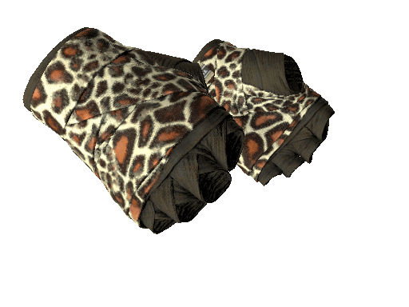](https://www.ghostcap.com/wp-content/uploads/2023/08/leather_handwraps_handwrap_leathery_fabric_giraffe_light_large.0efe682dbf18aadb7bece5975acf5033df42765a.png)

**Giraffe**: Price range from $82.43 to $1,392.33.

[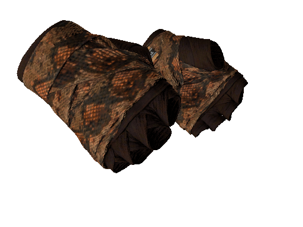](https://www.ghostcap.com/wp-content/uploads/2023/08/leather_handwraps_handwrap_leathery_snakeskin_orange_light_large.d22b23b2d86c4a419ce260b4186a2ef95ff0178a.png)

**Constrictor**: Price range from $77.76 to $340.00.

Extraordinary Gloves

- **Giraffe**: Price range from $82.43 to $1,392.33.
- **CAUTION!**: Price range from $218.73 to $583.94.
- **Desert Shamagh**: Price range from $77.28 to $469.97.
- **Constrictor**: Price range from $77.76 to $340.00.

## 4\. **Moto Gloves**

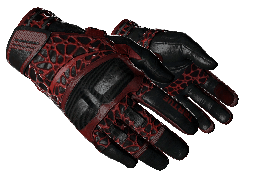

**Blood Pressure**: Price range from $98.25 to $601.35.

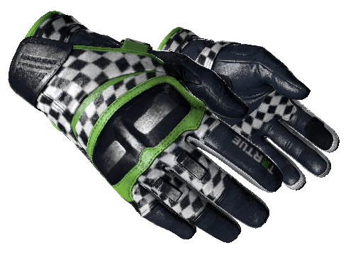

**Finish Line**: Price range from $108.10 to $581.99.

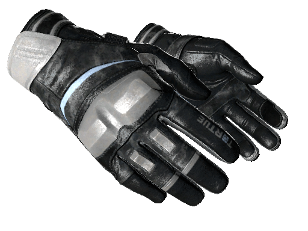

**Smoke Out**: Price range from $99.02 to $644.71.

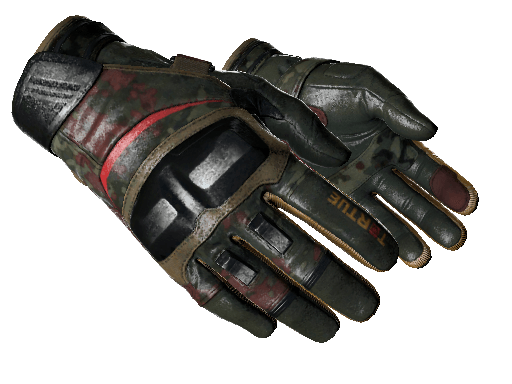

**3rd Commando Company**: Price range from $69.95 to $847.43.

Extraordinary Gloves

- **Smoke Out**: Price range from $99.02 to $644.71.
- **Finish Line**: Price range from $108.10 to $581.99.
- **Blood Pressure**: Price range from $98.25 to $601.35.
- **3rd Commando Company**: Price range from $69.95 to $847.43.

## 5\. **Specialist Gloves**

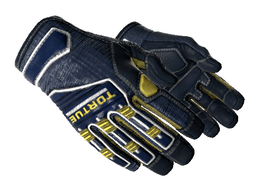

**Field Agent**: Price range from $171.49 to $1,435.71.

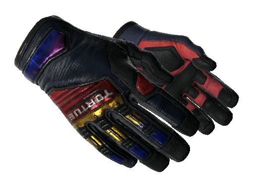

**Marble Fade**: Price range from $185.99 to $1,800.00.

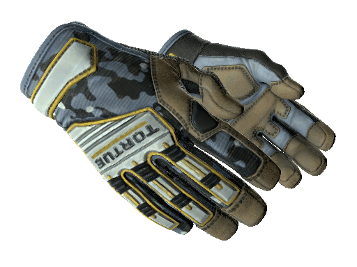

**Lt. Commander**: Price range from $165.67 to $1,516.70.

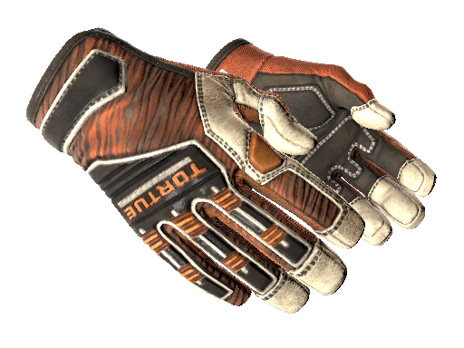

**Tiger Strike**: Price range from $234.69 to $1,600.00.

Extraordinary Gloves

- **Marble Fade**: Price range from $185.99 to $1,800.00.
- **Field Agent**: Price range from $171.49 to $1,435.71.
- **Tiger Strike**: Price range from $234.69 to $1,600.00.
- **Lt. Commander**: Price range from $165.67 to $1,516.70.

## 6\. **Sport Gloves**

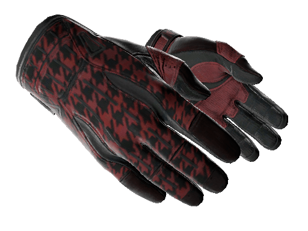

**Scarlet Shamagh**: Price range from $224.25 to $888.88.

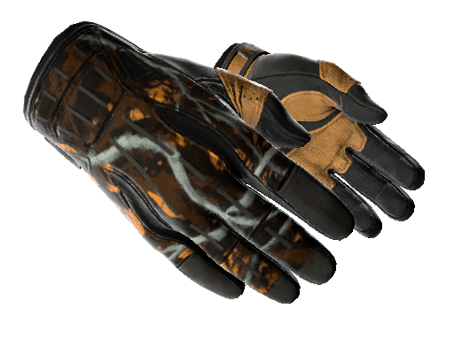

**Big Game**: Price range from $239.00 to $783.67.

**Nocts**: Price range from $218.56 to $3,650.00.

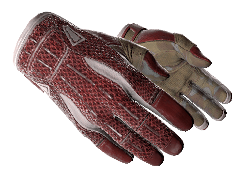

**Slingshot**: Price range from $369.00 to $3,800.00.

Extraordinary Gloves

- **Slingshot**: Price range from $369.00 to $3,800.00.
- **Nocts**: Price range from $218.56 to $3,650.00.
- **Scarlet Shamagh**: Price range from $224.25 to $888.88.
- **Big Game**: Price range from $239.00 to $783.67.

## Conclusion

The Recoil Case has introduced a wide array of gloves, each with its unique design and market value. From the vibrant colors of the Broken Fang Gloves to the sleek designs of the Driver Gloves, these additions have undoubtedly enriched the gaming experience for CS enthusiasts.

Whether you're a collector, trader, or just an avid player, the Recoil Case gloves offers something special for everyone. With the continuous updates and additions, CS continues to engage its community, keeping the game fresh and exciting.
