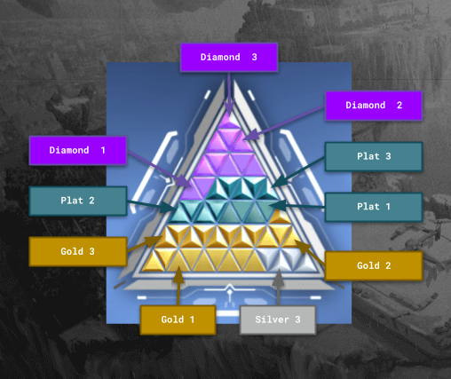

import { Image } from "astro:assets";

import __Valorant_Ranking_System_2160x1215_jpg from "./Valorant-Ranking-System-2160x1215.jpg";
import __Valorant_Ranks_in_Order_2160x1087_png from "./Valorant-Ranks-in-Order-2160x1087.png";
import __Valorant_Rank_Distribution_by_ghostcap_jpg from "./Valorant-Rank-Distribution-by-ghostcap.jpg";
import __valorant_ranks_infographic_2160x1696_png from "./valorant-ranks-infographic-2160x1696.png";

So you just started playing Valorant at the lower ranks, and you suddenly got the urge to become a better player. You finally work your way up from Iron to Silver, all that hard work paid off. Then one competitive match you face an Immortal rank player.

Bad news...

In a flash, you get sent back to the previous rank of Iron. Determined to improve your overall performance, you scour the internet for every guide possible to help you win matches. You then quickly realize you're actually a noob, and you need to start with the basics before you can [become the next s1mple](https://mobalytics.gg/valorant/leaderboard)

Now you're here, looking at Valorant's ranking system to see what you need to achieve to beat this guy. Read along, and I will teach you exactly how the Valorant ranking system works. Don't worry, I was in your position once! Let's get started!

## **How does the Valorant ranking system work? And how to unlock Valorant ranked mode?**

<Image
  decoding="async"
  width="2160"
  height="1215"
  alt="TODO: update alt text"
  sizes="(max-width: 2160px) 100vw, 2160px"
  src={__Valorant_Ranking_System_2160x1215_jpg}
  widths={[2160, 768, 1536, 2048, 1920]}
/>

Like any other game, a competitive one for that matter, you have to climb the ladder and win as many matches to level up. It can be very exhausting, rough, and time-consuming for most players, especially for other players who are new to FPS gaming.

Thus it pays to play with like-minded individuals as solo queue players can be very frustrating sometimes when you try to climb the ranked ladder.

The game has its own ranking system and before you can play Valorant's ranked mode and unlock competitive mode, you have to play its other game modes and reach level 20.

In this way, you get to familiarize the unlocked agents(you'll mostly start to play as Agent Brimstone), and their given abilities, and you get familiarized with the game maps and use them to your team's advantage.

Once you have reached level 20, you have to do five placement matches in a competitive mode to determine your account level and unlock your starting rank.

From there you can now start grinding and upgrade your skill levels and move ranks to ranks starting from its lowest rank the Iron to higher ranks such as the new Ascendant rank or the most coveted Immortal and Radiant.

The ranking system is an important part of the game. It determines what tier you are in, which in turn determines the rewards you get. The higher your rank, the better your rewards will be.

## **Valorant Ranks in Order**

<Image
  decoding="async"
  width="2160"
  height="1087"
  alt="TODO: update alt text"
  sizes="(max-width: 2160px) 100vw, 2160px"
  src={__Valorant_Ranks_in_Order_2160x1087_png}
  widths={[2160, 768, 1536, 2048, 3496]}
/>

As of this writing, there are a total of nine tiers in Valorant ranks. Included is the newly released rank called Ascendant from Episode 5.

Each of the tiers has its own sub ranks, having 1 as the lowest sub rank and 3 as the highest sub rank. Radiant has no sub-rank and is currently the highest in Valorant ranks.

Here are all the Valorant ranks in order.

- Iron
  - Iron 1
  - Iron 2
  - Iron 3
- Bronze
  - Bronze 1
  - Bronze 2
  - Bronze 3
- Silvers
  - Silver 1
  - Silver 2
  - Silver 3
- Golds
  - Gold 1
  - Gold 2
  - Gold 3
- Platinum
  - Platinum 1
  - Platinum 2
  - Platinum 3
- Diamonds
  - Diamond 1
  - Diamond 2
  - Diamond 3
- Ascendants ( Added on Episode 5)
  - Ascendant 1
  - Ascendant 2
  - Ascendant 3
- Immortals
  - Immortal 1
  - Immortal 2
  - Immortal 3
- Radiant

## **Valorant Rank Distribution**

<Image
  decoding="async"
  width="1434"
  height="806"
  alt="TODO: update alt text"
  sizes="(max-width: 1434px) 100vw, 1434px"
  src={__Valorant_Rank_Distribution_by_ghostcap_jpg}
  widths={[1434, 768]}
/>

As of June 2022, the chart below represents the total Valorant Rank Distribution of all players in the region, according to Esports Tales.

Iron One: 3.2 percent

Iron Two: 4.1 percent

Iron Three: 6.6 percent

Bronze One: 7.5 percent

Bronze Two: 9.3 percent

Bronze Three: 9.0 percent

Silver One: 10.0 percent

Silver Two: 8.8 percent

Silver Three: 8.3 percent

Gold One: 7.9 percent

Gold Two: 5.9 percent

Gold Three: 4.8 percent

Platinum One: 4.1 percent

Platinum Two: 2.8 percent

Platinum Three: 2.1 percent

Diamond One: 1.8 percent

Diamond Two: 1.3 percent

Diamond Three: 1.0 percent

Immortal One: 0.9 percent

Immortal Two: 0.3 percent

Immortal Three: 0.2 percent

Radiant: 0.03 percent

The majority of the Valorant players are in Silver rank, and only .03% of the players' population is at the Radiant rank.

This distribution has improved compared to when it started, when too many players are in its lowest rank. Riot Games has been doing its best to ensure that players are placed on the best possible rank distribution they deserve.

We also expect changes in the distribution after Episode 5 was released last June 20, 2022, that added a new rank called Ascendant between Diamond ranks and Immortals ranks.

Players are hoping for a better placement for all the ranks after adding Ascendant.

## **Valorant Act Ranks**

Valorant has now Act Rank. An act, according to Riot games, is a competitive period within an episode or what we commonly called a season. Every episode contains 3 acts, each new act usually lasts for about 2 months. It measures your overall progression across an entire act and is based on your highest-ranked win, which as per Riot games is your proven skill level.

Your act rank badge will be filled with small triangles that represent the rank you played. As you progress, lower rank wins will be replaced with your higher rank wins.

The border that surrounds the pyramid is what you call, Act Rank Border. It changes depending on the number of competitive wins you get.

The progress bar below the pyramid will tell you how many more competitive wins you need to get, to go to the next border level.

You can always view your act rank progress in your career tab.

There will be a soft reset at the end of every act. After doing one placement, you will have to return to your previous rank.

Lower ranked players with ranks Iron to Ascendant will have to grind a little harder to get to the rank they deserve and this will allow top players to get their best place on a smaller leaderboard population.

There is a reset at the end of every season. Regardless if you are in Iron, Diamond ranks, Immortal, and Radiant.

At every end of the season, you will receive a gun buddy that represents the highest act rank you have achieved on that certain episode.

## **Matchmaking Rating and Rank Rating**

<Image
  decoding="async"
  width="2160"
  height="1696"
  alt="TODO: update alt text"
  sizes="(max-width: 2160px) 100vw, 2160px"
  src={__valorant_ranks_infographic_2160x1696_png}
  widths={[2160, 768, 1536, 2048, 3500]}
/>

Riot games use a very competitive matchmaking rating system also known as MMR, to rate all players in Valorant ranks. Players will have their own MMR that will adjust over time based on the player's performance.

The MMR is hidden from all players and Riot games use this MMR system to match players with the same MMR. As you improve your skill level, your MMR increases and you lose MMR points when you lose.

Riot games defined a different rank rating system for Valorant ranks.

For Valorant ranks Iron to Ascendant, players should earn 100 rank rating in every three tiers before they can move to a new rank.

As to Valorant ranks' Immortal to Radiant, you have to get to a certain rank rating regional threshold to rank from Immortal 1 to Immortal 2 and so on.

When a new episode begins, all players need to play five placement matches, the highest rank one can get after the placement match is Ascendant 1. The same placement match applies to Immortal and Radiant ranks.

You will also need to do one placement match for Acts 2 and 3, to get your new rank.

If your MMR is higher than your current rank then it means you will earn more RR points on your wins and lose lesser RR points on your losses.

If your MMR is close to your rank, you will earn and lose closer RR points. If your MMR is lower than your current rank, you will earn fewer RR points when you win and lose more RR points when you lose.

## **Match History**

To assess your performance for each game and to track your rank progression, you can always view your career's match history. It also shows your KDA in games. While Riot Games is doing its best to upgrade its stats for you to have a better grasp of your game performance, these platforms offer more detailed performance :

- [tracker.gg](https://tracker.gg/)
- blitz
- spike stats
- overwolf
- valorantstat.xyz

## **Conclusion**

As a new FPS player, playing Valorant is fun and engaging. I have been grinding for a few months now [since I first downloaded Valorant](https://www.ghostcap.com/how-to-download-and-install-valorant/) and I have been moving back and forth from Iron 3 to Bronze 1. I aim to move to the next tier before the end of Episode 5 Act 1! A total rookie trying to climb the ladder!

Hopefully, I was able to share some inputs on how Valorant's ranking system works.

The rank distribution in the game has been changing over time and those on lower ranks have managed to move up to higher ranks, so there's room for growth!

How about you? What is your current rank in Valorant and what do you do to improve your game performance? Share your thoughts in our Discord!
