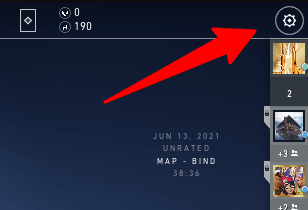

import { Image } from "astro:assets";

import __Escape_button_jpg from "./Escape-button.jpg";
import __vcsqewhqp2f51_png_1920x1080__png from "./vcsqewhqp2f51-png-1920x1080-.png";
import __How_to_leave_a_Valorant_game_screen_jpg from "./How-to-leave-a-Valorant-game-screen.jpg";

Back in the 1990s, when your mom was screaming at your dinner was ready, it was simple to stop playing your game.

Press start, go eat your dinner, come back to your game, press start again, job done. You're back playing your match.

These days it's different. [You can't pause an online game](https://www.gigaclear.com/blog/why-cant-my-child-pause-their-online-gaming).

If you leave your match early, other team members' experience will go down and they will possibly lose the game.

This is generally frowned upon in most online multi-player games and Valo is no exception.

With that being said, as an avid gamer, sometimes you really must leave the game and attend to other things.

## How to leave a Valorant game

Leaving a match is quite simple if you have ever played any other game before. So it's not like you need an existing strategy or something. However, this is exactly how you leave a match early.

**Total Time:** 1 minute

### 1\. Open the menu

<Image
  decoding="async"
  width="2048"
  height="1536"
  alt="Escape button"
  sizes="(max-width: 2048px) 100vw, 2048px"
  src={__Escape_button_jpg}
  widths={[2048, 768, 1536]}
/>

Open the menu by pressing the Escape button.

### 2\. Click the gear icon

Take the cursor to the top right corner of the screen to the gear icon.

### 3\. Click leave match

<Image
  decoding="async"
  width="552"
  height="533"
  alt="TODO: update alt text"
  sizes="(max-width: 552px) 100vw, 552px"
  src={__vcsqewhqp2f51_png_1920x1080__png}
  widths={[552, 24]}
/>

Click on the gear icon to bring up the UI with options to Leave Match and Exit to Main Menu.

### 4\. Confirm the leave

<Image
  decoding="async"
  width="1280"
  height="720"
  alt="TODO: update alt text"
  sizes="(max-width: 1280px) 100vw, 1280px"
  src={__How_to_leave_a_Valorant_game_screen_jpg}
  widths={[1280, 768]}
/>

Click on the Leave Match option and then press Confirm.

**Supply:**

- Account

**Tools:**

- Valorant

## Is there a penalty for leaving Valorant?

When you go to leave a competitive match you will be presented with a message that reads this

Leave In-Progress Match?

Are you sure you want to leave while the match is in progress?

This will harm the experience of the other players, and you will not be able to take any other actions until the game has ended. You can rejoin at any time by re-launching the game.

Abandoning matches will lead to reduced progressions and game restrictions.

After leaving an existing match, you cannot queue up for a new match until the current match is over.

## Does Valorant ban you if you leave a game?

Other than letting down the entire team, you generally won't get a ban the first time you leave a match in Valorant or go AFK.

You'll not receive any bonus points during matches that trigger such penalties. If you keep on leaving matches in the middle of the game, then you may be issued with a Temporary Suspension.

Failing to comply with this message means that you may be possibly issued a permanent suspension and banned from the game.

## How do I get rid of Valorant queue penalty?

Unfortunately, there's nothing a player can do other than waiting for your penalty to expire.

## How long is the penalty for Valorant?

If you're looking to keep your Valorant record clean, it's important to be aware of the potential penalties for violations.

While a single infraction may not result in much punishment, repeated offenses can add up and lead to more serious penalties.

The most common punishment for Valorant violations is a warning, which may include a loss of ranking points or matchmaking privileges.

More severe offenses can result in a temporary or permanent ban from the game. These penalties vary depending on the offense and last anywhere from 3 minutes all the way up until 7 days.

However, it should be noted that these punishments are usually reserved for players with a history of bad behavior.

So, if you're generally well-behaved, you shouldn't have to worry about facing any major penalties. Repeat offenders, on the other hand, watch out lol.

## Tell me the best way to leave competitive matches?

The best way to leave a competitive match in Valorant is to not leave the game at all.

Let me explain

If you really need to leave, you can't join other competitive queues anyway, so it's best if you simply press Alt + Tab while in the Valorant match. This way you can keep using your computer and do other tasks or even play other games while you're waiting.

You need to be careful as your whole team may still report you for being AFK.

You can simply avoid this by "tabbing" back into the game and walking around for a little bit, complaining that your PC is lagging, and trying to get sympathy from the other team members.

This is probably the best exit strategy as you can avoid getting reported. Just be nice to your teammates.

Other than that, there is no real good way to leave a competitive mode match.

## Is leaving a match the same as queue dodging?

No, to leave a match in Valorant means you have already started the game and you have pressed the leave match button.

Queue dodging is when you start a game in Valorant, but once you're at the character selection screen, you decide to not pick to exit the queue.

Riot games will punish you the same way for queue dodging and if you leave a game.

## Conclusion

Many players every day need to leave a match for one reason or another, and who are we to judge them for leaving in the middle of a match.

We need to remember that Valorant is just a game at the end of the day and if you're trying to go pro and [climb the ranks](https://www.ghostcap.com/valorant-ranks/), then it's best you don't play solo and get some reliable teammates.

I believe the system implemented by Riot games is fair for most players, and the fact that it will give you a leave match option, as well as warning you of the repercussions before you leave a game is a nice touch.

Overall, don't make it a habit to leave the match unless you really have to.
